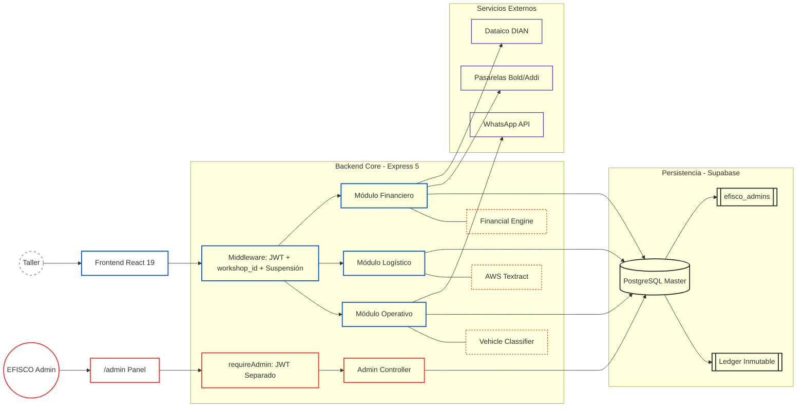
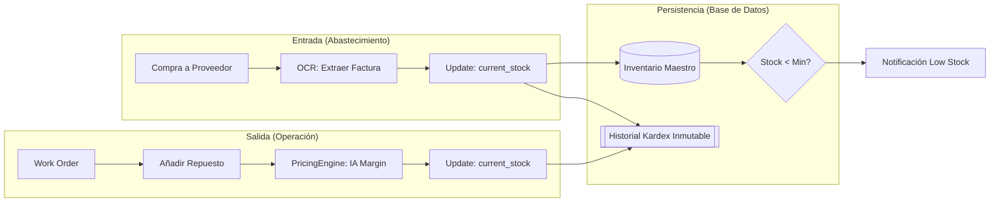

# Arquitectura

> Ver también: [README](README.md) · [SECURITY](SECURITY.md) · [FINANCIAL_ENGINE](FINANCIAL_ENGINE.md) · [API](API.md)

El sistema utiliza una arquitectura **multi-tenant** con aislamiento de datos verificado en cada endpoint del backend (`workshop_id` de la sesión) y un núcleo de cálculo financiero inmutable. La validación de acceso cruzado entre talleres es responsabilidad de la aplicación, no de la base de datos — ver el detalle completo en [SECURITY.md](SECURITY.md).

---

## 1. Mapa de Componentes y Capas



---

## 2. Ciclo de Vida Operativo (End-to-End)

```mermaid
sequenceDiagram
    autonumber
    participant C as Cliente
    participant R as Recepción
    participant WA as WhatsApp (Meta)
    participant B as Bahía (Ops)
    participant I as Inventario
    participant F as Finanzas
    participant EXT as Externos (DIAN/Pay)
    participant DB as Persistencia (DB)

    C->>R: Ingreso (Reporte de Fallo)
    activate R
    R->>WA: Notificar al Cliente
    R->>B: Convertir a Orden de Trabajo
    activate B
    Note over B: El Classifier asigna Tier (Básico/Premium)
    deactivate R

    loop Durante el Servicio
        B->>I: Solicitar Repuesto
        activate I
        I->>DB: Validar Stock & TX
        DB-->>I: Confirmación
        I-->>B: Item Entregado
        deactivate I
        B->>B: Acumular Costos
    end

    B->>F: Finalizar y Liquidar
    activate F
    deactivate B

    rect rgb(0, 0, 0)
        Note over F, DB: Proceso de Cierre Contable (Fiscal 2026)
        F->>F: Calcular FinancialEngine
        F->>DB: Insertar Movimientos Ledger
        F->>EXT: Emitir Factura & Procesar Pago
    end

    F->>C: Vehículo Listo + Factura Digital
    deactivate F
```



---

## 3. Stack Tecnológico

| Capa | Tecnología | Rol |
|:---|:---|:---|
| UI | React 19 + Vite | SPA con routing client-side |
| Estilos | Tailwind CSS v4 | Design system utilitario |
| Estado | Zustand | `useFinancialStore`, `useBillingStore`, `useThemeStore`, `useAdminStore`, `useInstallStore` |
| Backend | Express 5 + Node.js ESM | API REST con async/await nativo |
| Base de datos | Supabase (PostgreSQL) | Persistencia + aislamiento multi-tenant a nivel de aplicación |
| OCR | AWS Textract | Extracción de facturas de proveedores |
| Comunicaciones | Meta WhatsApp Cloud API | Notificaciones automáticas + envío de documentos (reporte de puntaje) |
| PDF server-side | Puppeteer + Chromium headless | Motor genérico HTML→PDF (`pdfRenderer.service.js`) reusado por las tres plantillas del sistema — reporte de puntaje, comprobante de pago (por cuota) y comprobante de venta (al liquidar) — así el backend es la única fuente tanto para la autodescarga del cliente como para el envío por WhatsApp: exactamente el mismo documento en los dos lugares, en vez de dos implementaciones distintas |
| Facturación | Dataico | Emisión DIAN electrónica (no bloqueante) |
| Pasarelas | Bold (físico/online/QR) + Addi (crédito) | Procesamiento de pagos |
| Crypto | Node.js `crypto.scrypt` | Hash de contraseñas admin (sin bcrypt) |
| Admin JWT | `jsonwebtoken` con `ADMIN_JWT_SECRET` | Token separado del JWT de talleres |
| PWA | `manifest.json` + `public/sw.js` + íconos maskable/any | Instalable como app desde el celular, con ícono correcto (margen de seguridad para el recorte automático del sistema). `sw.js` es un service worker mínimo sin caché — su único propósito es cumplir el requisito de instalabilidad de Chrome/Edge/Android para que el navegador dispare `beforeinstallprompt` (botón "Instalar" real en Landing/Auth, capturado en `useInstallStore`). `start_url: "/login"` (con `scope: "/"` explícito) — abrir el ícono instalado sin sesión activa lleva directo al login, no a la Landing de presentación |

---

## 4. Decisiones Técnicas Clave

- **Ledger Inmutable** — Cada movimiento financiero es append-only. Trazabilidad contable completa y auditable. Ver [FINANCIAL_ENGINE.md](FINANCIAL_ENGINE.md#libro-auxiliar-cash-flow-ledger).
- **Pipeline OCR asíncrono** — Procesamiento de facturas en segundo plano vía AWS Textract.
- **Tarificación dinámica por tier** — Clasificador de vehículos asigna el tier automáticamente (Básico/Premium).
- **Margen what-if fiel** — El cálculo de proyección del [Panel de Equilibrio](BUSINESS_RULES.md#panel-de-equilibrio-equilibrio) usa costo variable absoluto por orden (`varCostPerOrder`), no margen porcentual fijo. Al subir precios, el margen % mejora automáticamente porque los costos de partes no suben.
- **Gotcha real de `html2canvas`/`html2pdf.js` (PDF en blanco)** — posicionar el contenedor a capturar con coordenadas muy negativas (`position:fixed;top:-9999px`) es una causa documentada de canvas vacío en algunos navegadores. El patrón correcto en este proyecto (`generateScorePDF.js`): `position:absolute` dentro del flujo normal del documento + `opacity:0;pointer-events:none`, más un frame de espera (`requestAnimationFrame` doble) antes de capturar, para darle tiempo al navegador de terminar el layout/paint del contenido recién inyectado.
- **Mobile-first auditado, no solo "responsive por Tailwind"** — tener clases `md:`/`sm:` no garantiza que algo se vea bien en un celular real; varios contenedores con `flex ... items-center` (sin `w-full`) se centraban en vez de estirarse en mobile, causando overflow simétrico en ambos lados (ej. filtros de Bahía, footer). El patrón correcto en este proyecto: contenedores con `w-full sm:w-auto` + filas de tabs/filtros con `overflow-x-auto` explícito (nunca asumir que el contenido cabe). Modales largos siempre con `max-h-[90vh] flex flex-col` + región central `overflow-y-auto flex-1` (header/footer fijos) — sin esto, contenido más alto que la pantalla queda inaccesible en el celular, sin forma de hacer scroll.
- **Un evento del navegador que solo se dispara una vez debe vivir en un store global, no en un hook local de página** — `beforeinstallprompt` (botón "Instalar" de Landing/Auth) se capturó primero en un hook dentro de cada página; el navegador lo dispara una única vez, así que al navegar de `/` a `/login` (React Router desmonta una página y monta la otra) el hook nuevo arrancaba en `null` y el evento ya capturado se perdía — el botón "desaparecía" al cambiar de pantalla. Corregido moviendo la captura a `useInstallStore` (Zustand), inicializado una sola vez en `App.jsx`: cualquier evento de navegador que sea "úsalo o piérdelo" (single-fire) necesita vivir por encima del ciclo de vida de las páginas que lo consumen.

> Las decisiones de aislamiento multi-tenant, autenticación y control de acceso (admin separado, suspensión, contrato B2B, autorización del taller) están documentadas en **[SECURITY.md](SECURITY.md#decisiones-técnicas-de-seguridad)**.

---

## 5. Inventario y Kardex Inmutable

Trazabilidad total: cada movimiento físico genera un reflejo contable obligatorio en la base de datos.



Detalle funcional del módulo de Inventario en [BUSINESS_RULES.md](BUSINESS_RULES.md#inventario).

---

## Variables de Entorno

`backend/.env`:

```env
# Supabase
SUPABASE_URL=https://<project>.supabase.co
SUPABASE_SERVICE_ROLE_KEY=<service-role-key>
SUPABASE_ANON_KEY=<anon-key>

# JWT talleres (Supabase)
JWT_SECRET=<secret>

# JWT admin interno EFISCO (separado)
ADMIN_JWT_SECRET=<secret-admin>

# AWS Textract (OCR)
AWS_ACCESS_KEY_ID=<key>
AWS_SECRET_ACCESS_KEY=<secret>
AWS_REGION=us-east-1

# WhatsApp Meta Cloud API
WHATSAPP_TOKEN=<bearer-token>
WHATSAPP_PHONE_NUMBER_ID=<phone-id>
# El dominio del frontend (https://efiscosas.vercel.app) vive como prefijo
# estático dentro del botón "Visitar sitio web" de la plantilla
# `solicitud_datos_dian` en Meta — el backend solo manda el sufijo
# workshopId/intakeId como parámetro del botón, no la URL completa.

# Dataico (Facturación DIAN) — solo la URL del API es global.
# El account_id y el token son por-taller: cada taller tiene su propia
# sub-cuenta dentro de la cuenta maestra de Efisco en Dataico, configurada
# en Configuración → Módulo del Contador (dataico_api_key / dataico_authtoken
# / dataico_resolution_number / dataico_prefix / dataico_department_code /
# dataico_city_code en workshop_config). No hay cuenta de respaldo — si un
# taller no tiene sus credenciales configuradas, la facturación electrónica
# falla explícitamente en vez de emitir bajo una cuenta equivocada.
DATAICO_BASE_URL=https://api.dataico.com/direct/dataico_api/v2

# Webhooks Bold/Addi (opcional pero recomendado)
# Si no se configuran, los webhooks aceptan cualquier notificación sin
# verificar origen — ver nota de seguridad en SECURITY.md.
BOLD_WEBHOOK_TOKEN=<token-compartido-con-bold>
ADDI_WEBHOOK_TOKEN=<token-compartido-con-addi>

# Resend (correos custom disparados por el backend — no cubre los correos
# de Supabase Auth como Reset Password, esos usan el SMTP configurado en el
# dashboard de Supabase). Requerido solo para el correo de rechazo al
# eliminar un taller no activado (ver BUSINESS_RULES.md).
RESEND_API_KEY=<api-key-de-resend>
# Opcional — por defecto EFISCO <soporte@efisco.co>
RESEND_FROM_EMAIL=EFISCO <soporte@efisco.co>
```

> **Nota de seguridad — webhooks de pago:** ver [SECURITY.md](SECURITY.md#webhooks-de-pago).
