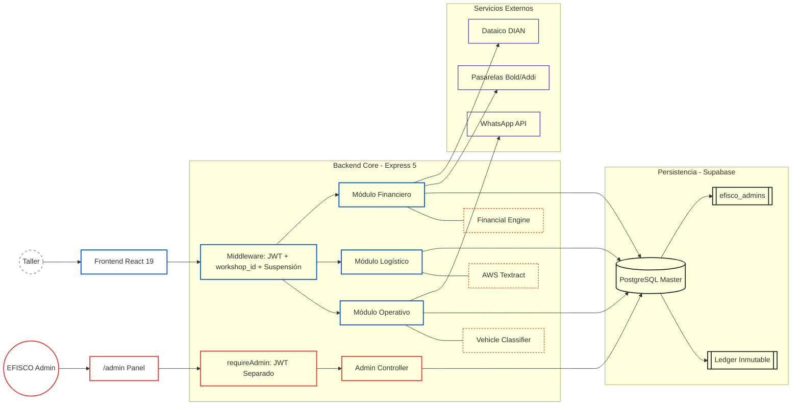
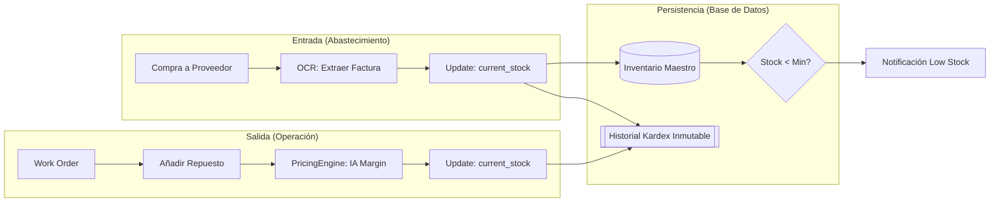

# Arquitectura

> Ver también: [README](README.md) · [SECURITY](SECURITY.md) · [FINANCIAL_ENGINE](FINANCIAL_ENGINE.md) · [API](API.md)

El sistema utiliza una arquitectura **multi-tenant** con aislamiento de datos verificado en cada endpoint del backend (`workshop_id` de la sesión) y un núcleo de cálculo financiero inmutable. La validación de acceso cruzado entre talleres es responsabilidad de la aplicación, no de la base de datos, ver el detalle completo en [SECURITY.md](SECURITY.md).

---

## 1. Mapa de Componentes y Capas



---

## 2. Ciclo de Vida Operativo (End-to-End)

```mermaid
sequenceDiagram
    autonumber
    participant C as Cliente
    participant R as Recepción
    participant WA as WhatsApp (Meta)
    participant B as Bahía (Ops)
    participant I as Inventario
    participant F as Finanzas
    participant EXT as Externos (DIAN/Pay)
    participant DB as Persistencia (DB)

    C->>R: Ingreso (Reporte de Fallo)
    activate R
    R->>WA: Notificar al Cliente
    R->>B: Convertir a Orden de Trabajo
    activate B
    Note over B: El Classifier asigna Tier (Básico/Premium)
    deactivate R

    loop Durante el Servicio
        B->>I: Solicitar Repuesto
        activate I
        I->>DB: Validar Stock & TX
        DB-->>I: Confirmación
        I-->>B: Item Entregado
        deactivate I
        B->>B: Acumular Costos
    end

    B->>F: Finalizar y Liquidar
    activate F
    deactivate B

    rect rgb(0, 0, 0)
        Note over F, DB: Proceso de Cierre Contable (Fiscal 2026)
        F->>F: Calcular FinancialEngine
        F->>DB: Insertar Movimientos Ledger
        F->>EXT: Emitir Factura & Procesar Pago
    end

    F->>C: Vehículo Listo + Factura Digital
    deactivate F
```



---

## 3. Stack Tecnológico

| Capa | Tecnología | Rol |
|:---|:---|:---|
| UI | React 19 + Vite | SPA con routing client-side |
| Estilos | Tailwind CSS v4 | Design system utilitario |
| Estado | Zustand | `useFinancialStore`, `useBillingStore`, `useThemeStore`, `useAdminStore`, `useInstallStore` |
| Backend | Express 5 + Node.js ESM | API REST con async/await nativo |
| Base de datos | Supabase (PostgreSQL) | Persistencia + aislamiento multi-tenant a nivel de aplicación |
| OCR | AWS Textract | Extracción de facturas de proveedores |
| Comunicaciones | Meta WhatsApp Cloud API | Notificaciones automáticas + envío de documentos (reporte de puntaje) |
| PDF server-side | Puppeteer + Chromium headless | Motor genérico HTML→PDF (`pdfRenderer.service.js`) reusado por las tres plantillas del sistema — reporte de puntaje, comprobante de pago (por cuota) y comprobante de venta (al liquidar) — así el backend es la única fuente tanto para la autodescarga del cliente como para el envío por WhatsApp: exactamente el mismo documento en los dos lugares, en vez de dos implementaciones distintas |
| Facturación | Dataico | Emisión DIAN electrónica (no bloqueante) |
| Excel server-side | `exceljs` | Genera el Libro Mayor único (`.xlsx` real) que descarga el contador — reemplaza los 6 reportes CSV anteriores |
| Pasarelas | Bold (físico/online/QR) + Addi (crédito) | Procesamiento de pagos |
| Crypto | Node.js `crypto.scrypt` | Hash de contraseñas admin (sin bcrypt) |
| Admin JWT | `jsonwebtoken` con `ADMIN_JWT_SECRET` | Token separado del JWT de talleres |
| PWA | `manifest.json` + `public/sw.js` + íconos maskable/any | Instalable como app desde el celular, con ícono correcto (margen de seguridad para el recorte automático del sistema). `sw.js` es un service worker mínimo sin caché — su único propósito es cumplir el requisito de instalabilidad de Chrome/Edge/Android para que el navegador dispare `beforeinstallprompt` (botón "Instalar" real en Landing/Auth, capturado en `useInstallStore`). `start_url: "/login"` (con `scope: "/"` explícito) — abrir el ícono instalado sin sesión activa lleva directo al login, no a la Landing de presentación |

---

## 4. Decisiones Técnicas Clave

- **Ledger Inmutable** — Cada movimiento financiero es append-only. Trazabilidad contable completa y auditable. Ver [FINANCIAL_ENGINE.md](FINANCIAL_ENGINE.md#libro-auxiliar-cash-flow-ledger).
- **Pipeline OCR asíncrono** — Procesamiento de facturas en segundo plano vía AWS Textract.
- **Tarificación dinámica por tier** — Clasificador de vehículos asigna el tier automáticamente (Básico/Premium).
- **Margen what-if fiel** — El cálculo de proyección del [Panel de Equilibrio](BUSINESS_RULES.md#panel-de-equilibrio-equilibrio) usa costo variable absoluto por orden (`varCostPerOrder`), no margen porcentual fijo. Al subir precios, el margen % mejora automáticamente porque los costos de partes no suben.
- **Gotcha real de `html2canvas`/`html2pdf.js` (PDF en blanco)** — posicionar el contenedor a capturar con coordenadas muy negativas (`position:fixed;top:-9999px`) es una causa documentada de canvas vacío en algunos navegadores. El patrón correcto en este proyecto (`generateScorePDF.js`): `position:absolute` dentro del flujo normal del documento + `opacity:0;pointer-events:none`, más un frame de espera (`requestAnimationFrame` doble) antes de capturar, para darle tiempo al navegador de terminar el layout/paint del contenido recién inyectado.
- **Mobile-first auditado, no solo "responsive por Tailwind"** — tener clases `md:`/`sm:` no garantiza que algo se vea bien en un celular real; varios contenedores con `flex ... items-center` (sin `w-full`) se centraban en vez de estirarse en mobile, causando overflow simétrico en ambos lados (ej. filtros de Bahía, footer). El patrón correcto en este proyecto: contenedores con `w-full sm:w-auto` + filas de tabs/filtros con `overflow-x-auto` explícito (nunca asumir que el contenido cabe). Modales largos siempre con `max-h-[90vh] flex flex-col` + región central `overflow-y-auto flex-1` (header/footer fijos) — sin esto, contenido más alto que la pantalla queda inaccesible en el celular, sin forma de hacer scroll.
- **Un evento del navegador que solo se dispara una vez debe vivir en un store global, no en un hook local de página** — `beforeinstallprompt` (botón "Instalar" de Landing/Auth) se capturó primero en un hook dentro de cada página; el navegador lo dispara una única vez, así que al navegar de `/` a `/login` (React Router desmonta una página y monta la otra) el hook nuevo arrancaba en `null` y el evento ya capturado se perdía — el botón "desaparecía" al cambiar de pantalla. Corregido moviendo la captura a `useInstallStore` (Zustand), inicializado una sola vez en `App.jsx`: cualquier evento de navegador que sea "úsalo o piérdelo" (single-fire) necesita vivir por encima del ciclo de vida de las páginas que lo consumen.
- **Un preview/simulador en el frontend debe reusar las mismas fórmulas del motor real del backend, no reimplementarlas con sus propias constantes** — tanto `ModalLiquidacion.jsx` (preview de liquidación) como `useFinancialStore.calculateLiveInvoice` (simulador, sin caller activo hoy) traían su propia copia de la lógica de IVA/retenciones con tasas fijas (19%, 4%, 0.966%) y sin el umbral UVT ni el gate por régimen del taller que sí aplica `financialEngine.liquidateClientInvoice` — dos implementaciones del mismo cálculo que fueron divergiendo con el tiempo a medida que el backend se volvía configurable (rev. 25, bug #11), hasta que el cajero podía ver un "Total Neto" en pantalla distinto del que de verdad se liquidaba. Corregido replicando exactamente los mismos parámetros y comparaciones que el backend (incluida la lectura explícita contra `null`/`undefined` en vez de `|| default`, ver [FINANCIAL_ENGINE.md](FINANCIAL_ENGINE.md)) — cualquier preview de un cálculo que también existe en el backend debe leer su configuración real (`workshop_config`) y replicar la fórmula tal cual, nunca hardcodear valores "razonables" por separado. **La misma categoría de bug reapareció en rev. 40**, más angosta: el preview ya replicaba la fórmula completa de retenciones/IVA, pero le faltaba una sola línea del backend — el IVA (19%) que el motor cobra sobre la comisión de la pasarela misma (`commissionVat`) antes de restarla del neto. Un "replicar la fórmula" no es una tarea de una sola vez: cada línea nueva que se agregue al motor real (aquí, la retención de la pasarela sobre el giro de rev. 38) es candidata a quedar fuera del preview si no se audita explícitamente contra el código del backend línea por línea al momento de tocarlo.
- **Un "saldo"/"pasivo" que se muestra en dos pantallas distintas necesita el mismo alcance de fechas, no solo la misma fórmula** — `getDashboardSummary` (Dashboard Financiero) calcula `financialEngine.calculateGlobalHealth` sobre TODO el histórico del ledger, sin filtro de fecha; `getCashFlow` (Flujo de Caja) reimplementaba la misma idea a mano, pero solo con los asientos dentro del rango `[from,to]` elegido (por defecto, el mes en curso), sin encadenar el saldo/IVA acumulados de meses anteriores. Para cualquier taller con más de un mes de uso, "Saldo Real"/"IVA Pendiente DIAN" de las dos pantallas divergían — no por una fórmula distinta, sino porque una veía todo el histórico y la otra solo una ventana. Corregido haciendo que `getCashFlow` calcule también, con `calculateGlobalHealth`, el saldo/IVA reales de antes de `from` y la posición acumulada real hasta `to` (ver [FINANCIAL_ENGINE.md](FINANCIAL_ENGINE.md#3-salud-financiera-global-calculateglobalhealth)) — una métrica de "posición" (saldo, pasivo) siempre debe ser acumulada hasta una fecha de corte; solo las métricas de "flujo" (ingresos, egresos de ESTE período) deben acotarse al rango elegido.
- **Un "ingreso" en el panel de EFISCO debe verificar de QUIÉN es esa plata, no solo sumar el ledger que esté más a mano** — `getStats` (Panel Admin EFISCO) sumaba `cash_flow_ledger`/`INC_GROSS`, que es la venta bruta de CADA TALLER a sus propios clientes, y lo mostraba como "Ingresos plataforma"/"Ingresos procesados" de EFISCO — un número sin relación con lo que los talleres realmente le pagan a EFISCO (podía superar los $40M con solo un puñado de talleres activos, frente al ingreso real de EFISCO, órdenes de magnitud menor). El ledger correcto para el ingreso de EFISCO es `efisco_accounting_ledger` (`direction='income'`) — un ledger completamente aparte, sin `workshop_id`, que ya usaba correctamente la pestaña Contabilidad del mismo panel. En un sistema con dos "libros" distintos (el de cada taller y el propio de EFISCO), cualquier KPI nuevo debe declarar explícitamente de cuál libro sale, y el texto de la UI debe decirlo tal cual — el propio subtítulo ("facturado por todos los talleres") ya delataba el bug antes de que alguien mirara el código.
- **Un default hardcodeado que en realidad es un umbral legal debe declarar su fecha de vigencia y su riesgo de cambiar** — los topes UVT de retención (`RETENTION_THRESHOLD_PARTS_UVT`, `retention_threshold_services_uvt`) parecían una constante estable ("27 UVT, así ha sido siempre"), pero el Decreto 572/2025 los bajó, el Consejo de Estado los suspendió y luego revivió el decreto en cuestión de semanas (mayo-julio 2026) — ambos valores cambiaron 3 veces en menos de 60 días por una demanda de nulidad todavía en curso. Corregido actualizando los defaults a los vigentes hoy (10/2 UVT) y agregando una alerta permanente en el panel del contador (no solo un comentario en el código) recordando verificar la norma vigente — un valor que la ley puede cambiar por fuera del control del software necesita ser fácil de corregir Y visible que puede estar desactualizado, no solo "configurable en algún input".

- **Un mensaje de error que se muestra al usuario nunca debe ser el `.message` crudo de la base de datos** — casi todos los controllers (109 sitios en 12 archivos) hacían `res.status(500).json({ error: error.message })` sin distinguir un `Error` de aplicación (ya en español, ej. "Repuesto no encontrado") de un error real de Postgres/PostgREST (constraints, nombres de columna, "duplicate key value violates unique constraint..."), que terminaba mostrado tal cual al cajero/dueño. Corregido con `backend/utils/dbErrors.js:friendlyDbError` — distingue por `error.code` (SQLSTATE, solo presente en errores reales de base de datos): con `code`, mapea a un mensaje en español; sin `code`, devuelve `error.message` intacto (mismo comportamiento de siempre para los `throw new Error(...)` de aplicación). El detalle técnico real sigue disponible para quien loguee `error` server-side — la función solo decide qué cruza la frontera hacia el cliente. Patrón a replicar: cualquier controller nuevo debe usar `friendlyDbError(error)` en su catch de 500, nunca `error.message` a secas.
- **Un debounce o una petición dependiente de un id cambiante necesita un `useEffect` con cleanup real, no un `setTimeout`/fetch suelto dentro de un event handler** — 2 instancias del mismo bug encontradas en rev. 42: `AdminWorkshops.jsx:handleSearch` armaba su debounce (`setTimeout` + `return () => clearTimeout(t)`) dentro de un `onChange` — ese `return` no lo ejecuta nadie fuera de un `useEffect`, así que cada tecla disparaba un fetch nuevo sin cancelar los anteriores (fetch por letra + una respuesta vieja podía pisar resultados nuevos); y `Config.jsx` cargaba historial/métricas/pago-pendiente de un empleado en un `useEffect` keyed por su id, pero sin ningún guard contra la respuesta de un empleado anterior llegando tarde — abrir el panel de A y luego rápido el de B podía dejar el panel de B con datos de A. Ambos corregidos con las 2 técnicas estándar de React para "una respuesta async puede llegar después de que ya no aplica": debounce real dentro de un `useEffect(() => { const t = setTimeout(...); return () => clearTimeout(t); }, [dep])`, y un flag `cancelled` (seteado en el cleanup, chequeado antes de cada `setState` en el `.then()`) para peticiones en vuelo que dependen de un id que puede cambiar antes de que resuelvan.
- **Un componente de confirmación compartido necesita su propio `loading`, no depender de que cada caller cierre el modal a tiempo** — `ElegantConfirmModal.jsx` (7 usos en el proyecto) no tenía ningún prop de estado de carga; varios callers (`AdminWorkshops.jsx`, `Proveedores.jsx`, `Recepcion.jsx`) solo cerraban el modal en el `finally` de su petición, así que el botón de confirmar seguía clickeable mientras la petición estaba en curso — doble clic podía disparar dos DELETE seguidos. Otros callers (`Inventario.jsx`, `ModalLiquidacion.jsx`) sí cerraban el modal de forma síncrona antes de la petición y nunca tuvieron el bug — la inconsistencia entre callers del mismo componente era la señal de que la protección debía vivir en el componente, no repetirse (con suerte) en cada uso. Corregido agregando `loading` (opcional, backward-compatible) a `ElegantConfirmModal`: deshabilita ambos botones y el cierre por backdrop/X, muestra spinner + "Procesando...". `Config.jsx` comparte un solo modal genérico entre 3 acciones distintas — en vez de tocar los 3 handlers, se envolvió el `onConfirm` una sola vez en el punto donde se conecta al modal (`handleConfirmModalClick`), beneficiando a los 3 sin duplicar lógica.
- **Una escritura que depende de otra debe ordenarse por cuál es más barata de reintentar, no por el orden "natural" en que se piensan** — `settleOrder` insertaba el ledger financiero y RECIÉN DESPUÉS marcaba la orden como `completed`. Si ese segundo update fallaba (conexión caída, timeout), la orden quedaba sin `completed` y un reintento del usuario (mismo botón, mismo click) volvía a pasar la única guarda de idempotencia (que solo mira el `status` al principio de la función) y duplicaba TODOS los asientos financieros — ingreso, IVA, retenciones, comisiones, todo doblado. Corregido invirtiendo el orden: primero se marca la orden como `completed`, y el ledger se inserta después. Si el insert del ledger llegara a fallar en ese punto, el resultado es una orden completada sin su ledger (un hueco visible y auditable con una consulta simple), no dinero duplicado en el libro contable — entre dos escrituras dependientes que no pueden ser una sola transacción real, la más segura de reintentar debe ir de última.
- **El admin API de Supabase (`auth.admin.listUsers`) pagina — cualquier búsqueda por email debe agotar todas las páginas, no confiar en `perPage` alto** — `requestPasswordReset` y `getWorkshops` llamaban `listUsers({ perPage: 1000 })` una sola vez, así que el usuario 1001+ (por antigüedad de creación, no por orden alfabético) quedaba invisible: sin correo de recuperación, sin `owner_email` resuelto en el panel admin. Corregido con `backend/utils/authUsers.js` (`listAllAuthUsers`), que pagina hasta que una página devuelve menos de `perPage` resultados — cualquier consumidor nuevo que necesite buscar o mapear por email debe reusar este helper en vez de una llamada suelta.
- **Una regla de negocio corregida en un solo lugar tiende a reaparecer en cualquier otro lugar que la reimplemente por su cuenta — un fix necesita un utilitario compartido, no una corrección puntual** — el bug de "hoy en Colombia ≠ hoy en UTC" (Colombia es UTC-5 fijo, sin horario de verano; cualquier acción entre las 7pm y medianoche hora local ya tiene un `created_at` UTC del día/mes siguiente) ya se había corregido dos veces por separado, cada vez a mano: en `getMonthlyBooks` (rev. 25/Bug #14, cierre de libros mensuales) y en `Cobros.jsx` ("Vencida"). Ninguna de las dos correcciones se extrajo a un helper reusable, así que en rev. 47 el mismo bug apareció intacto en otros 17 sitios que también calculaban "hoy"/"mes en curso" con `new Date().toISOString().split('T')[0]`/`.substring(0,7)` cada uno por su cuenta — Flujo de Caja (el reporte que lo hizo evidente), el badge de cuotas vencidas del Dashboard/Sidebar (que ya tenía el fix correcto al lado, en `Cobros.jsx`, sin que nadie lo reusara), el score de riesgo de clientes, comisiones de mecánicos, KPIs del panel admin, kardex de inventario, y las fechas por defecto de varios formularios. Corregido de raíz con `frontend/src/utils/localDate.js` / `backend/utils/localDate.js` (espejo, mismo patrón que `ledgerLabels.js`/`financialEngine.js`) — cualquier cálculo nuevo de "hoy" o "mes en curso" en este proyecto debe importar de ahí, nunca instanciar su propio `new Date().toISOString()`. Un hallazgo más profundo de la misma revisión: el filtro de rango de `getCashFlow`/`getCompletedOrders` recibía `from`/`to` del frontend como timestamps SIN offset de zona horaria, y Postgres los interpretaba con el timezone de la sesión (UTC) — un bug de un nivel más abajo que el de "cómo se muestra la fecha", este sí capaz de traer datos incorrectos de la base, no solo mostrarlos mal (helper `asBogotaIso`).

- **En este repo no existía convención de migraciones de esquema** (rev. 49): no hay `migrations/`, `supabase/migrations/` ni un runner — los cambios de esquema se aplicaban a mano vía SQL Editor de Supabase, y el único artefacto versionado era `backend/backup/efiscodb.sql` (un `pg_dump` completo, snapshot, no un historial incremental). Al agregar `service_catalog.gama`/`complejidad` se creó `backend/migrations/` con un primer archivo `.sql` fechado (`ALTER TABLE` plano, sin runner) — sin credenciales de conexión directa a Postgres (solo `SUPABASE_SERVICE_ROLE_KEY`, que habla REST/PostgREST, no DDL), el cambio de esquema lo debe correr el usuario a mano en el SQL Editor; el asistente no tiene forma de ejecutar DDL por su cuenta en este proyecto.
- **Un contenedor Docker local puede acaparar un puerto y servir código viejo sin avisar** (rev. 49): además del `node server.js`/`nodemon` de siempre, existe `backend/docker-compose.yml` (contenedor `efisco-api`, imagen con el código *horneado* en el build — sin bind mount), que puede quedar corriendo horas después de haberlo levantado una vez. Si además hay un `node server.js` local sobre el mismo puerto 3000, ambos procesos aparecen en `netstat`/`docker ps`, y las peticiones pueden estar llegando al contenedor viejo — los síntomas son confusos porque el request SÍ llega a un Express real y responde 2xx coherente (mismo mensaje, misma forma de JSON), solo que con la lógica de antes del último cambio; en este caso, una columna nueva que el backend debía persistir llegaba `null` pese a que el payload del frontend y el código en disco eran correctos. Señal para reconocer el patrón: un cambio de backend que compila y pasa sus tests pero no se refleja al probar en vivo → verificar `docker ps` antes de sospechar del código.
- **Una función ya escrita puede quedar como código muerto esperando a que el resto del sistema la alcance** (rev. 49): `backend/utils/pricing.js:getServiceMargin` (con tests en `pricing.test.js` que documentan la tabla completa) existía desde antes de esta revisión, sin ningún caller en producción ni las columnas de BD (`service_catalog.gama`/`complejidad`) que necesitaba para ser útil — quedó ahí, probada pero inerte, hasta que una imagen de referencia del usuario (tabla de márgenes por Gama/Complejidad) resultó coincidir exactamente con esa función ya implementada. Antes de construir una feature nueva "desde cero" vale la pena buscar si ya hay una función con el nombre/forma correcta en `utils/` — puede que ya esté escrita y solo falte conectarla.

- **Un elemento persistente de UI (drawer/sidebar) no puede abrirse/cerrarse en función de "algún paso de la secuencia lo necesita" — tiene que ser "el paso ACTUAL lo necesita"** (`frontend/src/utils/tour.js`, rev. 50): la guía de usuario móvil (driver.js) chequeaba, al arrancar, si *algún* paso de la secuencia completa apuntaba al `<aside>` del menú — si sí, abría el drawer para TODA la duración del tour. El tour de Inicio termina señalando el menú principal, así que sus primeros 4 pasos (título, bahía, financiero, mes) se resaltaban con el drawer + su overlay ya tapando el contenido detrás. Corregido moviendo la apertura/cierre del drawer a hooks `onNextClick`/`onPrevClick` en el `popover` del paso vecino al de `aside` — se abre/cierra justo en la transición hacia/desde ese paso puntual (esperando el fin de la transición CSS de 500ms antes de dejar que driver.js mida la posición del elemento), no al inicio del tour completo.
- **Un paso de un tour guiado que apunta a un elemento condicional puede quedar "flotando" sin avisar** (rev. 50): dos pasos del tour de Equilibrio (`.equilibrio-grafico`, `.equilibrio-whatif`) solo existen en el DOM si `hasData` es verdadero (ver [BUSINESS_RULES.md](BUSINESS_RULES.md#panel-de-equilibrio-equilibrio)) — si el selector no existe, driver.js no lanza error: cae a un elemento dummy de 0×0 centrado en pantalla y muestra el popover ahí, sin nada resaltado, una experiencia confusa sin ninguna señal de qué salió mal. `tour.js` ahora filtra, antes de arrancar, cualquier paso cuyo `document.querySelector(step.element)` no devuelva nada (excepto `aside`, siempre presente aunque oculto) — un tour con pasos condicionales debe verificar existencia real en el DOM, no asumir que el elemento que existía cuando se escribió el tour sigue montado.
- **Una guarda contra respuesta-fuera-de-orden es barata de agregar preventivamente, incluso sin poder confirmar que el bug ya ocurrió** (`Config.jsx:fetchEmployees`/`fetchServices`, rev. 50): mismo patrón ya documentado arriba (rev. 42) para el panel de detalle de un empleado, aplicado ahora a las dos listas completas del catálogo (servicios, equipo) — un contador de petición (`useRef`, incrementado al disparar cada fetch) que descarta cualquier respuesta que no sea la de la última petición en vuelo. A diferencia del bug de rev. 42, acá **no se confirmó una reproducción real**: la sospecha inicial (la lista no se actualizaba tras crear un registro) resultó ser, al probarlo con calma paso a paso, una lectura apresurada de la UI antes de que el fetch en curso resolviera — no un bug de la app. La guarda se dejó de todos modos por ser el mismo patrón de bajo costo/alto valor que ya probó su utilidad en rev. 42, no como confirmación de un defecto encontrado.
- **Un pipeline de render externo (fuente de contenido de una página pública) no necesita vivir en el repo de la app ni depender de sus mismas herramientas** (`media/hf-project/`, rev. 50): los 5 videos de [Demo pública](BUSINESS_RULES.md#demo-pública-demo-rev-50) se generan con [HyperFrames](https://github.com/heygen-com/hyperframes) (HTML+GSAP → MP4 vía Chrome headless + `ffmpeg`), un proyecto Node independiente fuera de `frontend`/`backend`, con su propio `package.json` y dependencia de sistema (`ffmpeg` en el `PATH`, no en `node_modules`). El único acoplamiento con la app es unidireccional y manual: los `.mp4`/`-poster.jpg` renderizados se copian a mano a `frontend/public/videos/demo/` — no hay build step ni CI que los regenere automáticamente. Iterar sobre la calidad/diseño de los videos (tipografía, animación, `--crf`) no requiere tocar la cuenta de prueba ni recapturar pantallas: las capturas fuente ya están en disco (`media/hf-project/assets/`).
- **Un botón fullscreen sobre un `<video>` necesita un fallback propietario para iOS Safari, no solo la Fullscreen API estándar** (`Demo.jsx:handleFullscreen`, rev. 50): `video.requestFullscreen()` no existe en iOS Safari — ahí el único camino es `video.webkitEnterFullscreen()`, una API que solo funciona invocada directamente sobre el elemento `<video>` (no sobre un contenedor `<div>` envolvente, a diferencia del resto de navegadores). Los controles nativos (`controls={isFullscreen}`, con el estado sincronizado vía los eventos `fullscreenchange`/`webkitfullscreenchange`) solo se muestran mientras dura la pantalla completa, para que el preview en la página quede limpio el resto del tiempo.
- **Un `border-2 border-transparent` que solo se vuelve visible en `:focus` es, en la práctica, invisible en modo oscuro hasta que se interactúa** (rev. 51): 47 inputs/selects/textareas en 8 archivos (`Inventario.jsx`, `Config.jsx`, `Recepcion.jsx`, `Bahia.jsx`, `DashboardFinanciero.jsx`, `ContadorInventario.jsx`, `OpeningBalanceModal.jsx`, `ContadorPanel.jsx`) usaban el mismo patrón — borde transparente en reposo, coloreado (`focus:border-slate-900 dark:focus:border-white`, con 2 variantes puntuales en azul/esmeralda) solo al enfocar. En modo claro el `shadow-inner` y el contraste contra el fondo blanco disimulaban la ausencia de borde; en modo oscuro, con el input y la tarjeta contenedora en tonos oscuros similares, el campo quedaba sin ningún borde visible hasta tocarlo — reportado por el usuario ("en modo oscuro no se ve nada"). Corregido reemplazando `border-transparent` por `border-slate-200 dark:border-slate-700` (un borde neutro visible en ambos modos) en los 8 archivos, sin tocar los colores de `focus:` ya definidos por cada uno.

> Las decisiones de aislamiento multi-tenant, autenticación y control de acceso (admin separado, suspensión, contrato B2B, autorización del taller) están documentadas en **[SECURITY.md](SECURITY.md#decisiones-técnicas-de-seguridad)**.

---

## 5. Inventario y Kardex Inmutable

Trazabilidad total: cada movimiento físico genera un reflejo contable obligatorio en la base de datos.



Detalle funcional del módulo de Inventario en [BUSINESS_RULES.md](BUSINESS_RULES.md#inventario).

---

## Variables de Entorno

`backend/.env`:

```env
# Supabase
SUPABASE_URL=https://<project>.supabase.co
SUPABASE_SERVICE_ROLE_KEY=<service-role-key>
SUPABASE_ANON_KEY=<anon-key>

# JWT talleres (Supabase)
JWT_SECRET=<secret>

# JWT admin interno EFISCO (separado)
ADMIN_JWT_SECRET=<secret-admin>

# Dominio de las cookies httpOnly de sesión (efisco_token/efisco_admin_token,
# ver SECURITY.md → Migración de autenticación a cookies httpOnly). Solo para
# producción — DEJAR SIN CONFIGURAR en local, o el navegador descarta la
# cookie en localhost por no coincidir el dominio.
# En producción, con api.efisco.co como subdominio propio y dedicado del
# backend, también se puede DEJAR SIN CONFIGURAR: la cookie queda host-only
# (válida solo para api.efisco.co, que es el único host al que el frontend
# le pega) — funciona igual de bien que ponerla en .efisco.co, sin ampliar
# su alcance a efisco.co/www.efisco.co sin necesidad real. Verificado en
# producción sin esta variable seteada (rev. 48).
# COOKIE_DOMAIN=.efisco.co

# AWS Textract (OCR)
AWS_ACCESS_KEY_ID=<key>
AWS_SECRET_ACCESS_KEY=<secret>
AWS_REGION=us-east-1

# WhatsApp Meta Cloud API
WHATSAPP_TOKEN=<bearer-token>
WHATSAPP_PHONE_NUMBER_ID=<phone-id>
# El dominio del frontend (https://efiscosas.vercel.app) vive como prefijo
# estático dentro del botón "Visitar sitio web" de la plantilla
# `solicitud_datos_dian` en Meta — el backend solo manda el sufijo
# workshopId/intakeId como parámetro del botón, no la URL completa.
#
# WHATSAPP_ENABLED=false — interruptor manual, separado de si el token
# existe. Para la etapa "ya tengo el token de Meta pero aún no me verifican
# para producción": deja el canal apagado (whatsappService.isConfigured()
# devuelve false, messagingChannelService cae a Telegram) SIN borrar/pegar
# el token cada vez que cambia el estado de la verificación. Quitar la
# variable (o ponerla en `true`) reactiva WhatsApp de inmediato.
# WHATSAPP_ENABLED=false

# Telegram (canal alternativo mientras Meta aprueba WhatsApp Business, ver
# messagingChannel.service.js) — bot creado con @BotFather, gratis, sin
# verificación de negocio. Con estas 3 variables sin configurar, el sistema
# se comporta exactamente igual que antes (solo WhatsApp). BACKEND_URL
# (ya usado por mercadopago.service.js) se reutiliza para armar la URL del
# webhook — no hace falta una variable nueva para eso.
TELEGRAM_BOT_TOKEN=<token-de-botfather>
TELEGRAM_BOT_USERNAME=<username-del-bot-sin-arroba>
TELEGRAM_WEBHOOK_SECRET=<secreto-propio-para-el-webhook>

# Dataico (Facturación DIAN) — la URL del API y el modo ambiente son
# globales. El account_id y el token de Caso 1 (taller → cliente) son
# por-taller: cada taller tiene su propia sub-cuenta dentro de la cuenta
# maestra de Efisco en Dataico, configurada en Configuración → Módulo del
# Contador (dataico_api_key / dataico_authtoken / dataico_resolution_number
# / dataico_prefix / dataico_department_code / dataico_city_code en
# workshop_config). No hay cuenta de respaldo — si un taller no tiene sus
# credenciales configuradas, la facturación electrónica falla explícitamente
# en vez de emitir bajo una cuenta equivocada (cae al Comprobante de Venta
# interno, sin CUFE, ver BUSINESS_RULES.md).
DATAICO_BASE_URL=https://api.dataico.com/direct/dataico_api/v2
# CRÍTICO (rev. 28): sin esto, o con cualquier valor distinto de
# "PRODUCCION", el payload manda env:"PRUEBAS" a Dataico y CUALQUIER
# resolución real de la DIAN responde "No se encuentra numeración... en la
# cuenta de DATAICO" — no es un problema de credenciales ni de numeración,
# es literalmente el ambiente equivocado. Descubierto diagnosticando el
# smoke-test real de Caso 1 en producción (ver InformeLoQueFalta.txt rev. 28).
DATAICO_ENV=PRODUCCION
# Cuenta PROPIA de Dataico de EFISCO (Caso 2 — EFISCO facturándose a sí misma
# hacia un taller: suscripción, documentos soporte). Independiente de las
# credenciales por-taller de arriba; la numeración/consecutivo de Caso 2 vive
# en la tabla `efisco_billing_config` (fila única), no en variables de
# entorno — ver BUSINESS_RULES.md → Contabilidad.
DATAICO_AUTH_TOKEN=<auth-token-cuenta-efisco>
DATAICO_ACCOUNT_ID=<account-id-cuenta-efisco>

# Webhooks de pago (REQUERIDOS para confirmar pagos — fail-closed desde
# 2026-07-17: si el token no está configurado, el webhook RECHAZA la
# notificación en vez de aceptarla, y las órdenes quedan en
# 'pendiente_pasarela'. El mismo valor debe configurarse en el panel del
# proveedor. Ver nota de seguridad en SECURITY.md.)
BOLD_WEBHOOK_TOKEN=<token-compartido-con-bold>
ADDI_WEBHOOK_TOKEN=<token-compartido-con-addi>
# Mercado Pago no permite headers custom en su notification_url — este
# token viaja como query string, inyectado por el propio backend al crear
# la preferencia de pago (mercadopago.service.js).
MERCADOPAGO_WEBHOOK_TOKEN=<token-propio-para-mp>

# OTP de score — demo_code (código devuelto directo al recepcionista si
# WhatsApp falla o no está configurado). Solo se permite fuera de
# producción (NODE_ENV !== 'production') o con este opt-in explícito;
# en producción sin este flag, el endpoint responde 503/502 en vez de
# filtrar el código. Asegúrate de que el hosting tenga NODE_ENV=production.
# OTP_DEMO_MODE=true

# Resend (correos custom disparados por el backend — no cubre los correos
# de Supabase Auth como Reset Password, esos usan el SMTP configurado en el
# dashboard de Supabase). Requerido solo para el correo de rechazo al
# eliminar un taller no activado (ver BUSINESS_RULES.md).
RESEND_API_KEY=<api-key-de-resend>
# Opcional — por defecto EFISCO <soporte@efisco.co>
RESEND_FROM_EMAIL=EFISCO <soporte@efisco.co>
```

> **Nota de seguridad — webhooks de pago:** ver [SECURITY.md](SECURITY.md#webhooks-de-pago).
