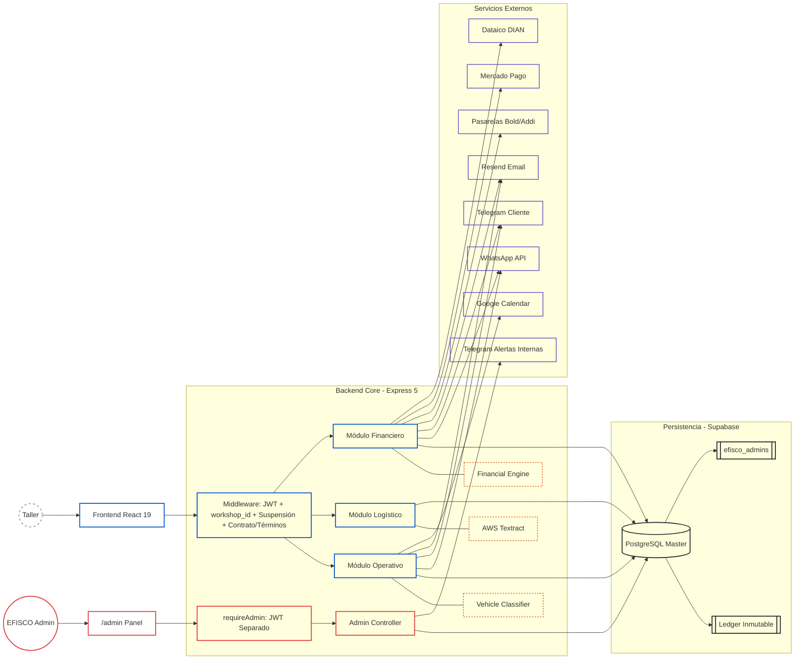
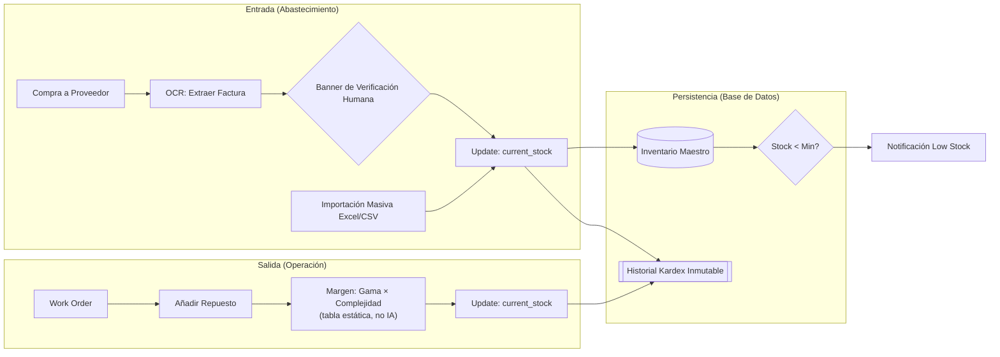

# Arquitectura

> Ver también: [README](../README.md) · [SECURITY](SECURITY.md) · [API](API.md) · [BUSINESS_RULES](../Reglas%20de%20Negocio%20y%20Finanzas/BUSINESS_RULES.md) · [OPERATIONS](../Reglas%20de%20Negocio%20y%20Finanzas/OPERATIONS.md) · [INVENTORY](../Reglas%20de%20Negocio%20y%20Finanzas/INVENTORY.md) · [FINANCE](../Reglas%20de%20Negocio%20y%20Finanzas/FINANCE.md) · [FINANCIAL_ENGINE](../Reglas%20de%20Negocio%20y%20Finanzas/FINANCIAL_ENGINE.md) · [BILLING](../Reglas%20de%20Negocio%20y%20Finanzas/BILLING.md) · [GROWTH_ACQUISITION](../Estrategia%20Comercial%20y%20Ventas/GROWTH_ACQUISITION.md) · [PRICING_SALES](../Estrategia%20Comercial%20y%20Ventas/PRICING_SALES.md) · [MONITORING](../MONITORING.md) · [TESTING](../TESTING.md)

El sistema utiliza una arquitectura **multi-tenant** con aislamiento de datos verificado en cada endpoint del backend (`workshop_id` de la sesión) y un núcleo de cálculo financiero inmutable. La validación de acceso cruzado entre talleres es responsabilidad de la aplicación, no de la base de datos — ver el detalle completo en [SECURITY.md](SECURITY.md).

---

## 1. Mapa de Componentes y Capas



*Nota: WhatsApp, Telegram y Resend Email forman una cascada de fallback (WhatsApp → Telegram → Email), no tres canales independientes — ver [OPERATIONS.md](../Reglas%20de%20Negocio%20y%20Finanzas/OPERATIONS.md) para el orden real. Telegram Alertas Internas es un bot separado del bot de cliente (uso interno de monitoreo, ver [MONITORING.md](../MONITORING.md)).*

---

## 2. Ciclo de Vida Operativo (End-to-End)

> El canal `MSG` es una cascada de fallback — WhatsApp primero, Telegram si falla, Email (Resend) si ambos fallan — no un canal único (ver [OPERATIONS.md](../Reglas%20de%20Negocio%20y%20Finanzas/OPERATIONS.md)). Desde el 09-ago-2026 el QR de "Registro Seguro EFISCO" es el camino principal en Recepción, no WhatsApp (que además está deshabilitado en producción, ver `WHATSAPP_ENABLED` abajo).

```mermaid
sequenceDiagram
    autonumber
    participant C as Cliente
    participant R as Recepción
    participant B as Bahía (Ops)
    participant I as Inventario
    participant F as Finanzas
    participant MSG as Cascada (WhatsApp→Telegram→Email)
    participant EXT as Externos (DIAN/Pay)
    participant DB as Persistencia (DB)

    C->>R: Ingreso (Reporte de Fallo)
    activate R
    R->>C: QR de Registro Seguro EFISCO
    R->>B: Convertir a Orden de Trabajo
    activate B
    Note over B: El Classifier asigna Tier (Básico/Premium)
    deactivate R

    loop Durante el Servicio
        B->>I: Solicitar Repuesto
        activate I
        I->>DB: Validar Stock & TX
        DB-->>I: Confirmación
        I-->>B: Item Entregado
        deactivate I
        B->>B: Acumular Costos
    end

    B->>MSG: Aviso de Valor Tentativo
    MSG->>C: Notificación (precio estimado)

    B->>F: Finalizar y Liquidar
    activate F
    deactivate B

    rect rgb(0, 0, 0)
        Note over F, DB: Proceso de Cierre Contable (Fiscal 2026)
        F->>F: Calcular FinancialEngine
        F->>DB: Marcar Orden Completada
        F->>DB: Insertar Movimientos Ledger (atómico)
        F->>EXT: Emitir Factura & Procesar Pago
    end

    F->>MSG: Vehículo Listo + Factura Digital
    MSG->>C: Notificación (WhatsApp → Telegram → Email)
    deactivate F
```



---

## 3. Stack Tecnológico

| Capa | Tecnología | Rol |
|:---|:---|:---|
| UI | React 19 + Vite | SPA con routing client-side |
| Estilos | Tailwind CSS v4 | Design system utilitario |
| Estado | Zustand | `useAuthStore`, `useFinancialStore`, `useBillingStore`, `useThemeStore`, `useAdminStore`, `useInstallStore`, `useSetupStore`, `useLockStore`, `useProvidersStore`, `useCookieConsentStore`, `useInstallmentsStore`, `useCashFlowStore` |
| Backend | Express 5 + Node.js ESM | API REST con async/await nativo |
| Base de datos | Supabase (PostgreSQL) | Persistencia + aislamiento multi-tenant a nivel de aplicación |
| OCR | AWS Textract | Extracción de facturas de proveedores |
| Comunicaciones | Meta WhatsApp Cloud API | Notificaciones automáticas + envío de documentos (reporte de puntaje) |
| PDF server-side | Puppeteer + Chromium headless | Motor genérico HTML→PDF (`pdfRenderer.service.js`) reusado por las tres plantillas del sistema — reporte de puntaje, comprobante de pago (por cuota) y comprobante de venta (al liquidar) — así el backend es la única fuente tanto para la autodescarga del cliente como para el envío por WhatsApp: exactamente el mismo documento en los dos lugares, en vez de dos implementaciones distintas |
| Facturación | Dataico | Emisión DIAN electrónica (no bloqueante) |
| Excel server-side | `exceljs` | Genera el Libro Mayor único (`.xlsx` real) que descarga el contador — reemplaza los 6 reportes CSV anteriores |
| Calendario | Google Calendar API (`googleapis`) | Sincroniza órdenes de trabajo con el Google Calendar personal de cada persona (dueño + mecánicos), cada quien con su propia conexión OAuth — ver [OPERATIONS.md](../Reglas%20de%20Negocio%20y%20Finanzas/OPERATIONS.md#sincronización-con-google-calendar) y [SECURITY.md](SECURITY.md#google-calendar-y-tokens-oauth-por-persona-2026-07-27) |
| Pasarelas | Bold (físico/online/QR) + Addi (crédito) | Procesamiento de pagos |
| Crypto | Node.js `crypto.scrypt` | Hash de contraseñas admin (sin bcrypt) |
| Admin JWT | `jsonwebtoken` con `ADMIN_JWT_SECRET` | Token separado del JWT de talleres |
| PWA | `manifest.json` + `public/sw.js` + íconos maskable/any | Instalable como app desde el celular, con ícono correcto (margen de seguridad para el recorte automático del sistema). `sw.js` es un service worker mínimo sin caché — su único propósito es cumplir el requisito de instalabilidad de Chrome/Edge/Android para que el navegador dispare `beforeinstallprompt` (botón "Instalar" real en Landing/Auth, capturado en `useInstallStore`). `start_url: "/login"` (con `scope: "/"` explícito) — abrir el ícono instalado sin sesión activa lleva directo al login, no a la Landing de presentación |

---

## 4. Decisiones Técnicas Clave

- **Ledger Inmutable** — Cada movimiento financiero es append-only. Trazabilidad contable completa y auditable. Ver [FINANCIAL_ENGINE.md](../Reglas%20de%20Negocio%20y%20Finanzas/FINANCIAL_ENGINE.md#libro-auxiliar-cash-flow-ledger).
- **Pipeline OCR asíncrono** — Procesamiento de facturas en segundo plano vía AWS Textract.
- **Tarificación dinámica por tier** — Clasificador de vehículos asigna el tier automáticamente (Básico/Premium).
- **Margen what-if fiel** — El cálculo de proyección del [Panel de Equilibrio](../Reglas%20de%20Negocio%20y%20Finanzas/FINANCE.md#panel-de-equilibrio-equilibrio) usa costo variable absoluto por orden (`varCostPerOrder`), no margen porcentual fijo. Al subir precios, el margen % mejora automáticamente porque los costos de partes no suben.
- **Gotcha real de `html2canvas`/`html2pdf.js` (PDF en blanco)** — posicionar el contenedor a capturar con coordenadas muy negativas (`position:fixed;top:-9999px`) es una causa documentada de canvas vacío en algunos navegadores. El patrón correcto en este proyecto (`generateScorePDF.js`): `position:absolute` dentro del flujo normal del documento + `opacity:0;pointer-events:none`, más un frame de espera (`requestAnimationFrame` doble) antes de capturar, para darle tiempo al navegador de terminar el layout/paint del contenido recién inyectado.
- **Mobile-first auditado, no solo "responsive por Tailwind"** — tener clases `md:`/`sm:` no garantiza que algo se vea bien en un celular real; varios contenedores con `flex ... items-center` (sin `w-full`) se centraban en vez de estirarse en mobile, causando overflow simétrico en ambos lados (ej. filtros de Bahía, footer). El patrón correcto en este proyecto: contenedores con `w-full sm:w-auto` + filas de tabs/filtros con `overflow-x-auto` explícito (nunca asumir que el contenido cabe). Modales largos siempre con `max-h-[90vh] flex flex-col` + región central `overflow-y-auto flex-1` (header/footer fijos) — sin esto, contenido más alto que la pantalla queda inaccesible en el celular, sin forma de hacer scroll.
- **Un evento del navegador que solo se dispara una vez debe vivir en un store global, no en un hook local de página** — `beforeinstallprompt` (botón "Instalar" de Landing/Auth) se capturó primero en un hook dentro de cada página; el navegador lo dispara una única vez, así que al navegar de `/` a `/login` (React Router desmonta una página y monta la otra) el hook nuevo arrancaba en `null` y el evento ya capturado se perdía — el botón "desaparecía" al cambiar de pantalla. Corregido moviendo la captura a `useInstallStore` (Zustand), inicializado una sola vez en `App.jsx`: cualquier evento de navegador que sea "úsalo o piérdelo" (single-fire) necesita vivir por encima del ciclo de vida de las páginas que lo consumen.
- **Un preview/simulador en el frontend debe reusar las mismas fórmulas del motor real del backend, no reimplementarlas con sus propias constantes** — tanto `ModalLiquidacion.jsx` (preview de liquidación) como `useFinancialStore.calculateLiveInvoice` (simulador, sin caller activo hoy) traían su propia copia de la lógica de IVA/retenciones con tasas fijas (19%, 4%, 0.966%) y sin el umbral UVT ni el gate por régimen del taller que sí aplica `financialEngine.liquidateClientInvoice` — dos implementaciones del mismo cálculo que fueron divergiendo con el tiempo a medida que el backend se volvía configurable (rev. 25, bug #11), hasta que el cajero podía ver un "Total Neto" en pantalla distinto del que de verdad se liquidaba. Corregido replicando exactamente los mismos parámetros y comparaciones que el backend (incluida la lectura explícita contra `null`/`undefined` en vez de `|| default`, ver [FINANCIAL_ENGINE.md](../Reglas%20de%20Negocio%20y%20Finanzas/FINANCIAL_ENGINE.md)) — cualquier preview de un cálculo que también existe en el backend debe leer su configuración real (`workshop_config`) y replicar la fórmula tal cual, nunca hardcodear valores "razonables" por separado. **La misma categoría de bug reapareció en rev. 40**, más angosta: el preview ya replicaba la fórmula completa de retenciones/IVA, pero le faltaba una sola línea del backend — el IVA (19%) que el motor cobra sobre la comisión de la pasarela misma (`commissionVat`) antes de restarla del neto. Un "replicar la fórmula" no es una tarea de una sola vez: cada línea nueva que se agregue al motor real (aquí, la retención de la pasarela sobre el giro de rev. 38) es candidata a quedar fuera del preview si no se audita explícitamente contra el código del backend línea por línea al momento de tocarlo.
- **Un "saldo"/"pasivo" que se muestra en dos pantallas distintas necesita el mismo alcance de fechas, no solo la misma fórmula** — `getDashboardSummary` (Dashboard Financiero) calcula `financialEngine.calculateGlobalHealth` sobre TODO el histórico del ledger, sin filtro de fecha; `getCashFlow` (Flujo de Caja) reimplementaba la misma idea a mano, pero solo con los asientos dentro del rango `[from,to]` elegido (por defecto, el mes en curso), sin encadenar el saldo/IVA acumulados de meses anteriores. Para cualquier taller con más de un mes de uso, "Saldo Real"/"IVA Pendiente DIAN" de las dos pantallas divergían — no por una fórmula distinta, sino porque una veía todo el histórico y la otra solo una ventana. Corregido haciendo que `getCashFlow` calcule también, con `calculateGlobalHealth`, el saldo/IVA reales de antes de `from` y la posición acumulada real hasta `to` (ver [FINANCIAL_ENGINE.md](../Reglas%20de%20Negocio%20y%20Finanzas/FINANCIAL_ENGINE.md#3-salud-financiera-global-calculateglobalhealth)) — una métrica de "posición" (saldo, pasivo) siempre debe ser acumulada hasta una fecha de corte; solo las métricas de "flujo" (ingresos, egresos de ESTE período) deben acotarse al rango elegido.
- **Un "ingreso" en el panel de EFISCO debe verificar de QUIÉN es esa plata, no solo sumar el ledger que esté más a mano** — `getStats` (Panel Admin EFISCO) sumaba `cash_flow_ledger`/`INC_GROSS`, que es la venta bruta de CADA TALLER a sus propios clientes, y lo mostraba como "Ingresos plataforma"/"Ingresos procesados" de EFISCO — un número sin relación con lo que los talleres realmente le pagan a EFISCO (podía superar los $40M con solo un puñado de talleres activos, frente al ingreso real de EFISCO, órdenes de magnitud menor). El ledger correcto para el ingreso de EFISCO es `efisco_accounting_ledger` (`direction='income'`) — un ledger completamente aparte, sin `workshop_id`, que ya usaba correctamente la pestaña Contabilidad del mismo panel. En un sistema con dos "libros" distintos (el de cada taller y el propio de EFISCO), cualquier KPI nuevo debe declarar explícitamente de cuál libro sale, y el texto de la UI debe decirlo tal cual — el propio subtítulo ("facturado por todos los talleres") ya delataba el bug antes de que alguien mirara el código.
- **Un default hardcodeado que en realidad es un umbral legal debe declarar su fecha de vigencia y su riesgo de cambiar** — los topes UVT de retención (`retention_threshold_parts_uvt`, `retention_threshold_services_uvt`) parecían una constante estable ("27 UVT, así ha sido siempre"), pero el Decreto 572/2025 los bajó, el Consejo de Estado los suspendió y luego revivió el decreto en cuestión de semanas (mayo-julio 2026) — ambos valores cambiaron 3 veces en menos de 60 días por una demanda de nulidad todavía en curso. Corregido actualizando los defaults a los vigentes hoy (10/2 UVT) y agregando una alerta permanente en el panel del contador (no solo un comentario en el código) recordando verificar la norma vigente — un valor que la ley puede cambiar por fuera del control del software necesita ser fácil de corregir Y visible que puede estar desactualizado, no solo "configurable en algún input".

- **Un mensaje de error que se muestra al usuario nunca debe ser el `.message` crudo de la base de datos** — casi todos los controllers (109 sitios en 12 archivos) hacían `res.status(500).json({ error: error.message })` sin distinguir un `Error` de aplicación (ya en español, ej. "Repuesto no encontrado") de un error real de Postgres/PostgREST (constraints, nombres de columna, "duplicate key value violates unique constraint..."), que terminaba mostrado tal cual al cajero/dueño. Corregido con `backend/utils/dbErrors.js:friendlyDbError` — distingue por `error.code` (SQLSTATE, solo presente en errores reales de base de datos): con `code`, mapea a un mensaje en español; sin `code`, devuelve `error.message` intacto (mismo comportamiento de siempre para los `throw new Error(...)` de aplicación). El detalle técnico real sigue disponible para quien loguee `error` server-side — la función solo decide qué cruza la frontera hacia el cliente. Patrón a replicar: cualquier controller nuevo debe usar `friendlyDbError(error)` en su catch de 500, nunca `error.message` a secas.
- **Un debounce o una petición dependiente de un id cambiante necesita un `useEffect` con cleanup real, no un `setTimeout`/fetch suelto dentro de un event handler** — 2 instancias del mismo bug encontradas en rev. 42: `AdminWorkshops.jsx:handleSearch` armaba su debounce (`setTimeout` + `return () => clearTimeout(t)`) dentro de un `onChange` — ese `return` no lo ejecuta nadie fuera de un `useEffect`, así que cada tecla disparaba un fetch nuevo sin cancelar los anteriores (fetch por letra + una respuesta vieja podía pisar resultados nuevos); y `Config.jsx` cargaba historial/métricas/pago-pendiente de un empleado en un `useEffect` keyed por su id, pero sin ningún guard contra la respuesta de un empleado anterior llegando tarde — abrir el panel de A y luego rápido el de B podía dejar el panel de B con datos de A. Ambos corregidos con las 2 técnicas estándar de React para "una respuesta async puede llegar después de que ya no aplica": debounce real dentro de un `useEffect(() => { const t = setTimeout(...); return () => clearTimeout(t); }, [dep])`, y un flag `cancelled` (seteado en el cleanup, chequeado antes de cada `setState` en el `.then()`) para peticiones en vuelo que dependen de un id que puede cambiar antes de que resuelvan.
- **Un componente de confirmación compartido necesita su propio `loading`, no depender de que cada caller cierre el modal a tiempo** — `ElegantConfirmModal.jsx` (7 usos en el proyecto) no tenía ningún prop de estado de carga; varios callers (`AdminWorkshops.jsx`, `Proveedores.jsx`, `Recepcion.jsx`) solo cerraban el modal en el `finally` de su petición, así que el botón de confirmar seguía clickeable mientras la petición estaba en curso — doble clic podía disparar dos DELETE seguidos. Otros callers (`Inventario.jsx`, `ModalLiquidacion.jsx`) sí cerraban el modal de forma síncrona antes de la petición y nunca tuvieron el bug — la inconsistencia entre callers del mismo componente era la señal de que la protección debía vivir en el componente, no repetirse (con suerte) en cada uso. Corregido agregando `loading` (opcional, backward-compatible) a `ElegantConfirmModal`: deshabilita ambos botones y el cierre por backdrop/X, muestra spinner + "Procesando...". `Config.jsx` comparte un solo modal genérico entre 3 acciones distintas — en vez de tocar los 3 handlers, se envolvió el `onConfirm` una sola vez en el punto donde se conecta al modal (`handleConfirmModalClick`), beneficiando a los 3 sin duplicar lógica.
- **Una escritura que depende de otra debe ordenarse por cuál es más barata de reintentar, no por el orden "natural" en que se piensan** — `settleOrder` insertaba el ledger financiero y RECIÉN DESPUÉS marcaba la orden como `completed`. Si ese segundo update fallaba (conexión caída, timeout), la orden quedaba sin `completed` y un reintento del usuario (mismo botón, mismo click) volvía a pasar la única guarda de idempotencia (que solo mira el `status` al principio de la función) y duplicaba TODOS los asientos financieros — ingreso, IVA, retenciones, comisiones, todo doblado. Corregido invirtiendo el orden: primero se marca la orden como `completed`, y el ledger se inserta después. Si el insert del ledger llegara a fallar en ese punto, el resultado es una orden completada sin su ledger (un hueco visible y auditable con una consulta simple), no dinero duplicado en el libro contable — entre dos escrituras dependientes que no pueden ser una sola transacción real, la más segura de reintentar debe ir de última.
- **El admin API de Supabase (`auth.admin.listUsers`) pagina — cualquier búsqueda por email debe agotar todas las páginas, no confiar en `perPage` alto** — `requestPasswordReset` y `getWorkshops` llamaban `listUsers({ perPage: 1000 })` una sola vez, así que el usuario 1001+ (por antigüedad de creación, no por orden alfabético) quedaba invisible: sin correo de recuperación, sin `owner_email` resuelto en el panel admin. Corregido con `backend/utils/authUsers.js` (`listAllAuthUsers`), que pagina hasta que una página devuelve menos de `perPage` resultados — cualquier consumidor nuevo que necesite buscar o mapear por email debe reusar este helper en vez de una llamada suelta.
- **Una regla de negocio corregida en un solo lugar tiende a reaparecer en cualquier otro lugar que la reimplemente por su cuenta — un fix necesita un utilitario compartido, no una corrección puntual** — el bug de "hoy en Colombia ≠ hoy en UTC" (Colombia es UTC-5 fijo, sin horario de verano; cualquier acción entre las 7pm y medianoche hora local ya tiene un `created_at` UTC del día/mes siguiente) ya se había corregido dos veces por separado, cada vez a mano: en `getMonthlyBooks` (rev. 25/Bug #14, cierre de libros mensuales) y en `Cobros.jsx` ("Vencida"). Ninguna de las dos correcciones se extrajo a un helper reusable, así que en rev. 47 el mismo bug apareció intacto en otros 17 sitios que también calculaban "hoy"/"mes en curso" con `new Date().toISOString().split('T')[0]`/`.substring(0,7)` cada uno por su cuenta — Flujo de Caja (el reporte que lo hizo evidente), el badge de cuotas vencidas del Dashboard/Sidebar (que ya tenía el fix correcto al lado, en `Cobros.jsx`, sin que nadie lo reusara), el score de riesgo de clientes, comisiones de mecánicos, KPIs del panel admin, kardex de inventario, y las fechas por defecto de varios formularios. Corregido de raíz con `frontend/src/utils/localDate.js` / `backend/utils/localDate.js` (espejo, mismo patrón que `ledgerLabels.js`/`financialEngine.js`) — cualquier cálculo nuevo de "hoy" o "mes en curso" en este proyecto debe importar de ahí, nunca instanciar su propio `new Date().toISOString()`. Un hallazgo más profundo de la misma revisión: el filtro de rango de `getCashFlow`/`getCompletedOrders` recibía `from`/`to` del frontend como timestamps SIN offset de zona horaria, y Postgres los interpretaba con el timezone de la sesión (UTC) — un bug de un nivel más abajo que el de "cómo se muestra la fecha", este sí capaz de traer datos incorrectos de la base, no solo mostrarlos mal (helper `asBogotaIso`).

**Misma familia de bug, variante distinta, reapareció en 2026-07-29**: no es el cálculo de "hoy"/rango de arriba, sino `toLocaleString`/`toLocaleDateString`/`toLocaleTimeString` llamados en el **backend** sin `timeZone` explícito — el locale `'es-CO'` solo controla el idioma del formato (nombres de mes, separadores), NO la zona horaria; sin `timeZone`, JavaScript usa la del proceso de Node, que en producción corre en la nube (normalmente UTC), no en Bogotá. Encontrado en 4 sitios que generan documentos reales para el usuario final: la columna "Fecha" del Libro Mayor (`finance.controller.js:generateLedgerBook`), el Comprobante de Pago y el Comprobante de Venta (`paymentReceiptTemplate.js`/`saleReceiptTemplate.js`, enviados por WhatsApp), y el reporte de Score (`scoreReportTemplate.js`) — cualquier evento entre las 7pm y medianoche hora Bogotá aparecía fechado al día siguiente en estos documentos. Corregido agregando `timeZone: 'America/Bogota'` explícito en cada llamada — **excepto** `saleReceiptTemplate.js`'s `due_date` (columna `date` pura, sin hora), que se ancla a `timeZone: 'UTC'` en vez de Bogotá: `new Date('YYYY-MM-DD')` ya parsea como medianoche UTC, así que convertir esa fecha a Bogotá (UTC-5) correría el día calendario al anterior — el fix correcto para un valor `date` puro es preservar el día tal cual, no reinterpretarlo como un instante real. A diferencia del bug de arriba (que sí tenía un helper centralizado, `localDate.js`, que nadie reusó), esta variante no tenía ningún caso previo corregido de qué copiar — no existía un wrapper compartido para "formatear un timestamptz en hora de Bogotá para mostrárselo al usuario", así que cada sitio necesitó el fix a mano; candidato a extraerse a un helper si aparece una quinta ocurrencia.

- **En este repo no existía convención de migraciones de esquema** (rev. 49): no hay `migrations/`, `supabase/migrations/` ni un runner — los cambios de esquema se aplicaban a mano vía SQL Editor de Supabase, y el único artefacto versionado era `backend/backup/efiscodb.sql` (un `pg_dump` completo, snapshot, no un historial incremental). Al agregar `service_catalog.gama`/`complejidad` se creó `backend/scripts/migrations/` con un primer archivo `.sql` fechado (`ALTER TABLE` plano, sin runner) — sin credenciales de conexión directa a Postgres (solo `SUPABASE_SERVICE_ROLE_KEY`, que habla REST/PostgREST, no DDL), el cambio de esquema lo debe correr el usuario a mano en el SQL Editor; el asistente no tiene forma de ejecutar DDL por su cuenta en este proyecto. Los scripts de backfill/corrección de datos (uso único, nunca corridos por el asistente) viven en `backend/scripts/` directamente, con el mismo patrón: dry-run por defecto, `--confirm` + confirmación escrita para aplicar de verdad (ver `backfill-historical-double-entry.mjs`, `backfill-document-numbers.mjs`, `fix-opening-balance-double-entry.mjs`).
- **Primera función de Postgres (RPC) de este proyecto (2026-07-29) — el "sin RPC" de arriba dejó de ser una regla absoluta.** `documentNumbering.js` reclamaba el consecutivo del Libro Mayor con un patrón optimista de dos pasos hecho desde el cliente (`SELECT` + `UPDATE...WHERE`, con reintento) explícitamente para NO necesitar una función de base de datos — comentario que quedó obsoleto: ese patrón dejaba una ventana real de desorden entre dos transacciones HTTP independientes (ver [FINANCIAL_ENGINE.md — reclamo atómico](../Reglas%20de%20Negocio%20y%20Finanzas/FINANCIAL_ENGINE.md#número-de-documento-2026-07-28)), y cerrarla de verdad exigía que el reclamo del consecutivo y el insert de las filas del comprobante ocurrieran en una sola transacción — algo que dos llamadas HTTP separadas de PostgREST no pueden garantizar sin una función que las una. Se agregó `scripts/migrations/2026-07-29_atomic_document_number_claim.sql` con dos funciones `plpgsql`, aplicadas a mano en el SQL Editor igual que cualquier otro cambio de esquema (mismo flujo de arriba, sin runner). Lección: evitar RPC es una buena heurística por defecto (menos piezas móviles, todo el cambio vive en JS versionado) hasta que la propia correctitud del dato depende de una garantía transaccional que el cliente no puede dar por sí solo — ahí el RPC no es una preferencia de estilo, es la única forma correcta.
- **Un contenedor Docker local puede acaparar un puerto y servir código viejo sin avisar** (rev. 49): además del `node server.js`/`nodemon` de siempre, existe `backend/docker-compose.yml` (contenedor `efisco-api`, imagen con el código *horneado* en el build — sin bind mount), que puede quedar corriendo horas después de haberlo levantado una vez. Si además hay un `node server.js` local sobre el mismo puerto 3000, ambos procesos aparecen en `netstat`/`docker ps`, y las peticiones pueden estar llegando al contenedor viejo — los síntomas son confusos porque el request SÍ llega a un Express real y responde 2xx coherente (mismo mensaje, misma forma de JSON), solo que con la lógica de antes del último cambio; en este caso, una columna nueva que el backend debía persistir llegaba `null` pese a que el payload del frontend y el código en disco eran correctos. Señal para reconocer el patrón: un cambio de backend que compila y pasa sus tests pero no se refleja al probar en vivo → verificar `docker ps` antes de sospechar del código.
- **Una función ya escrita puede quedar como código muerto esperando a que el resto del sistema la alcance** (rev. 49): `backend/utils/pricing.js:getServiceMargin` (con tests en `pricing.test.js` que documentan la tabla completa) existía desde antes de esta revisión, sin ningún caller en producción ni las columnas de BD (`service_catalog.gama`/`complejidad`) que necesitaba para ser útil — quedó ahí, probada pero inerte, hasta que una imagen de referencia del usuario (tabla de márgenes por Gama/Complejidad) resultó coincidir exactamente con esa función ya implementada. Antes de construir una feature nueva "desde cero" vale la pena buscar si ya hay una función con el nombre/forma correcta en `utils/` — puede que ya esté escrita y solo falte conectarla.

- **Un elemento persistente de UI (drawer/sidebar) no puede abrirse/cerrarse en función de "algún paso de la secuencia lo necesita" — tiene que ser "el paso ACTUAL lo necesita"** (`frontend/src/utils/tour.js`, rev. 50): la guía de usuario móvil (driver.js) chequeaba, al arrancar, si *algún* paso de la secuencia completa apuntaba al `<aside>` del menú — si sí, abría el drawer para TODA la duración del tour. El tour de Inicio termina señalando el menú principal, así que sus primeros 4 pasos (título, bahía, financiero, mes) se resaltaban con el drawer + su overlay ya tapando el contenido detrás. Corregido moviendo la apertura/cierre del drawer a hooks `onNextClick`/`onPrevClick` en el `popover` del paso vecino al de `aside` — se abre/cierra justo en la transición hacia/desde ese paso puntual (esperando el fin de la transición CSS de 500ms antes de dejar que driver.js mida la posición del elemento), no al inicio del tour completo.
- **Un paso de un tour guiado que apunta a un elemento condicional puede quedar "flotando" sin avisar** (rev. 50): dos pasos del tour de Equilibrio (`.equilibrio-grafico`, `.equilibrio-whatif`) solo existen en el DOM si `hasData` es verdadero (ver [FINANCE.md](../Reglas%20de%20Negocio%20y%20Finanzas/FINANCE.md#panel-de-equilibrio-equilibrio)) — si el selector no existe, driver.js no lanza error: cae a un elemento dummy de 0×0 centrado en pantalla y muestra el popover ahí, sin nada resaltado, una experiencia confusa sin ninguna señal de qué salió mal. `tour.js` ahora filtra, antes de arrancar, cualquier paso cuyo `document.querySelector(step.element)` no devuelva nada (excepto `aside`, siempre presente aunque oculto) — un tour con pasos condicionales debe verificar existencia real en el DOM, no asumir que el elemento que existía cuando se escribió el tour sigue montado.
- **Una guarda contra respuesta-fuera-de-orden es barata de agregar preventivamente, incluso sin poder confirmar que el bug ya ocurrió** (`Config.jsx:fetchEmployees`/`fetchServices`, rev. 50): mismo patrón ya documentado arriba (rev. 42) para el panel de detalle de un empleado, aplicado ahora a las dos listas completas del catálogo (servicios, equipo) — un contador de petición (`useRef`, incrementado al disparar cada fetch) que descarta cualquier respuesta que no sea la de la última petición en vuelo. A diferencia del bug de rev. 42, acá **no se confirmó una reproducción real**: la sospecha inicial (la lista no se actualizaba tras crear un registro) resultó ser, al probarlo con calma paso a paso, una lectura apresurada de la UI antes de que el fetch en curso resolviera — no un bug de la app. La guarda se dejó de todos modos por ser el mismo patrón de bajo costo/alto valor que ya probó su utilidad en rev. 42, no como confirmación de un defecto encontrado.
- **Un pipeline de render externo (fuente de contenido de una página pública) no necesita vivir en el repo de la app ni depender de sus mismas herramientas** (`media/hf-project/`, rev. 50): los 5 videos de [Demo pública](../Reglas%20de%20Negocio%20y%20Finanzas/BUSINESS_RULES.md#demo-pública-demo-rev-50) se generan con [HyperFrames](https://github.com/heygen-com/hyperframes) (HTML+GSAP → MP4 vía Chrome headless + `ffmpeg`), un proyecto Node independiente fuera de `frontend`/`backend`, con su propio `package.json` y dependencia de sistema (`ffmpeg` en el `PATH`, no en `node_modules`). El único acoplamiento con la app es unidireccional y manual: los `.mp4`/`-poster.jpg` renderizados se copian a mano a `frontend/public/videos/demo/` — no hay build step ni CI que los regenere automáticamente. Iterar sobre la calidad/diseño de los videos (tipografía, animación, `--crf`) no requiere tocar la cuenta de prueba ni recapturar pantallas: las capturas fuente ya están en disco (`media/hf-project/assets/`).
- **Un botón fullscreen sobre un `<video>` necesita un fallback propietario para iOS Safari, no solo la Fullscreen API estándar** (`Demo.jsx:handleFullscreen`, rev. 50): `video.requestFullscreen()` no existe en iOS Safari — ahí el único camino es `video.webkitEnterFullscreen()`, una API que solo funciona invocada directamente sobre el elemento `<video>` (no sobre un contenedor `<div>` envolvente, a diferencia del resto de navegadores). Los controles nativos (`controls={isFullscreen}`, con el estado sincronizado vía los eventos `fullscreenchange`/`webkitfullscreenchange`) solo se muestran mientras dura la pantalla completa, para que el preview en la página quede limpio el resto del tiempo.
- **Un `border-2 border-transparent` que solo se vuelve visible en `:focus` es, en la práctica, invisible en modo oscuro hasta que se interactúa** (rev. 51): 47 inputs/selects/textareas en 8 archivos (`Inventario.jsx`, `Config.jsx`, `Recepcion.jsx`, `Bahia.jsx`, `DashboardFinanciero.jsx`, `ContadorInventario.jsx`, `OpeningBalanceModal.jsx`, `ContadorPanel.jsx`) usaban el mismo patrón — borde transparente en reposo, coloreado (`focus:border-slate-900 dark:focus:border-white`, con 2 variantes puntuales en azul/esmeralda) solo al enfocar. En modo claro el `shadow-inner` y el contraste contra el fondo blanco disimulaban la ausencia de borde; en modo oscuro, con el input y la tarjeta contenedora en tonos oscuros similares, el campo quedaba sin ningún borde visible hasta tocarlo — reportado por el usuario ("en modo oscuro no se ve nada"). Corregido reemplazando `border-transparent` por `border-slate-200 dark:border-slate-700` (un borde neutro visible en ambos modos) en los 8 archivos, sin tocar los colores de `focus:` ya definidos por cada uno.
- **Un texto que rota entre variantes de distinto largo no puede reemplazar el elemento completo — necesita reservar el espacio de la variante más alta** (`Landing.jsx`, 2026-07-25): el titular del hero rota entre 3 frases (`HEADLINES`) cada 4.5s reemplazando el `<h1>` completo (`key={headlineIdx}` + fade). Como las 3 frases tienen distinto largo (una envuelve a 3 líneas en pantallas angostas, las otras a 2), el alto del `<h1>` cambiaba en cada rotación y empujaba el párrafo de abajo ("EFISCO es el sistema operativo...") — un salto molesto justo mientras el usuario lo estaba leyendo, reportado como "da toc". Corregido apilando las 3 variantes en la misma celda de CSS Grid (`grid` + `[grid-area:1/1]` en cada una) en vez de montar solo la activa: el navegador dimensiona el contenedor por el contenido más alto de TODAS las celdas superpuestas, así que el alto queda fijo sin importar cuál esté visible; el cruce entre variantes pasa a ser solo de opacidad (`animate={{opacity: i === headlineIdx ? 1 : 0}}`), nunca de montaje/desmontaje. Patrón reusable para cualquier rotador de texto/contenido de largo variable que no deba mover el layout de alrededor.

- **Una integración con el calendario personal de alguien no puede tener una cuenta "maestra"** (Google Calendar, 2026-07-27): OAuth de Google no permite que una app cree eventos en el calendario de una persona sin que esa persona misma haya dado su consentimiento — así que "sincronizar las órdenes del taller" no es una integración única del dueño, es N conexiones independientes (dueño + cada mecánico que el dueño habilite), cada una con su propio `refresh_token`. `googleCalendarService.syncWorkOrder` resuelve el empleado-dueño internamente en cada llamada (no depende de `req.user`, porque quien crea/edita la orden no siempre es el dueño) y sincroniza en paralelo a cada persona conectada y habilitada, ignorando en silencio (fire-and-forget, `.catch(() => {})`) a quien no lo esté — un mecánico sin conectar simplemente no recibe eventos, sin que eso bloquee ni degrade la creación de la orden. Ver el flujo funcional completo en [OPERATIONS.md](../Reglas%20de%20Negocio%20y%20Finanzas/OPERATIONS.md#sincronización-con-google-calendar) y el manejo de tokens en [SECURITY.md](SECURITY.md#google-calendar-y-tokens-oauth-por-persona-2026-07-27).

- **Una convención de signo propia puede cuadrar puertas adentro y seguir estando mal — el criterio real es si sobrevive al cruzar hacia un sistema externo que sí aplica la regla estándar** (Saldo Inicial, 2026-07-28): `OPENING_BALANCE` se insertaba como una sola línea `CREDIT` a Bancos, y el resto del motor (`openingBalanceValue`, `calculateGlobalHealth`) leía ese mismo `CREDIT` como "aumenta" — internamente autoconsistente, los totales de Finanzas/Flujo de Caja cuadraban. Pero esa convención está al revés de la partida doble real (un Activo aumenta por DÉBITO), y sin contrapartida el asiento nunca estuvo balanceado — solo que nada dentro de EFISCO lo exigía. El bug se volvió visible por dos caminos distintos, ninguno de los dos "los totales están mal": (1) el contador lo detectó al pensar en cómo se vería importado a Siigo/Alegra (un sistema que sí aplica la regla estándar, donde ese `CREDIT`-solo se lee como una reducción), y (2) una función de UI ya escrita correctamente (`getMovementFormatting`, que si aplica la regla estándar de Activo) ya pintaba esa fila en rojo — la inconsistencia estaba señalizada dentro de la propia app antes de que nadie la notara en los totales agregados. Lección: cuando una parte del sistema (una función de negocio) ya aplica la regla contable real y otra (el insert que genera los datos) usa una convención propia "que da el mismo resultado", ambas van a divergir tarde o temprano — y el punto de divergencia rara vez es donde se originó el bug. Ver [FINANCIAL_ENGINE.md](../Reglas%20de%20Negocio%20y%20Finanzas/FINANCIAL_ENGINE.md#saldo-inicial--partida-doble-2026-07-28).
- **Un número de comprobante no puede recalcularse en el momento de exportar — tiene que persistirse en el instante en que el evento ocurre** (Número de Documento, 2026-07-28): la primera versión de esta idea calculaba el consecutivo (`FV-`/`CP-`/etc.) al vuelo dentro de `generateLedgerBook`, agrupando filas por `work_order_id`/`related_purchase_id` en el momento de exportar. El problema: si el contador exporta solo febrero hoy y marzo-febrero el mes que viene, un evento de febrero podría numerarse distinto entre ambas exportaciones según qué otras filas entraron al cálculo — rompiendo la referencia que el contador ya usó para importar el mes anterior a Siigo/Alegra. Corregido asignando el número una sola vez, en el `INSERT` original (`backend/utils/documentNumbering.js`, contador atómico por taller con el mismo patrón optimista que `dataico.service.js:claimInvoiceNumber`), y solo leyéndolo tal cual al exportar. Cualquier identificador que un sistema externo vaya a usar como referencia estable debe nacer en el momento del evento, no derivarse de una consulta que puede devolver resultados distintos según cuándo y con qué filtro se corra. El formato de ese consecutivo se corrigió una segunda vez el 2026-07-29 (quitarle el `padStart(3,'0')` que lo dejaba en `ASI-001` en vez de `ASI-1`) — el consecutivo por prefijo en sí nunca estuvo mal, solo el padding.
- **Un dato que el contador pide para un reporte no debe editarse desde el panel del contador — debe capturarse donde vive la fuente real del dato** (Tercero completo del Libro Mayor, 2026-07-28/29): el primer intento de agregar Tipo de Documento/Contribuyente/Dirección/Ciudad/Correo/Teléfono para el Excel puso un modal de edición completo dentro de `ContadorProveedores.jsx` (`/contador` → Proveedores) — parecía el lugar obvio porque fue el contador quien pidió el reporte. Se revirtió el mismo día: el contador no es quien conoce la dirección o el correo real de un proveedor, es el **dueño** (que ya lo registra en `Proveedores.jsx`) o el **propio cliente** (que ya se auto-registra en `ClienteRegistro.jsx`). El dato terminó agregado a esos dos formularios existentes, no a uno nuevo del contador — la pregunta correcta ante "¿dónde va este campo?" no es "¿quién lo va a usar?" sino "¿quién es la única persona que puede saber si es correcto?". Ver [FINANCIAL_ENGINE.md](../Reglas%20de%20Negocio%20y%20Finanzas/FINANCIAL_ENGINE.md#tercero-completo--tipo-de-documentocontribuyente-dirección-ciudad-correo-teléfono-2026-07-29).
- **Un bug de "falta el asiento contable" tiende a repetirse en cualquier endpoint hermano que haga lo mismo por otro camino, no solo en el que se reportó** (Inventario Inicial, 2026-07-28): se corrigió `addStandaloneInventory` (alta de un ítem nuevo) para que insertara su partida doble — pero `updateStock` ("Añadir Stock", sumarle unidades a un ítem que ya existe) hacía exactamente lo mismo por un endpoint distinto, con el mismo gap, y no se tocó en la primera pasada porque el reporte del usuario no lo mencionó explícitamente. Se encontró recién al investigar por qué un taller específico tenía inventario "que no se le puso" — grepeando `current_stock` en el controller completo, no solo el endpoint ya señalado. Antes de dar por cerrado un bug de "esta acción no genera su asiento/registro/notificación", vale la pena buscar TODOS los caminos que llegan al mismo efecto (aquí, cualquier lugar que toque `inventory_transactions` con `type='invoice'`), no solo el que el usuario usó para notarlo. Corregido extrayendo la lógica compartida a `postInventoryOpeningBalance` (helper único, usado por ambos endpoints) para que un tercer camino futuro no pueda olvidarlo de nuevo tan fácil.
- **Un script de corrección de datos de un solo uso necesita revisar si YA se aplicó antes de replantear, no solo antes de escribir** (2026-07-28): tanto `fix-opening-balance-double-entry.mjs` como `backfill-inventory-opening-balance.mjs` seguían el patrón ya establecido (dry-run por defecto, `--confirm` + confirmación escrita para aplicar) pero ninguno de los dos verificaba, en el propio `planWorkshop`, si la fila que estaban a punto de listar ya tenía su corrección puesta — solo miraban la condición de entrada (`type='OPENING_BALANCE'` / `inventory_transactions` sin `purchase_id`), no si ya existía la fila de salida. Correr cualquiera de los dos una segunda vez (dry-run repetido no importa, pero un `--confirm` repetido sí) habría insertado pares duplicados o, en el caso del Saldo Inicial, vuelto a invertir un `impact` que ya estaba corregido, dejándolo mal otra vez. Se encontró al volver a correr el dry-run de `backfill-inventory-opening-balance.mjs` para verificar un caso puntual y ver que seguía listando alzas que el usuario ya había confirmado antes. Corregido agregando el cruce contra `cash_flow_ledger` antes de planear cada fila en ambos scripts. Todo script de este proyecto que "corrige N filas basándose en una condición" necesita una segunda condición — "y todavía no se corrigió" — antes de considerarse seguro para correr más de una vez, que es exactamente el escenario real (dry-run, revisar, dry-run de nuevo, `--confirm`) que este flujo de trabajo ya usa por diseño.
- **Una tabla hija nueva necesita sus Foreign Keys reales desde el primer día, no solo las columnas `_id` sueltas** (tablero de Herramientas, 2026-08-01): `work_order_tools` se creó con `work_order_id`/`tool_id` como `uuid` planos (sin `REFERENCES`), a diferencia de sus tablas hermanas (`work_order_mechanics_order_fkey`, etc.). El código igual compilaba y los `INSERT`/`DELETE` funcionaban — pero los `.select('tools(name)')`/`.select('work_orders(status)')` embebidos que la propia feature necesitaba (mostrar "Herramientas Usadas" en Bahía/Historial, calcular disponibilidad) fallaban en silencio: PostgREST necesita una FK real en catálogo para resolver un embed, el nombre de columna no basta, y el código no comprobaba el `.error` de esas consultas puntuales, así que el síntoma era simplemente "no se muestra nada", no un 500. Corregido agregando las FKs faltantes en una migración aparte una vez notado. Lección: al escribir una tabla hija que se va a LEER con `.select()` embebido (no solo insertar/borrar por id), la FK tiene que existir desde la migración original — verificar con un `.select('tabla_hija(campo_de_tabla_padre)')` real antes de dar la feature por terminada, no asumir que porque el `INSERT` no tira error la relación ya quedó bien declarada.
- **Estado que se puede calcular en el momento no debería guardarse y sincronizarse a mano** (disponibilidad de Herramientas, 2026-08-01): la primera versión de "Disponible"/"En uso" por herramienta fue un campo `status` escrito directamente al seleccionarla/liberarla en una orden — el mismo patrón de "dos escrituras que hay que mantener sincronizadas" que ya causó bugs reales en este proyecto (ver más arriba, Saldo Inicial/número de documento). Se reemplazó antes de llegar a producción por un cálculo en vivo (`tools.controller.js:getTools`, cuenta cuántas unidades siguen enlazadas — `work_order_tools` — a una orden con `status='ejecucion'` en el momento de la consulta) en vez de un campo que hay que actualizar en cada punto donde una orden cambia de estado (crearla, editarla, pausarla, finalizarla, eliminarla — 5 puntos de escritura distintos, cualquiera de los cuales podía olvidarse y dejar el conteo desincronizado). Costo: una query más por lectura. Beneficio: no puede desincronizarse nunca, porque no hay nada que sincronizar. Regla general de este proyecto: si un valor se puede derivar en el momento de leer, y el volumen de datos lo permite, mejor calcularlo que guardarlo — el riesgo de una escritura olvidada casi siempre pesa más que el costo de una consulta extra.
- **Gotcha real de `@mdi/react` (CJS puro) bajo Vite** (Herramientas, 2026-08-01): `import Icon from '@mdi/react'` (default import) puede traer el objeto de exports completo (`{Icon, Stack, default}`) en vez del componente — el paquete no tiene build ESM propio, y el interop de módulos de Vite/esbuild no siempre desenvuelve `module.exports.default` de forma confiable cuando el módulo también expone exports nombrados. Síntoma: `Element type is invalid: expected a string... but got: object`, apuntando al componente que renderiza el ícono, no al import en sí — no obvio de rastrear sin saber que el paquete es CJS. Fix: usar el import nombrado, `import { Icon } from '@mdi/react'`, que sí resuelve directo sin pasar por la ambigüedad del default. Cualquier librería de íconos/UI instalada que no declare `"type": "module"`/`exports` en su `package.json` es candidata al mismo problema — preferir el import nombrado si el paquete lo ofrece.

- **`frontend/public/sitemap.xml`/`robots.txt` para indexación en Google (2026-08-03)**: el sitemap solo traía `/` (nunca actualizado desde que se agregaron páginas públicas nuevas — Demo, Tarifas, Reportes Financieros, Soporte, legales). Se actualizó con las 8 URLs públicas reales (excluyendo `/login` — sin valor de SEO — y las rutas privadas/dinámicas: `/admin/*`, `/support-session`, `/cliente/registro/:workshopId/:intakeId`), y se agregó `robots.txt` (no existía) apuntando a `https://efisco.co/sitemap.xml` para que cualquier crawler lo encuentre sin depender de que alguien lo suba a mano a Search Console. Nota para SEO futuro: al no usar `react-helmet` ni SSR, todas las rutas comparten el mismo `<title>`/`<meta description>` del `index.html` — Google indexa el contenido real de cada página (ejecuta el JS al rastrear), pero el snippet en resultados de búsqueda es idéntico para todas.
- **Barrido de bugs de responsive mobile (2026-08-03)**, continuación del audit de rev. 51 (arriba) a más pantallas: contenido que se salía del borde de la pantalla (overflow horizontal sin scroll) y texto/botones mal alineados en celular, en `AdminAlerts.jsx`, `AdminAccounting.jsx`, `AdminReferrals.jsx`, `AdminPayouts.jsx`, `AdminWorkshops.jsx` (panel admin) y `FlujoCaja.jsx`, `Referidos.jsx`, `Soporte.jsx`, `Tarifas.jsx`, `Config.jsx`, `DashboardFinanciero.jsx`, `Inventario.jsx`, `Dashboard.jsx` (panel del taller) — mismo patrón ya establecido en este proyecto: contenedores `w-full sm:w-auto` en vez de `flex items-center` sin ancho explícito, filas de tabs/filtros/tablas con `overflow-x-auto` explícito. Confirma la lección de rev. 51: "tener clases `md:`/`sm:` no garantiza que algo se vea bien en un celular real" sigue apareciendo en pantallas nuevas hasta que se auditan una por una contra un dispositivo real, no solo contra el breakpoint del navegador.

- **Un prefetch "para que la siguiente pantalla cargue antes del click" no puede copiar la técnica del navegador si la app nunca hace una navegación de documento real** (`frontend/src/utils/routePreload.js`, 2026-08-14): `<script type="speculationrules">` (prerender nativo del navegador) no sirve en una SPA de React Router — los links pasan por `preventDefault()` + `pushState`, nunca ocurre la navegación de documento que dispara esa API. El prefetch se hizo a nivel de aplicación en su lugar: precargar el `import()` del chunk `React.lazy` de la ruta antes del click. Tres disparadores conviven en `Sidebar.jsx`/`AdminSidebar.jsx`: hover con debounce de 150ms en desktop (`scheduleHoverPreload`, para que barrer el menú con el mouse sin intención de entrar no dispare descargas de más), `touchstart` inmediato en móvil (sin debounce — el dedo ya está sobre el ítem exacto, no hay barrido accidental como con el mouse), e idle-prefetch de 1-2 rutas típicas por rol al montar el sidebar (`requestIdleCallback`, pensado para móvil, donde no siempre hay un gesto previo al primer tap real). Los tres pasan por el mismo choke point (`preloadRoute`), que respeta `navigator.connection` — si `saveData` está activo o `effectiveType` no es `'4g'` (bloquea 3G y por debajo), no se precarga nada, porque muchos talleres usan datos móviles limitados y un prefetch no pedido no debería consumírselos (decisión explícita del usuario sobre el umbral: cortar en 3G, no solo en 2G). `App.jsx` dejó de definir sus propios `import()` para las páginas lazy — todos vienen de `routeImports` en `routePreload.js`, la misma fuente que consumen los sidebars, para que el chunk que se precarga sea siempre el que la ruta real monta.

> Las decisiones de aislamiento multi-tenant, autenticación y control de acceso (admin separado, suspensión, contrato B2B, autorización del taller) están documentadas en **[SECURITY.md](SECURITY.md#decisiones-técnicas-de-seguridad)**.

---

## 5. Inventario y Kardex Inmutable

Trazabilidad total: cada movimiento físico genera un reflejo contable obligatorio en la base de datos.

El OCR nunca escribe directo a la base — siempre pasa por un banner de verificación humana antes de actualizar stock (ver [INVENTORY.md](../Reglas%20de%20Negocio%20y%20Finanzas/INVENTORY.md)). La importación masiva por Excel/CSV es una segunda entrada, independiente de la compra a proveedor. El margen de repuestos es una tabla estática por Gama × Complejidad, no un sistema de IA.



Detalle funcional del módulo de Inventario en [INVENTORY.md](../Reglas%20de%20Negocio%20y%20Finanzas/INVENTORY.md#inventario).

---

## Variables de Entorno

`backend/.env`:

```env
# Supabase
SUPABASE_URL=https://<project>.supabase.co
SUPABASE_SERVICE_ROLE_KEY=<service-role-key>
SUPABASE_ANON_KEY=<anon-key>

# JWT talleres (Supabase)
JWT_SECRET=<secret>

# JWT admin interno EFISCO (separado)
ADMIN_JWT_SECRET=<secret-admin>

# Dominio de las cookies httpOnly de sesión (efisco_token/efisco_admin_token,
# ver SECURITY.md → Migración de autenticación a cookies httpOnly). Solo para
# producción — DEJAR SIN CONFIGURAR en local, o el navegador descarta la
# cookie en localhost por no coincidir el dominio.
# En producción, con api.efisco.co como subdominio propio y dedicado del
# backend, también se puede DEJAR SIN CONFIGURAR: la cookie queda host-only
# (válida solo para api.efisco.co, que es el único host al que el frontend
# le pega) — funciona igual de bien que ponerla en .efisco.co, sin ampliar
# su alcance a efisco.co/www.efisco.co sin necesidad real. Verificado en
# producción sin esta variable seteada (rev. 48).
# COOKIE_DOMAIN=.efisco.co

# AWS Textract (OCR)
AWS_ACCESS_KEY_ID=<key>
AWS_SECRET_ACCESS_KEY=<secret>
AWS_REGION=us-east-1

# WhatsApp Meta Cloud API
#
# ESTADO (2026-08-18): el Business Manager "Efisco" completo fue DESACTIVADO
# PERMANENTEMENTE por Meta ("no cumple la Política de Comercio de WhatsApp
# Business") — afecta a AMBAS WABAs (producción EfiscoSAS y prueba), no solo
# al número real. Mientras la apelación ("Solicitar revisión" en
# business.facebook.com/business-support-home) no se resuelva, NINGÚN envío
# de WhatsApp llega, aunque el token/phone-id sean válidos.
#
# GOTCHA CRÍTICO descubierto el mismo día: con la cuenta desactivada, la API
# de Meta sigue devolviendo 200 OK + un `message id` como si el envío hubiera
# funcionado — whatsappService.sendMessage/sendDocument ven `success: true`
# y NUNCA caen a Telegram/Email, aunque el mensaje jamás llegue. No hay forma
# de detectar esto desde la respuesta síncrona (se necesitaría un webhook de
# status que EFISCO no tiene, solo manda saliente). Por eso, mientras la
# cuenta siga desactivada, hay que forzar el interruptor manual de abajo
# (WHATSAPP_ENABLED=false) — si no, `messagingChannelService` cree que
# WhatsApp funcionó y deja al cliente sin ningún comprobante.
WHATSAPP_TOKEN=<bearer-token>
WHATSAPP_PHONE_ID=<phone-id>
# El dominio del frontend (https://efiscosas.vercel.app) vive como prefijo
# estático dentro del botón "Visitar sitio web" de la plantilla
# `solicitud_datos_dian` en Meta — el backend solo manda el sufijo
# workshopId/intakeId como parámetro del botón, no la URL completa.
#
# Número de PRODUCCIÓN activo desde 2026-08-17: <numero-produccion> (EfiscoSAS),
# Phone Number ID <phone-number-id-produccion>, bajo la WABA "EfiscoSAS" (asset
# <waba-asset-id>, Business ID <business-id>) — distinta de la WABA de
# prueba que usa el número <numero-prueba> (Phone Number ID <phone-number-id-prueba>).
# El token de la WABA de prueba NO sirve para el número real: los tokens de
# WhatsApp Cloud API están scoped a la WABA, no solo al Phone Number ID —
# cambiar únicamente WHATSAPP_PHONE_ID sin cambiar también el token falla en
# silencio (o con error de permisos) al primer envío.
#
# Cómo se generó el token actual (permanente, vía Business Settings, NO el
# "Identificador de acceso" del panel Meta for Developers → Paso 1 Probar,
# que es temporal y queda atado a la WABA de prueba):
# 1. business.facebook.com/settings/system_users → usuario del sistema
#    existente ("Backend Efisco").
# 2. Configuración del negocio → Cuentas de WhatsApp → WABA "EfiscoSAS" →
#    Asignar personas → seleccionar el usuario del sistema → activar
#    permisos "Mensajes", "Números de teléfono (solo ver)" y "Plantillas de
#    mensajes (solo ver)" (acceso parcial, no total).
# 3. De vuelta en Usuarios del sistema → "Generar identificador" → app
#    "Efisco" → caducidad "Nunca" → permisos whatsapp_business_management +
#    whatsapp_business_messaging (vienen premarcados).
# Verificado con GET a graph.facebook.com/v20.0/<phone-id>?fields=
# display_phone_number,verified_name,quality_rating antes de darlo por bueno.
#
# WHATSAPP_ENABLED=false — interruptor manual, separado de si el token
# existe. Sirve para dos escenarios distintos: (1) "ya tengo el token de
# Meta pero aún no me verifican para producción", y (2) el caso real actual
# — la cuenta fue desactivada por Meta (ver arriba) y el gotcha de
# "éxito falso" hace que NO desactivarlo sea peor que no tener token. En
# ambos casos: whatsappService.isConfigured() devuelve false,
# messagingChannelService salta WhatsApp entero y va directo a Telegram →
# Email (ver cascada abajo). Quitar la variable (o ponerla en `true`)
# reactiva el intento de WhatsApp de inmediato — solo hacerlo después de
# confirmar que la apelación a Meta se resolvió (GET a graph.facebook.com
# como se explica arriba, y que "Estado de la cuenta" ya no diga
# "Desactivada" en business.facebook.com/settings/whatsapp_account).
WHATSAPP_ENABLED=false
#
# El `.env` local tiene el token/phone-id de la WABA de PRUEBA (para poder
# seguir probando el flujo sin depender de que Meta resuelva la apelación —
# el número de prueba SÍ entrega `hello_world`, aunque no plantillas
# propias). PENDIENTE en Render: replicar el par token/phone-id de la WABA
# de PRODUCCIÓN (no la de prueba) una vez la cuenta se reactive — mientras
# tanto, WHATSAPP_ENABLED=false en Render es más importante que cuál
# token/phone-id tenga cargado, por el gotcha del "éxito falso" de arriba.

# Telegram (canal de respaldo automático de WhatsApp, ver
# messagingChannel.service.js) — bot creado con @BotFather, gratis, sin
# verificación de negocio. Con estas 3 variables sin configurar, el sistema
# se comporta exactamente igual que antes (solo WhatsApp, sin respaldo).
# BACKEND_URL (ya usado por mercadopago.service.js) se reutiliza para armar
# la URL del webhook — no hace falta una variable nueva para eso.
#
# Desde 2026-08-18, messagingChannelService intenta WhatsApp primero (si
# está configurado) y SI EL ENVÍO FALLA, cae automáticamente a Telegram —
# ya no es "uno u otro" fijo por cliente. Motivo: la plantilla de
# Autenticación de WhatsApp (OTP de score) está bloqueada permanentemente
# por el umbral de volumen de Meta (ver más abajo), así que sin este
# fallback ningún cliente con Telegram vinculado podría recibir su código,
# aunque WhatsApp esté "configurado" a nivel servidor. Si el cliente no
# tiene Telegram vinculado (pero el bot SÍ está configurado en el
# servidor), el resultado es NO_CHANNEL_LINKED igual que antes — el
# frontend (Recepción) muestra el QR de vinculación en vez de un error
# crudo, sea cual sea el motivo real del fallo de WhatsApp.
#
# TERCER NIVEL (2026-08-18, mismo día — agregado tras el bloqueo de la
# cuenta de Meta): solo para `sendMessage`/`sendDocument` — el aviso de
# "vehículo listo" y los comprobantes de pago/venta al liquidar una orden
# o cobrar una cuota (billing.controller.js: settleOrder, payInstallment).
# Si WhatsApp Y Telegram fallan (o Telegram no aplica), cae a un correo vía
# Resend (ver RESEND_API_KEY más abajo) usando `clients.email` — campo
# ahora OBLIGATORIO desde el registro público del cliente
# (ClienteRegistro.jsx / clients.controller.js:publicRegister, validado
# también en el backend, no solo con `required` en el form) precisamente
# para que este tercer nivel siempre tenga a dónde caer. Deliberadamente
# NO se agregó a sendOTP/requestIntakeData/sendPriceChangeAlert — esos
# conservan su semántica NO_CHANNEL_LINKED tal cual (le dice al
# recepcionista que vincule Telegram), que no tiene sentido reemplazar por
# un correo en medio de esos flujos.
#
# `settleOrder`/`payInstallment` ahora ESPERAN (no fire-and-forget) el
# resultado de este envío y lo devuelven en la respuesta como
# `notification: { attempted, success, channel }` — el frontend
# (NotificationChannelModal.jsx, montado desde ModalLiquidacion.jsx y
# PanelCobros.jsx) le muestra al taller un modal diciendo por cuál canal
# llegó el comprobante, o que ninguno funcionó. Esto añade ~1-3s a la
# respuesta de liquidar/cobrar (el tiempo de la cascada), a cambio de que
# el cajero vea el canal real en vez de un envío silencioso en segundo
# plano.
#
# Bug real corregido el mismo día: en Bahia.jsx, el onSuccess de
# ModalLiquidacion cerraba el modal completo apenas la liquidación
# respondía OK — la vista post-liquidación (comprobante + este modal de
# canal) nunca llegaba a verse, aunque el código ya la generaba. El cierre
# ahora queda en el botón X de esa vista, no automático.
TELEGRAM_BOT_TOKEN=<token-de-botfather>
TELEGRAM_BOT_USERNAME=<username-del-bot-sin-arroba>
TELEGRAM_WEBHOOK_SECRET=<secreto-propio-para-el-webhook>

# Bot de Telegram de ALERTAS INTERNAS — completamente separado del bot de
# clientes de arriba (ver MONITORING.md). Otro bot de @BotFather, otro
# username, otro secret — un incidente en un bot no debe afectar al otro.
TELEGRAM_ALERTS_BOT_TOKEN=<token-de-botfather-alertas>
TELEGRAM_ALERTS_BOT_USERNAME=<username-del-bot-de-alertas-sin-arroba>
TELEGRAM_ALERTS_WEBHOOK_SECRET=<secreto-propio-para-el-webhook-de-alertas>

# Dataico (Facturación DIAN) — la URL del API y el modo ambiente son
# globales. El account_id y el token de Caso 1 (taller → cliente) son
# por-taller: cada taller tiene su propia sub-cuenta dentro de la cuenta
# maestra de Efisco en Dataico, configurada en Configuración → Módulo del
# Contador (dataico_api_key / dataico_authtoken / dataico_resolution_number
# / dataico_prefix / dataico_department_code / dataico_city_code en
# workshop_config). No hay cuenta de respaldo — si un taller no tiene sus
# credenciales configuradas, la facturación electrónica falla explícitamente
# en vez de emitir bajo una cuenta equivocada (cae al Comprobante de Venta
# interno, sin CUFE, ver BUSINESS_RULES.md).
DATAICO_BASE_URL=https://api.dataico.com/direct/dataico_api/v2
# CRÍTICO (rev. 28): sin esto, o con cualquier valor distinto de
# "PRODUCCION", el payload manda env:"PRUEBAS" a Dataico y CUALQUIER
# resolución real de la DIAN responde "No se encuentra numeración... en la
# cuenta de DATAICO" — no es un problema de credenciales ni de numeración,
# es literalmente el ambiente equivocado. Descubierto diagnosticando el
# smoke-test real de Caso 1 en producción (ver InformeLoQueFalta.txt rev. 28).
DATAICO_ENV=PRODUCCION
# Cuenta PROPIA de Dataico de EFISCO (Caso 2 — EFISCO facturándose a sí misma
# hacia un taller: suscripción, documentos soporte). Independiente de las
# credenciales por-taller de arriba; la numeración/consecutivo de Caso 2 vive
# en la tabla `efisco_billing_config` (fila única), no en variables de
# entorno — ver BILLING.md → Contabilidad.
DATAICO_AUTH_TOKEN=<auth-token-cuenta-efisco>
DATAICO_ACCOUNT_ID=<account-id-cuenta-efisco>

# Google Calendar (googleapis) — sincronización de órdenes con el calendario
# personal de cada persona (dueño + mecánicos), cada quien con su propia
# conexión OAuth. Ver OPERATIONS.md → Sincronización con Google Calendar
# y SECURITY.md → Google Calendar — tokens OAuth por persona. Sin estas 3
# variables, isConfigured() devuelve false y syncWorkOrder() no hace nada
# (fail-soft, nunca bloquea la creación/edición de una orden).
GOOGLE_CLIENT_ID=<client-id-de-google-cloud-console>
GOOGLE_CLIENT_SECRET=<client-secret-de-google-cloud-console>
# Debe coincidir EXACTO con el redirect URI autorizado en Google Cloud
# Console (OAuth consent screen) y apuntar al backend, no al frontend.
GOOGLE_OAUTH_REDIRECT_URI=http://localhost:3000/api/google-calendar/callback
# A dónde redirige el callback tras conectar/fallar (googleCalendar.controller.js
# construye la URL final como ${FRONTEND_URL}${return_path}?gcal=success|error).
# Sin configurar, cae a https://efisco.co.
FRONTEND_URL=http://localhost:5173

# Webhooks de pago (REQUERIDOS para confirmar pagos — fail-closed desde
# 2026-07-17: si el token no está configurado, el webhook RECHAZA la
# notificación en vez de aceptarla, y las órdenes quedan en
# 'pendiente_pasarela'. El mismo valor debe configurarse en el panel del
# proveedor. Ver nota de seguridad en SECURITY.md.)
BOLD_WEBHOOK_TOKEN=<token-compartido-con-bold>
ADDI_WEBHOOK_TOKEN=<token-compartido-con-addi>
# Mercado Pago no permite headers custom en su notification_url — este
# token viaja como query string, inyectado por el propio backend al crear
# la preferencia de pago (mercadopago.service.js).
MERCADOPAGO_WEBHOOK_TOKEN=<token-propio-para-mp>

# OTP de score — demo_code (código devuelto directo al recepcionista si
# WhatsApp falla o no está configurado). Solo se permite fuera de
# producción (NODE_ENV !== 'production') o con este opt-in explícito;
# en producción sin este flag, el endpoint responde 503/502 en vez de
# filtrar el código. Asegúrate de que el hosting tenga NODE_ENV=production.
#
# La plantilla de WhatsApp `codigo_verificacion_score` (categoría
# Autenticación, usada por whatsappService.sendOTPTemplate) NO se puede
# crear en la WABA de producción — Meta la bloquea hasta que la cuenta
# alcance ~1000 conversaciones iniciadas por la empresa AL DÍA por número
# (verificado 2026-08-18, error "no tiene permiso para crear plantillas de
# mensajes", persiste con negocio verificado y método de pago agregado).
# No es un paso de configuración pendiente — es un umbral de volumen que
# EFISCO no va a alcanzar en su operación normal.
#
# Desde el fallback automático WhatsApp→Telegram de messagingChannelService
# (ver arriba), esto ya NO significa "OTP roto": si el cliente ya vinculó
# Telegram, el código le llega igual (WhatsApp falla en silencio y cae solo);
# si no lo vinculó, Recepción le muestra el QR para vincularlo en el momento
# (NO_CHANNEL_LINKED). demo_code queda como último recurso real solo para
# cuando NI Telegram está configurado en el servidor — ya no es "la ruta
# normal mientras se aprueba la plantilla", porque esa plantilla no se va a
# aprobar con el volumen de EFISCO.
# OTP_DEMO_MODE=true

# Resend (correos custom disparados por el backend — no cubre los correos
# de Supabase Auth como Reset Password, esos usan el SMTP configurado en el
# dashboard de Supabase). Usado para el correo de rechazo al eliminar un
# taller no activado (ver BILLING.md → Talleres) Y, desde 2026-08-18, como
# tercer nivel de la cascada de mensajería al cliente (WhatsApp → Telegram
# → Email, ver arriba) — email.service.js expone sendMessage/sendDocument
# con el mismo contrato { success, ... } que whatsapp.service.js/
# telegram.service.js. Sin esta key, emailService.isConfigured() es false
# y ese tercer nivel simplemente no se intenta (mismo criterio fail-soft
# que los otros dos canales).
RESEND_API_KEY=<api-key-de-resend>
# Opcional — por defecto EFISCO <soporte@efisco.co>
RESEND_FROM_EMAIL=EFISCO <soporte@efisco.co>
```

> **Nota de seguridad — webhooks de pago:** ver [SECURITY.md](SECURITY.md#webhooks-de-pago).
