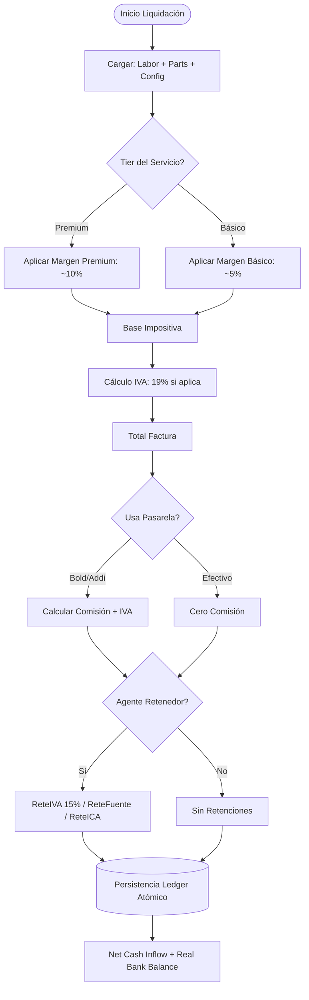

# Motor Financiero

> Ver también: [README](README.md) · [BUSINESS_RULES](BUSINESS_RULES.md) · [TESTING](TESTING.md) · [API](API.md)

`backend/utils/financialEngine.js` — núcleo de cálculo inmutable. Constantes 2026: UVT = $50.318, umbral retenciones = 27 UVT ≈ $1.358.586.

## Matriz de Decisión de Liquidación



## 1. Liquidación de servicios (`liquidateClientInvoice`)

```
Base Impositiva = Mano de Obra × (1 + margen%) + Repuestos (con margen)
IVA             = Base × vat_percentage            (si is_responsable_iva)
Total Factura   = Base + IVA

Si clientIsRetainer AND supera umbral UVT AND is_agente_retenedor_renta (taller
Ordinario/Gran Contribuyente — Régimen Simple/No Responsable de IVA nunca retienen):
  ReteFuente = Base × retefuente_rate_declarante
  ReteICA    = Base × (reteica_rate / 1000)
  ReteIVA    = IVA  × reteiva_rate

Pasarela Bold presencial:
  tarjeta_nacional     → 2.99% + $300
  tarjeta_internacional → 3.99% + $300
  qr_billetera         → 1.50%

Pasarela Bold online:
  tarjeta_nacional     → 3.49% + $900
  tarjeta_internacional → 4.49% + $900
  qr_billetera         → 1.50%

Pasarela Addi: gateway_addi_rate / 100
IVA sobre comisión = Comisión × 0.19

Net Cash Inflow = Total − ReteFuente − ReteICA − ReteIVA − Comisión − IVA comisión
```

**Venta a crédito**: `INC_GROSS.net_amount = 0` al liquidar; ingresos reales entran vía `payInstallment`. Ver el flujo funcional completo en [BUSINESS_RULES.md — Panel de Cobros](BUSINESS_RULES.md#panel-de-cobros-cobros).

---

## 2. Liquidación de compras (`liquidateSupplierPurchase`)

```
Base          = total_gross_cost / (1 + 0.19)
IVA de Compra = total_gross_cost − Base

Retenciones (base ≥ 27 UVT AND proveedor ≠ 'simple' AND taller
is_agente_retenedor_renta AND NO (taller Gran Contribuyente Y proveedor Gran
Contribuyente — dos grandes contribuyentes no se retienen entre sí):
  ReteFuente: declarante → Base × supplier_retefuente_rate
              no declarante → Base × retefuente_rate_no_declarante
  ReteICA:   Base × (reteica_rate_supplier ?? config.supplier_reteica_rate / 1000)
  ReteIVA:   IVA × 0.15

Si proveedor NO es responsable de IVA (`is_responsible_vat=false`): el total
facturado no trae IVA embebido, Base = total_gross_cost (sin dividir por 1.19).

GMF (payment_method='banco' AND apply_4x1000=true):
  GMF = total_gross_cost × 0.004

Net Outflow = total_gross_cost − ReteFuente − ReteICA − GMF
```

---

## 3. Salud financiera global (`calculateGlobalHealth`)

```
totalInflows  = Σ INC_GROSS (CREDIT) + NON_OP_INC + VAT_REFUND
totalOutflows = Σ SUP_PAY + GW_FEE + GW_VAT + TAX_GMF + CARD_FEE (DEBIT)

bankBalance     = totalInflows − totalOutflows
ivaLiability    = Σ TAX_IVA − Σ RET_IVA − Σ VAT_REFUND
realBankBalance = bankBalance − ivaLiability
```

---

## Libro Auxiliar (Cash Flow Ledger)

### Tipos de movimiento

| Tipo | Impacto | Descripción |
|:---|:---:|:---|
| `INC_GROSS` | CREDIT | Ingreso por servicio (net_amount = 0 en crédito) |
| `TAX_IVA` | CREDIT | IVA generado en la venta |
| `RET_FUENT` | DEBIT | ReteFuente practicada por el cliente |
| `RET_ICA` | DEBIT | ReteICA practicada por el cliente |
| `RET_IVA` | DEBIT | ReteIVA practicada por el cliente |
| `GW_FEE` | DEBIT | Comisión de pasarela (Bold / Addi) |
| `GW_VAT` | DEBIT | IVA sobre comisión de pasarela |
| `SUP_PAY` | DEBIT | Pago a proveedor |
| `TAX_GMF` | DEBIT | GMF 4×1000 en pagos bancarios |
| `CARD_FEE` | DEBIT | Costo de transacción con tarjeta |
| `NON_OP_INC` | CREDIT | Ingreso no operacional (manual) |
| `VAT_REFUND` | CREDIT | Devolución de IVA (`puc_code = '135520'`) |
| `MAN_INC` | CREDIT | Ingreso manual registrado por el usuario |
| `MAN_EGR` | DEBIT | Egreso manual registrado por el usuario |
| `REFERRAL` | CREDIT | Ingreso por comisión de referido |

El detalle de la vista `/flujo-caja` (filtros, agrupación, descarga CSV) está en [BUSINESS_RULES.md — Flujo de Caja](BUSINESS_RULES.md#flujo-de-caja-flujo-caja). La cobertura de tests de este motor está en [TESTING.md](TESTING.md).
