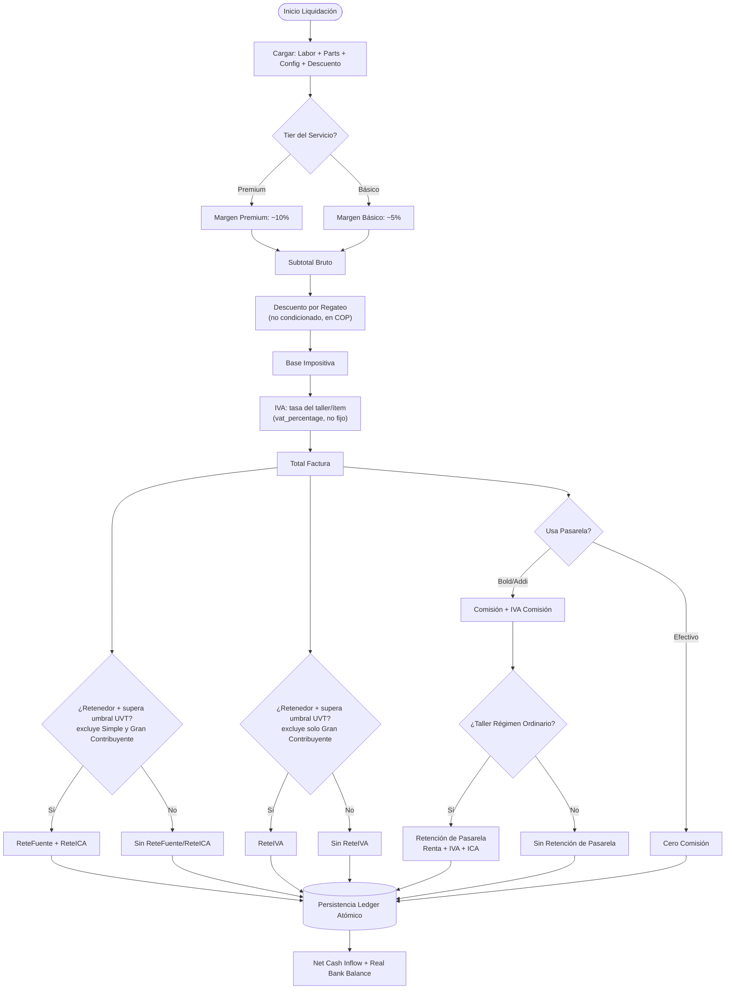

# Motor Financiero

> Ver también: [README](../README.md) · [ARCHITECTURE](../Arquitectura%20y%20Sistema%20Core/ARCHITECTURE.md) · [SECURITY](../Arquitectura%20y%20Sistema%20Core/SECURITY.md) · [API](../Arquitectura%20y%20Sistema%20Core/API.md) · [BUSINESS_RULES](BUSINESS_RULES.md) · [OPERATIONS](OPERATIONS.md) · [INVENTORY](INVENTORY.md) · [FINANCE](FINANCE.md) · [BILLING](BILLING.md) · [GROWTH_ACQUISITION](../Estrategia%20Comercial%20y%20Ventas/GROWTH_ACQUISITION.md) · [PRICING_SALES](../Estrategia%20Comercial%20y%20Ventas/PRICING_SALES.md) · [MONITORING](../MONITORING.md) · [TESTING](../TESTING.md)

`backend/utils/financialEngine.js` — núcleo de cálculo inmutable. Constantes 2026: UVT = $50.318, umbral retenciones **servicios = 2 UVT ≈ $100.636, compras = 10 UVT ≈ $503.180** (Decreto 572/2025, revivido el 1-jul-2026 tras un vaivén de suspensiones del Consejo de Estado — sigue en litigio activo, ver nota de riesgo abajo).

> ⚠️ **Topes UVT en litigio, revisar periódicamente**: el Decreto 572/2025 bajó estos topes (servicios 4→2 UVT, compras 27→10 UVT); el Consejo de Estado lo suspendió el 8-may-2026 (volviendo a 4/27) y revocó esa suspensión el 2-jun-2026, reviviendo el decreto desde el 1-jul-2026 (2/10 de nuevo, los valores usados hoy como default). Ambos son solo el **default** — el contador puede sobreescribirlos por taller en `retention_threshold_services_uvt`/`retention_threshold_parts_uvt` (panel "Matriz de Retenciones (UVT)", con una alerta permanente ahí mismo recordando este litigio) — pero si no lo hace, el sistema usa estos valores, así que hay que mantenerlos alineados a la norma vigente.

## Matriz de Decisión de Liquidación

Las retenciones del cliente (ReteFuente+ReteICA y ReteIVA) y el impacto de la pasarela (comisión + su propia retención) son **ramas independientes** que se restan por separado del Total Factura — ninguna depende de la otra (`netCashInflow = totalFactura - (comisión + IVA comisión + reteIca + reteFuente + reteIva + retención pasarela)`).



## 1. Liquidación de servicios (`liquidateClientInvoice`)

```
Subtotal Bruto  = Mano de Obra × (1 + margen%) + Repuestos (con margen)
Descuento       = descuento_monto, recortado a [0, Subtotal Bruto]
Subtotal Neto   = Subtotal Bruto − Descuento         (= Base Impositiva)
IVA             = Subtotal Neto × vat_percentage     (si is_responsable_iva)
Total Factura   = Subtotal Neto + IVA
```

`vat_percentage` es la tasa real configurada por el taller (no un 19% fijo — el default solo aplica si el campo no está configurado). El resultado expone esta misma tasa en `financial_summary.general_vat_rate_pct` para que el ítem de mano de obra de la factura Dataico (`billing.controller.js`) la reuse en vez de un 19 hardcodeado — antes divergían para talleres con IVA configurado ≠ 19% (bug corregido en rev. 25, ver `InformeLoQueFalta.txt`).

### Descuento por regateo (feature, 2026-08-16, pedido explícito del usuario)

Descuento comercial NO condicionado, en pesos COP (`descuento_monto`, campo editable en `ModalLiquidacion.jsx`, default $0), aplicado sobre el Subtotal Bruto (mano de obra + repuestos) de la factura completa — el caso típico del regateo de último momento en un taller mecánico. Según normativa DIAN, un descuento comercial no condicionado reduce la base gravable de **todo el documento** (IVA y retenciones), a diferencia de uno condicionado/financiero, que no la afecta — `liquidateClientInvoice` solo modela el primer caso.

`discountAmount` (7º parámetro, default `0` — si no se manda o es `$0`, el flujo es matemáticamente idéntico al de antes de este feature) se recorta a `[0, Subtotal Bruto]` — nunca negativo, nunca deja el Subtotal Neto por debajo de $0. El descuento se prorratea (`discount_ratio = Subtotal Neto / Subtotal Bruto`) entre la mano de obra y cada repuesto **antes** de calcular su IVA — así una factura con repuestos a tasas distintas (0%/5%/19%, `item.vat_percentage` congelado en `service_inventory_items`) sigue cobrando el impuesto real por ítem sobre su porción ya descontada, en vez de aplicar el descuento a ciegas sobre un IVA general único.

`labor_price`/`inventory_base` (el desglose que ya usaban las líneas de factura Dataico y el CRÉDITO a Ingresos del ledger) siguen expuestos en BRUTO, sin descuento — el motor agrega por separado `subtotal_bruto`, `discount_amount` y `discount_ratio` en `financial_summary`, para que `billing.controller.js:settleOrder` pueda:
- Insertar el CRÉDITO a Ingresos (`puc_income_code`/`puc_parts_income_code`) por el 100% del Subtotal Bruto, sin tocarlo — la trazabilidad del valor real de mano de obra/repuestos queda intacta.
- Insertar un DÉBITO nuevo a Descuentos en Ventas (`puc_descuento_ventas_code`, default `417595`, grupo PUC 4175 — configurable en `ContadorPanel.jsx` igual que el resto de cuentas PUC) por `discount_amount`, tipo de asiento `SALES_DISCOUNT` — contra-ingreso que resta del bruto de arriba. Solo se inserta si `discount_amount > 0` (regla de no-regresión: sin descuento, ni la línea existe).
- Prorratear `discount_ratio` en los ítems que se mandan a Dataico (`invoiceItems`), porque la factura electrónica arma su propia base sumando `price` por ítem — sin este prorrateo, la DIAN recibiría el Subtotal Bruto mientras el ledger interno liquidó sobre el Subtotal Neto.

`SALES_DISCOUNT` se agregó a `NON_CASH_TYPES` (no es un segundo movimiento de caja — su efecto ya está en el `net_amount` reducido de `CASH_RECEIPT`/`AR_RECOGNITION`) y a `COST_TYPES` (para que `calculateOperatingProfit` lo reste de la Utilidad Neta, igual que `INV_COGS`/`MECH_COMMISSION`) — mismo espejo de siempre entre `backend/utils/financialEngine.js` y `frontend/src/utils/ledgerLabels.js`.

**Bug real corregido durante la implementación**: `billing.controller.js` repartía el CRÉDITO de las líneas de ingreso (`laborShare`) dividiendo `labor_price` entre `base_impositiva` — antes de este feature esa base era igual al Subtotal Bruto, así que el bug era invisible; en cuanto `base_impositiva` pasó a ser el Subtotal Neto (más chico en cuanto hay descuento), `laborShare` se inflaba por encima de 1 y la porción de repuestos se volvía negativa. Corregido a dividir por `subtotal_bruto` explícito. Cubierto por `tests/billing/billing.settleOrder.discount.test.js` (sin descuento, con descuento, y descuento mayor al Subtotal Bruto — recortado al 100%, orden "gratis" sigue cuadrando en partida doble).

### Margen de mano de obra por Gama/Complejidad (rev. 49)

El "margen%" de la fórmula de arriba es `service_catalog.base_margin_basic`/`base_margin_premium` — un número guardado por servicio, elegido libremente por el taller al crear/editar el catálogo. Desde rev. 49, el formulario ("Crear Servicio" en `/config`) sugiere ese número en vez de dejarlo en blanco, a partir de dos clasificadores nuevos por servicio (`gama`, `complejidad`, cada uno `'Alta'`\|`'Baja'`) y la tabla oficial del documento fuente (*"Proyecto recortado para el Producto minimo viable .txt"*, líneas 68-73) — 4 combinaciones documentadas de 8 posibles:

| Tier | Gama | Complejidad | Rango | Sugerido |
|:---|:---:|:---:|:---:|:---:|
| Premium | Alta | Alta | 60%–45% | 50% |
| Premium | Baja | Alta | 60%–45% | 50% |
| Básico  | Alta | Baja | 60%–45% | 50% |
| Básico  | Baja | Baja/Media | 55%–40% | 45% |

Las 4 combinaciones no documentadas (p. ej. Básico+Alta+Alta) caen al default explícito de 45% con rango 40%-55% — mismo criterio que ya usaba `getServiceMargin` antes de tener UI. Implementación mirror en dos archivos (mismo patrón que `NON_CASH_TYPES`, ver [ARCHITECTURE.md](../Arquitectura%20y%20Sistema%20Core/ARCHITECTURE.md)): `backend/utils/pricing.js` (`getServiceMargin`/`getServiceMarginRange`, con tests en `backend/tests/pricing.test.js`) y `frontend/src/utils/pricingTiers.js` (mismas funciones, para calcular la sugerencia sin round-trip al servidor). `gama`/`complejidad` **no** participan en la liquidación real (`liquidateClientInvoice`/`billing.controller.js`/`workOrders.controller.js` siguen leyendo directo `base_margin_basic`/`base_margin_premium`) — son solo metadata de UI para no tener que memorizar la tabla cada vez que se crea un servicio; el usuario puede sobrescribir el número sugerido a mano.

No confundir con otros dos conceptos que reusan las mismas palabras: la "gama" de marca de vehículo (`Alta`/`Normal`, ver `vehicleClassifier.assignServiceTier`, decide el tier Premium/Básico de una *orden*) y la "complejidad" de orden (`service_complexity`, escala `baja`/`media`/`alta` en `work_orders`, elegida en Bahía al crear la orden). La `gama`/`complejidad` de esta sección son un tercer concepto, estático por servicio del catálogo, sin relación con esos dos.

```
Si clientIsRetainer AND supera umbral UVT:
  ReteFuente = Base × retefuente_rate_declarante   (exento: Simple, Gran Contribuyente)
  ReteICA    = Base × (reteica_rate / 1000)        (exento: Simple, Gran Contribuyente)
  ReteIVA    = IVA  × reteiva_rate                 (exento: solo Gran Contribuyente)

Pasarela Bold presencial:
  tarjeta_nacional     → 2.99% + $300
  tarjeta_internacional → 3.99% + $300
  qr_billetera         → 1.50%

Pasarela Bold online:
  tarjeta_nacional     → 3.49% + $900
  tarjeta_internacional → 4.49% + $900
  qr_billetera         → 1.50%

Pasarela Addi: gateway_addi_rate / 100
IVA sobre comisión = Comisión × 0.19

Retención de la PASARELA sobre el giro (solo Régimen Ordinario, ver abajo):
  ReteRenta = Base × gateway_reterenta_rate  [default 1.5%]
  ReteIVA   = IVA  × reteiva_rate            [mismo 15% que la retención del cliente]
  ReteICA   = Base × (gateway_reteica_rate / 1000)  [default 0.4‰... 4/1000 = 0.4%]

Net Cash Inflow = Total − ReteFuente − ReteICA − ReteIVA − Comisión − IVA comisión
                  − ReteRenta pasarela − ReteIVA pasarela − ReteICA pasarela
```

**Bug real corregido en rev. 40 — preview de `ModalLiquidacion.jsx` no incluía el IVA sobre la comisión**: el motor resta `commission + commissionVat` de `netCashInflow` (expuesto como `gateway_impact.total_gateway_cost`), pero el preview del frontend solo calculaba `gatewayFee` (la comisión base) y la restaba de `net` — nunca calculaba el 19% de IVA sobre esa comisión. El cajero veía un "Total Neto a Recibir" más alto que el que `settleOrder` realmente liquidaba al cobrar por Bold/Addi. Corregido agregando `gatewayFeeVat = gatewayFee × 0.19` (mismo 19% fijo que usa el backend para esta línea, no `config.vat_percentage`) al cálculo de `net`; la línea "Comisión Plataforma" del desglose ahora muestra el costo total real (`gatewayFee + gatewayFeeVat`).

### Matriz de retenciones taller × cliente en ventas (rev. 38)

Reescrita dos veces sobre la misma celda:

- **rev. 34**: se descubrió que ReteICA usaba la misma guarda que ReteFuente/
  ReteIVA (`workshopCanWithhold = is_agente_retenedor_renta` del TALLER) —
  pregunta correcta para compras (quien retiene es el comprador), pero
  equivocada para ventas (quien retiene es el CLIENTE que paga). Se agregó
  una rama especial para Régimen Simple basada en el régimen del cliente,
  confirmada contra una imagen ("Matriz Maestra de Aplicación") que el
  usuario proveyó en ese momento.
- **rev. 38**: el usuario trajo un segundo set de imágenes
  (`Taller_cliente1/2.jpg`) que contradecía la anterior en varias celdas. Se
  investigó contra el Estatuto Tributario real (Decreto 1091 de 2020, Art.
  911 y 437-2 ET) antes de tocar código, y se confirmó que la matriz de
  rev. 34 estaba **incompleta**: el Art. 911 exime al Régimen Simple de
  ReteFuente **e ICA** ("mas no de retención a título de IVA" — Decreto
  1091/2020), sin importar el régimen del cliente — la distinción
  Ordinario/Gran Contribuyente del cliente que introdujo rev. 34 no existe
  en la norma real. Además, un Gran Contribuyente es **autorretenedor** —
  nunca le retienen nada al vender (el mismo principio que ya aplicaba
  correctamente cuando es proveedor, ver más abajo), algo que rev. 34 no
  contemplaba (trataba Gran Contribuyente igual que Ordinario). Por último,
  "No Responsable de IVA" no tiene ninguna exención de ReteFuente/ReteICA —
  esa es una condición sobre el IVA que cobra, no sobre renta/ICA.

| Régimen del Taller | ReteFuente | ReteICA | ReteIVA |
|:---|:---:|:---:|:---:|
| No Responsable de IVA | SÍ (si cliente agente retenedor + umbral) | SÍ | $0 natural (no genera IVA) |
| Régimen Simple | **NO** (Art. 911) | **NO** (Art. 911 + Decreto 1091/2020) | SÍ (si cliente agente retenedor + umbral) |
| Régimen Ordinario | SÍ | SÍ | SÍ |
| Gran Contribuyente | **NO** (autorretenedor) | **NO** (autorretenedor) | **NO** (autorretenedor) |

El régimen del **cliente** (Ordinario vs. Gran Contribuyente) ya NO cambia el
resultado en ninguna fila — solo importa si el cliente está marcado como
agente retenedor (`clientIsRetainer`). Por eso `classifyClientRegime` (rev.
34) se eliminó del motor: dejó de tener uso. Reproducido originalmente con
datos reales del taller `77f4ea4b-...` (rev. 34) y revisado exhaustivamente
con tests para las 4 filas × ambos valores de `clientIsRetainer` (rev. 38, ver
[TESTING.md](../TESTING.md)). Mismo fix replicado en el preview de
`ModalLiquidacion.jsx` y en el simulador sin caller activo
`useFinancialStore.calculateLiveInvoice` (frontend) — ver también el bug del
IVA de la comisión de pasarela en ese mismo preview, corregido en rev. 40
(arriba, sección de Pasarela).

### Venta a crédito a un cliente agente retenedor — Cartera debe reconocer el NETO, no el bruto (2026-08-01, bug real corregido)

**Bug real corregido, bloqueaba la operación por completo**: `billing.controller.js:settleOrder` insertaba `AR_RECOGNITION` (Cartera reconocida, 130505) por `results.financial_summary.total_invoice` — el total BRUTO de la factura, sin descontar las retenciones que el cliente practica (`RET_FUENT`/`RET_IVA`/`RET_ICA`, ver matriz arriba). Cuando ambas condiciones coincidían (venta a crédito + cliente agente retenedor con retenciones > 0), el comprobante quedaba descuadrado por exactamente la suma de las retenciones — `documentNumbering.js:assertBalanced` (validación agregada 2026-07-30) rechazaba el insert con 500 "Comprobante descuadrado", así que **ninguna venta a crédito a un cliente agente retenedor podía liquidarse**, sin excepción. Confirmado empíricamente con un caso real: DEBIT $770.750 vs CREDIT $724.750, diff $46.000 = exactamente RET_FUENT+RET_IVA+RET_ICA de ese caso.

La causa raíz es conceptual, no solo aritmética: lo que el cliente REALMENTE queda debiendo es el total menos lo que retuvo — esa plata retenida nunca la va a pagar al taller, la remite directo a la DIAN (el taller ya la reconoció aparte como activo propio en las líneas `RET_FUENT`/`RET_IVA`/`RET_ICA`, DEBIT a las cuentas de anticipo 135515/135517/135518). Contarla también en Cartera la duplicaba.

Corregido usando `results.financial_summary.net_cash_inflow` (el mismo neto que ya usaba la rama de venta de contado para `CASH_RECEIPT`) también para `AR_RECOGNITION` en la rama de crédito. Las cuotas generadas (`client_installments`, `installmentsUtil.splitIntoInstallments`) también repartían el bruto — corregido a repartir el mismo neto, para que la suma de las cuotas coincida exacto con lo que la Cartera dice que el cliente debe y pagarlas todas cruce el saldo a $0. Cubierto por un test nuevo en `tests/billing.settleOrder.pucAccounts.test.js` ("venta a crédito a un cliente agente retenedor no queda descuadrada").

Ninguno de los dos talleres de prueba auditados había llegado a ejercitar esta combinación todavía (por eso nunca se había visto fallar en producción) — es un bug de código, no de datos, así que no hizo falta ningún backfill.

### Retención de la Pasarela sobre el giro al taller (rev. 38)

Bold/Addi actúan como agentes de retención **independientes del cliente**
sobre el giro que le hacen al taller (verificado contra el decreto de
retención en pagos electrónicos y el Art. 401-4 ET — Wompi lo confirma en su
propio centro de ayuda): 1.5% de renta sobre la base, 15% del IVA generado
(mismo `reteiva_rate` de arriba), e ICA propio de la actividad financiera
(`gateway_reteica_rate`, default 0.4‰ — **distinto** de la tarifa general de
servicios ~0.966‰ usada arriba para el ICA que practica el cliente).

| Régimen del Taller | ¿Sufre retención de pasarela? |
|:---|:---:|
| No Responsable de IVA | NO (Art. 401-4 — exención específica de quien no cobra IVA) |
| Régimen Simple | NO (Art. 911) |
| Régimen Ordinario | **SÍ**, las 3 (ReteRenta + ReteIVA + ReteICA) |
| Gran Contribuyente | NO (autorretenedor) |

Es independiente de `clientIsRetainer` (la practica la pasarela, no el
cliente), así que puede **coexistir** con la matriz de arriba si el cliente
además es agente retenedor y paga por Bold/Addi — ambas retenciones se restan
del `net_cash_inflow`. Se registra en el ledger como 3 tipos nuevos
(`GW_RET_RENTA`/`GW_RET_IVA`/`GW_RET_ICA`, informativos, cuenta PUC
`puc_pasarela_retencion_code` — ver tabla de tipos de movimiento abajo).
Configurable por el contador en `ContadorInventario.jsx` (sección "Tasas de
Pasarelas Externas").

**Venta a crédito**: `INC_GROSS.net_amount = 0` al liquidar (el ingreso operativo, base sin IVA, se reconoce completo en ese momento); ingresos reales de caja entran vía `payInstallment` (backend), que inserta un segundo asiento `INC_GROSS` por cada cuota cobrada con `net_amount = gross_amount` = valor de la cuota **con IVA incluido** — correcto para caja real (`bankBalance`), pero **no** debe sumarse otra vez al ingreso operativo: ya se reconoció al liquidar. El frontend (`FlujoCaja.jsx`) identifica esos asientos de cobro por su concepto fijo (`"Cuota N/M — ..."`, único texto que arma `payInstallment`) y los excluye del cálculo de Utilidad Neta (bug corregido: antes se sumaban también ahí, duplicando la venta e inflándola con IVA). Ver el flujo funcional completo en [FINANCE.md — Panel de Cobros](FINANCE.md#panel-de-cobros-cobros).

---

## 2. Liquidación de compras (`liquidateSupplierPurchase`)

```
Base          = total_gross_cost / (1 + 0.19)
IVA de Compra = total_gross_cost − Base

GMF (payment_method='banco' AND apply_4x1000=true):
  GMF = total_gross_cost × 0.004

Net Outflow = total_gross_cost − ReteFuente − ReteICA − GMF
```

Si proveedor NO es responsable de IVA (`is_responsible_vat=false`): el total facturado no trae IVA embebido, Base = total_gross_cost (sin dividir por 1.19). Si la factura trae un IVA explícito (OCR o corregido a mano, `invoiceVatAmount`), ese manda sobre el derivado.

### Matriz de retenciones taller-comprador × proveedor

Reescrita 3 veces sobre la misma tabla:

- Antes de esta sesión: todo-o-nada (las 3 retenciones aplicaban juntas o
  ninguna, según solo si ambos eran Gran Contribuyente — `Correcion.txt:40`).
- Fase 2 de la sesión: se separó en `appliesReteFuente`/`appliesReteIcaReteIva`,
  con el criterio "el proveedor Gran Contribuyente nunca se retiene
  (autorretenedor)", y se permitió a un taller Gran Contribuyente retener
  ICA+IVA (sin ReteFuente) a un proveedor Régimen Simple.
- **rev. 38**: investigado contra Decreto 1091/2020 y Art. 437-2 ET, se
  encontraron 2 problemas más finos: (1) ReteICA y ReteIVA NO comparten la
  misma exención — el Art. 911 protege al proveedor Régimen Simple de ReteICA
  **sin importar el régimen del comprador** (la excepción que Fase 2 le daba
  a Gran Contribuyente no existe en la norma real), y (2) un comprador
  simplemente Ordinario NO es agente retenedor de IVA frente a OTRO Ordinario
  (Art. 437-2: esa calidad es de los Grandes Contribuyentes, "sean o no
  responsables del IVA") — el código aplicaba ReteIVA en ese caso por error,
  bundleada con ReteICA. Ahora son 3 flags totalmente independientes:

| Taller comprador ↓ / Proveedor → | Ordinario / Persona Natural | Régimen Simple | Gran Contribuyente |
|:---|:---:|:---:|:---:|
| No responsable / Simple | Ninguna | Ninguna | Ninguna |
| Ordinario | ReteFuente + ReteICA (si supera el tope UVT de compras). ReteIVA **NO** ("entre ordinarios") | ReteFuente/ReteICA **NO** (Art. 911). ReteIVA **SÍ**, obligatoria (Art. 437-2, retención especial a proveedores RST) | Ninguna (autorretenedor) |
| Gran Contribuyente | ReteFuente + ReteICA + ReteIVA (comprador Gran Contribuyente sí es agente retenedor de IVA, Art. 437-2) | ReteFuente/ReteICA **NO** (Art. 911). ReteIVA **SÍ** | Ninguna (autorretenedor) |

```
ReteFuente: declarante → Base × (supplier_retefuente_rate / 100)     [default 2.5%]
            no declarante → Base × (retefuente_rate_no_declarante / 100) [default 3.5%]
ReteICA:   Base × (reteica_rate_supplier / 1000 si el proveedor tiene tasa propia,
                    si no config.supplier_reteica_rate / 1000)       [default 9.66‰]
            — misma exención que ReteFuente (Art. 911 protege ambas)
ReteIVA:   IVA × (config.reteiva_rate / 100)                         [default 15%]
            — aplica si el comprador es Gran Contribuyente O el proveedor es
              Régimen Simple (o ambos); NUNCA si el proveedor es Gran
              Contribuyente (autorretenedor)
```

`supplier_retefuente_rate` y `supplier_reteica_rate` (contador → `ContadorInventario.jsx`) se leen `/100`/`/1000` igual que el resto de tasas del sistema — antes `supplier_retefuente_rate` se leía como fracción cruda, así que guardar "2.5" (como las demás columnas) habría dado una retención del 250% (bug corregido en rev. 25). `reteiva_rate` en compras usaba un `RETEIVA_MULTIPLIER` fijo (15%) ignorando la tasa configurable del contador — bug corregido en rev. 34, ahora se lee igual que en ventas (`config.reteiva_rate`). Todas las tasas configurables de este módulo (incluidas `retefuente_rate_declarante`, `reteica_rate`, `gateway_addi_rate`) comparan contra `null`/`undefined` explícito, no `|| default` — un 0% real configurado por el contador se respeta en vez de caer al default.

**Bug real corregido en rev. 48 — el propio umbral UVT tenía el mismo problema**: `uvtValue`/`partsThresholdUvt` (`liquidateSupplierPurchase`) y `uvtValue`/`serviceThresholdUvt` (`liquidateClientInvoice`) se leían con `Number(config.x) || default` — un contador que configure el umbral en 0 UVT (para retener siempre, sin importar el monto) lo vería silenciosamente pisado de vuelta al default (10 o 2 UVT). Corregido a `config.x != null ? Number(config.x) : default` en las 4 lecturas, mismo criterio que ya usan las tasas de arriba.

**Diagnóstico real de un caso reportado (rev. 48)**: una compra taller-Ordinario → proveedor-Ordinario no generó ReteFuente/ReteICA pese a superar cómodamente el umbral UVT. La matriz en sí calculó bien — el gate real (`workshopCanWithhold = config.is_agente_retenedor_renta === true`) estaba en `false` porque el taller nunca había guardado de verdad "Régimen Ordinario" en el panel del Contador (consulta directa a la BD real confirmó los 4 talleres existentes en `fiscal_regime='no_iva'`). Causa de la confusión: `ContadorInventario.jsx`/`Config.jsx` inicializaban su estado local con `fiscal_regime: 'ordinario'` antes de cargar los datos reales — el panel podía mostrarse como si ya estuviera configurado sin estarlo (corregido el default a `'no_iva'`, el mismo que usa `auth.controller.js:register`). Ver también el Frente 4 de `InformeLoQueFalta.txt` (rev. 48): el mismo panel tenía además un bug de `localStorage['user']` obsoleto que probablemente impedía guardar el cambio de régimen del todo.

> Nota de simplificación: la retención especial de IVA a proveedores del Régimen Simple tiene, en la norma real, sus propios topes UVT (27 UVT bienes / 4 UVT servicios, fijados por el Art. 437-2 y no afectados por el Decreto 572/2025) — EFISCO reutiliza por simplicidad el mismo `retention_threshold_parts_uvt` configurable que ya usa ReteFuente/ReteICA en vez de una columna separada. Si esto genera diferencias prácticas relevantes, es candidato a una columna dedicada en una futura revisión.

**Ojo — Ordinario y Gran Contribuyente (taller comprador) comparten exactamente los mismos 3 booleans** (`is_responsable_iva`, `is_regimen_simple`, `is_agente_retenedor_renta` — ver [BUSINESS_RULES.md](BUSINESS_RULES.md#configuración-del-taller-config)); la fila "Gran Contribuyente" de esta matriz se decide con `config.fiscal_regime === 'gran_contribuyente'` (columna de texto aparte), no con esos booleans. Bug corregido en rev. 35: `POST /api/workshop/finance-settings` escribía esos 3 booleans directamente sin sincronizar `fiscal_regime` (a diferencia de `PUT /api/workshop/:id`, que sí lo hace vía un `REGIME_MAP` compartido) — un taller configurado como Gran Contribuyente por esa vía podía quedar con `fiscal_regime` desactualizado y perder la fila especial (ReteICA+ReteIVA a un proveedor Régimen Simple). Ambos endpoints ahora usan el mismo `REGIME_MAP` (hoisted en `workshop.controller.js`) como única fuente de verdad.

### Compra a plazos — Cuentas por Pagar a proveedores

Espejo exacto de la venta a crédito de clientes (ver más abajo): al registrar una compra con `payment_mode:'credito'` y `num_installments>1`, la cabecera (`supplier_purchases`) queda `status:'pendiente'`, se reparte el pago neto en `supplier_installments` (mismo `installments.js:splitIntoInstallments`, cuotas espaciadas por el intervalo real elegido — ver más abajo), y el asiento `SUP_PAY` inicial lleva `net_amount:0` (reconocimiento del costo, sin salida de caja aún — el costo/gasto ya se causa con el monto bruto). Cada cuota pagada (`PATCH /api/providers/installments/:id/pay`) inserta un nuevo `SUP_PAY` con `net_amount = amount` de la cuota, la salida de caja real. `SUP_PAY` no está en `NON_CASH_TYPES`, así que `cashValue`/`calculateGlobalHealth` excluyen automáticamente los $0 sin ningún cambio adicional al motor — mismo mecanismo que ya usa `INC_GROSS` para crédito a clientes.

**Bug real corregido en rev. 48 — orden no atómico entre el ledger y las cuotas**: `providers.controller.js:registerPurchase` insertaba `supplier_installments` (que puede fallar y hacer `throw`) ANTES del insert del ledger — un fallo ahí (FK, `first_payment_date` inválida, etc.) abortaba la respuesta dejando la cabecera de la compra (`supplier_purchases`) ya comprometida, pero sin NINGÚN asiento en `cash_flow_ledger` — ni siquiera el `SUP_PAY` informativo de `net_amount=0`, invisible por completo en Finanzas/Flujo de Caja. Se reordenó: el ledger se inserta primero, las cuotas después y sin `throw` (solo `console.error` si fallan) — mismo criterio defensivo que ya usa `settleOrder` con `client_installments` ("peor tener una cuenta por pagar sin cuotas generadas, recuperable a mano, que una compra con dinero movido pero invisible en el libro"). Bug secundario del mismo frente: `finance.controller.js:getDashboardSummary` sumaba `SUP_PAY.amount` (el bruto) en vez de `net_amount` para `supplierExpenses` — una compra a plazos se contaba completa al registrarla Y otra vez por cada cuota pagada; corregido a `net_amount`, espejo exacto de cómo ya trata `INC_GROSS`.

**Bug real corregido en rev. 48 — causación invisible en los paneles, aunque bien guardada en la BD**: `finance.controller.js:getDashboardSummary` (`ledgerHistory`) y `getCashFlow` (`entries`) tenían un filtro que ELIMINABA POR COMPLETO cualquier fila `INC_GROSS`/`SUP_PAY` con `net_amount=0` de la lista devuelta al frontend — no solo de las sumas (correcto), sino de la vista entera. Verificado con datos reales de un taller: el asiento existía en `cash_flow_ledger` pero no aparecía ni en Finanzas ni en Flujo de Caja. Se quitó el filtro (los totales/saldo acumulado siguen usando `net_amount`/`cashValue`, así que no se rompe nada) y se agregó distinción visual en el frontend (`ledgerLabels.js:isPendingCausacion`, usado en `FlujoCaja.jsx`/`DashboardFinanciero.jsx`): la fila se muestra con la etiqueta "Causado, pendiente de pago" en vez de con el `+/−` de caja real que sí llevan los movimientos que mueven el banco de verdad. El fix es retroactivo — la causación de compras/ventas a crédito ya registradas antes del fix también se muestra, sin necesidad de volver a registrarlas.

**Cálculo de `due_date` de cada cuota (`billing.controller.js`/`providers.controller.js`, espejo exacto entre clientes y proveedores)**: hasta rev. 47, cada cuota sumaba un mes calendario a la primera con `setUTCMonth`/`getUTCMonth` (anclado al mismo frame UTC en que se parseó `first_payment_date`, sin depender de la zona horaria del servidor) — pero esto asumía siempre "+1 mes" sin importar el intervalo real pactado (ej. primera cuota a 15 días terminaba con la segunda a "15 días + 1 mes" en vez de a 30 días). **Bug real corregido en rev. 48**: se reemplazó por `installments.js:buildInstallmentDueDates(anchorDate, firstPaymentDate, n, explicitDueDates)` — replica por defecto el mismo intervalo en DÍAS entre el ancla (hoy, el momento de la compra/venta) y la primera cuota para las siguientes (con fallback a 30 días si el intervalo es cero o negativo), y respeta un array `due_dates` explícito si el frontend lo manda (el usuario editó las fechas a mano). Espejo exacto en `frontend/src/utils/installments.js` para la sugerencia en vivo del formulario — `ModalLiquidacion.jsx`/`Proveedores.jsx` muestran un input de fecha editable por cada cuota desde la 2ª en adelante, prellenado con el cálculo automático.

### Retenciones de compra en CREDIT, no DEBIT — y `total_outflow` también resta ReteIVA (2026-07-30, pedido explícito del usuario)

**Bug real corregido, encontrado por el validador global de partida doble** (ver [Libro Auxiliar — validación de partida doble](#validación-de-partida-doble-en-el-insert-2026-07-30-pedido-explícito-del-usuario) más abajo): `providers.controller.js:registerPurchase` insertaba `RET_FUENT_COMPRA`/`RET_ICA_COMPRA`/`RET_IVA_COMPRA` en **DEBIT** — contablemente equivocado, porque 236540/236802/236702 son cuentas de **pasivo** (el taller retuvo esa plata del proveedor y se la debe a la DIAN, no es un costo adicional). Con DEBIT, el comprobante quedaba descuadrado por exactamente 2× la suma de retenciones cada vez que aplicaban. Ahora van en CREDIT, igual en `providers.controller.js`, `subscriptionBilling.service.js:recordWorkshopSideExpense` y `admin.controller.js:uploadSoftwareInvoice` (las 3 rutas comparten el mismo patrón de compra a proveedor — EFISCO es "proveedor" de sí misma en las últimas dos).

Un segundo bug, más profundo, apareció al intentar balancear lo anterior: `liquidateSupplierPurchase`'s `total_outflow` (el pago neto real al proveedor) restaba ReteFuente + ReteICA, pero **no** ReteIVA — un `total_outflow` sobrestimado exactamente en el monto de la ReteIVA cada vez que un taller Gran Contribuyente le compra a un Ordinario (o cualquier comprador a un proveedor Régimen Simple). Confirmado con el usuario: la ReteIVA SÍ reduce el pago real (el taller se queda esa plata igual que con ReteFuente/ReteICA, la remite a la DIAN aparte) — corregido a `total − (reteFuente + reteIca + reteIva)`. Afecta el `net_paid_amount` guardado en `supplier_purchases` y el monto real de la contrapartida `CASH_PAYMENT`/`AP_RECOGNITION` del ledger, en las mismas 3 rutas de arriba.

**`recordWorkshopSideExpense`/`uploadSoftwareInvoice` estaban más rotos todavía** — nunca habían registrado `TAX_IVA_DEDUC` ni ninguna línea de retención en el ledger (solo quedaban en las columnas de `supplier_purchases`, invisibles en el Libro Mayor), y jamás traían contrapartida de Caja/Bancos: cada pago de suscripción de EFISCO se guardaba con SOLO el lado DEBIT. Completadas con el mismo patrón ya corregido de `registerPurchase`.

### Validación de partida doble en el insert (2026-07-30, pedido explícito del usuario)

`documentNumbering.js:claimAndInsertLedger` (el único chokepoint por el que pasa TODO insert a `cash_flow_ledger` de todo controller) valida, antes de llamar al RPC, que `SUM(gross_amount ?? amount)` de las líneas `impact='DEBIT'` sea igual (tolerancia de 2 centavos, por redondeo de punto flotante al sumar varios montos ya redondeados) a la de las líneas `impact='CREDIT'` — si no cuadra, lanza un Error y NO se guarda nada. `gross_amount` (con fallback a `amount`) es el mismo campo que ya usa `finance.controller.js:generateLedgerBook` para las columnas Débito/Crédito del Libro Mayor real: sumar por `amount` sin más rompía `INC_GROSS` (que incluye el IVA prorrateado por dentro, contado aparte en su propia línea `TAX_IVA`) marcando como "descuadrado" un comprobante que en realidad cuadraba.

Activar esta validación reveló, además del bug de retenciones de arriba, otros 2 puntos de inserción que ya estaban descuadrados en producción y se corrigieron en la misma revisión:
- `finance.controller.js:addManualMovement` ("Ingreso No Operacional"/"Devolución IVA"): insertaba una sola línea CREDIT sin contrapartida — se agregó `CASH_RECEIPT` (DEBIT, Bancos) como contrapartida.
- `finance.controller.js:recordReferralIncome` ("Ingreso por Referido"): mismo problema, mismo fix (`CASH_RECEIPT` DEBIT).

### Comisión de mecánico y pago de sueldos — partida doble (2026-07-30, pedido explícito del usuario)

- **Causación de comisión** (`billing.controller.js:settleOrder`, type `MECH_COMMISSION`): el DEBIT al gasto (510506) no tenía contrapartida — se agregó un CREDIT a **233525** (Comisiones por Pagar, pasivo), mismo `type` que el DEBIT (mismo patrón que `INV_COGS`: comparten `type`, cualquier consumidor que sume por `type` debe filtrar `impact` — ver `mechanics.controller.js:getPendingPayment`, que ahora filtra `impact==='DEBIT'` al calcular `earned`/`paid`, si no duplicaría ambos).
- **Pago real** (`mechanics.controller.js:payMechanic`): tanto `MECH_SALARY_PAY` (510503) como `MECH_COMMISSION_PAY` ahora traen su contrapartida `CASH_PAYMENT` (CREDIT, Bancos 111005). `MECH_COMMISSION_PAY` pasó de debitar 236590 a debitar **233525** — la MISMA cuenta que acredita la causación de arriba, para que el pasivo se compense a $0 en vez de quedar dos cuentas sueltas que nunca se cruzan.

**Backfill de órdenes liquidadas ANTES de este fix (2026-07-31)**: el fix de arriba solo corrige el código para causaciones NUEVAS — cualquier orden con comisión de mecánico liquidada antes del 2026-07-30 quedó con el DEBIT huérfano, sin su contrapartida CREDIT, y por lo tanto con su comprobante FV- descuadrado para siempre (detectado auditando un taller real: comprobante con DEBIT $770.750 vs CREDIT $724.750 — la diferencia exacta era una comisión de $225,01 sin cruzar). Script de un solo uso `backend/scripts/fix-mech-commission-double-entry.mjs` (mismo patrón dry-run/`--confirm`/`COMPLETAR` que `fix-opening-balance-double-entry.mjs`): por cada `MECH_COMMISSION` DEBIT sin su pareja CREDIT (emparejado por `document_number`, o por `work_order_id`+`mechanic_id`+`amount` si la fila es de antes de que existiera el número de documento), inserta la contrapartida faltante — nunca borra ni modifica una fila existente.

### Costos Fijos Operacionales — Arriendo/Servicios Públicos/Otros Gastos (2026-07-30, pedido explícito del usuario)

Antes de esta revisión, `fixed_costs_rent`/`fixed_costs_utilities` (`Config.jsx`) eran solo estimados usados en proyecciones de punto de equilibrio — pagarlos de verdad no generaba ningún asiento en el Libro Mayor, y "Otros Gastos Generales" ni siquiera tenía un campo. Nuevo endpoint `POST /api/finance/fixed-costs/pay` (`finance.controller.js:payFixedCost`, botón "Pagar Costo Fijo" en `DashboardFinanciero.jsx`): DEBIT al gasto (512005 Arriendo / 513505 Servicios Públicos / 519595 Otros, según `category`) + CREDIT a Bancos (`CASH_PAYMENT`, 111005). Reusa el `type` `MAN_EGR` (Egreso Manual) — ya existía en `COST_TYPES`/`TYPE_LABELS` sin ningún caller real hasta ahora — las 3 categorías se distinguen por su propia cuenta PUC en el Libro Mayor, no por un `type` nuevo cada una. Sin migración nueva: usa el prefijo `CC` ya existente (ajustes/movimientos manuales), ninguna columna nueva en `workshop_config`.

**Resuelto (2026-07-31, pedido explícito del usuario)**: la tarjeta **"Costos de Operación"** ahora también suma `manualFixedCostsReal` — el gasto real de `MAN_EGR` (pagos hechos con el botón "Pagar Costo Fijo"), calculado aparte del `monthlyFixedCosts` estimado, no en su reemplazo: `operatingCosts = monthlyFixedCosts (presupuesto) + supplierExpenses (real) + manualFixedCostsReal (real)`. Se decidió SUMAR en vez de reemplazar el estimado porque el presupuesto configurado (`fixed_costs_rent`/`fixed_costs_utilities`) sigue sirviendo de referencia incluso en un mes donde el pago real todavía no se registra — la tarjeta pasa a mostrar "presupuesto + lo efectivamente pagado", no una u otra cosa. El desglose "Estructura de Caja" del Dashboard Financiero (`DashboardFinanciero.jsx`) expone ambos componentes por separado ("Costos Fijos (Presupuesto)" / "Costos Fijos Pagados (Real)") para que no se lean como el mismo número duplicado. Cubierto por `tests/finance.dashboardSummary.manualFixedCostsReal.test.js`.

---

## 3. Salud financiera global (`calculateGlobalHealth`)

Reescrita en rev. 22 alrededor de la distinción **caja real vs. informativo/devengo** (ver sección siguiente) — antes sumaba una lista fija de tipos DEBIT/CREDIT a mano, lo que duplicaba montos ya restados dentro de `net_amount` (ej. `GW_FEE`/`GW_VAT`) y no reconocía egresos manuales fuera de esa lista blanca:

```
Para cada asiento: isCashEntry(move) = !NON_CASH_TYPES.has(move.type)
                    cashValue(move)  = move.net_amount ?? move.amount   (0 en ventas a crédito)

// OPENING_BALANCE se excluye de este loop genérico — usa la convención
// estándar de partida doble (DEBIT=aumenta), al revés que el resto de tipos
// de caja real (CREDIT=aumenta) — ver más abajo.
totalInflows  = Σ cashValue(move) donde isCashEntry(move) && !isOpeningBalance(move) && impact = CREDIT
totalOutflows = Σ cashValue(move) donde isCashEntry(move) && !isOpeningBalance(move) && impact = DEBIT
openingBalanceNet = Σ openingBalanceValue(move) donde isCashEntry(move) && isOpeningBalance(move)

bankBalance     = totalInflows − totalOutflows + openingBalanceNet
ivaLiability    = Σ TAX_IVA (CREDIT) − Σ RET_IVA (DEBIT) − Σ VAT_REFUND (CREDIT) − Σ TAX_IVA_DEDUC (DEBIT)
realBankBalance = bankBalance − ivaLiability
```

El **Capital Inicial** (`OPENING_BALANCE`, el saldo migrado del cuaderno/Excel previo del taller) SÍ es caja real (`isCashEntry` lo cuenta), pero se reporta aparte de "Total Ingresos"/"Total Egresos" vía `isOpeningBalance`/`openingBalanceValue` — no es una venta ni un gasto del período, es el punto de partida. Mismo criterio espejado en `frontend/src/utils/ledgerLabels.js`. Bug real corregido en rev. 39: `finance.controller.js:setOpeningBalance` registraba este asiento contra `puc_otros_ingresos_code` (una cuenta de INGRESO) — contablemente incorrecto, ya que es efectivo que ya existía en el banco, no una venta del período. Ahora usa `puc_bancos_code` (PUC clase 11 "Disponible", default `111005`), configurable por el contador en `ContadorPanel.jsx` (bloque "Control Financiero"). Ver el bug de partida doble corregido después, en rev. 2026-07-28, más abajo.

### Saldo Inicial — partida doble (2026-07-28)

**Bug real corregido**: desde rev. 39, `setOpeningBalance` insertaba el asiento de arriba como una única línea `CREDIT` a `puc_bancos_code` para representar un aumento — y `openingBalanceValue` leía `CREDIT` como positivo, así que puertas adentro de EFISCO los totales (Finanzas, Flujo de Caja) cuadraban. El problema es que esa convención está **al revés de la partida doble estándar**: Bancos es una cuenta de Activo, y un Activo aumenta por **DÉBITO**, no por crédito — y esa única línea no tenía ninguna contrapartida que la balanceara. Dos señales del mismo bug real, ambas reportadas por el usuario (un contador):

1. Al exportar el Libro Mayor e importarlo a Siigo/Alegra (que sí aplican la regla contable estándar), esa línea `CREDIT`-solo a una cuenta de Activo se lee como una **reducción**, dejando el saldo bancario en negativo.
2. Dentro de la propia Lista de Movimientos de EFISCO (`FlujoCaja.jsx`/`DashboardFinanciero.jsx`), la fila del Saldo Inicial ya se pintaba en rojo/negativo — `ledgerLabels.js:getMovementFormatting` sí aplicaba la regla estándar de Activo (DEBIT=positivo para clase PUC "1") para el resto de asientos, así que la inconsistencia era visible ahí antes que en ningún total agregado.

Corregido insertando **dos líneas** por evento (`finance.controller.js:setOpeningBalance`), compartiendo el mismo `document_number` (`ASI-`):

- `OPENING_BALANCE` — DEBIT a `puc_bancos_code` para un aumento (CREDIT para una corrección a la baja).
- `OPENING_BALANCE_EQUITY` — la contrapartida, con el impacto opuesto, a `puc_capital_inicial_code` (cuenta de capital nueva, default `3705`, configurable por el contador en `ContadorPanel.jsx` — ver [BUSINESS_RULES.md](BUSINESS_RULES.md#configuración-del-taller-config)). Marcada como informativa en `NON_CASH_TYPES` — su efecto de caja ya está en la línea `OPENING_BALANCE` hermana; sumarla también duplicaría el monto.

`openingBalanceValue` se invirtió acorde (`DEBIT` ahora es el que suma, `CREDIT` el que resta) — mismo cambio espejado en `frontend/src/utils/ledgerLabels.js`. Las filas `OPENING_BALANCE` que ya existían en producción, insertadas bajo la convención vieja, se corrigieron con un script de un solo uso (`backend/scripts/fix-opening-balance-double-entry.mjs`, dry-run por defecto + `--confirm`): invierte el `impact` de cada fila existente y le inserta la contrapartida `OPENING_BALANCE_EQUITY` que le faltaba, reusando su `document_number` ya asignado si lo tenía.

**`getCashFlow` (`/flujo-caja`) reusa este mismo motor para su posición acumulada** (bug corregido): antes calculaba "Saldo Real"/"IVA Pendiente DIAN" solo con los asientos dentro de `[from,to]` — con el rango por defecto (mes en curso), cualquier taller con más de un mes de uso veía un "Capital Inicial" de $0 y un saldo/IVA que ignoraban todo lo acumulado antes, divergiendo de `/finanzas` (que sí usa el histórico completo). Ahora `getCashFlow` corre `calculateGlobalHealth` dos veces: una sobre los asientos anteriores a `from` (`summary.capital_inicial` = su `bankBalance`, `summary.prior_iva_liability` = su `ivaLiability` — el punto de partida real del rango) y otra sobre el histórico completo hasta `to` (`summary.bank_balance`/`summary.iva_pendiente`/`summary.net_balance` — la posición acumulada real a esa fecha, sin clampear el IVA a 0, igual que aquí). `FlujoCaja.jsx` arranca su tabla diaria y sus tarjetas de resumen desde ese saldo/IVA reales en vez de $0.

### Inventario Inicial — partida doble (2026-07-28)

**Bug real corregido**: mismo defecto que el Saldo Inicial de Bancos, pero para el activo Inventario. Dos endpoints dejan entrar repuestos "al costo" **sin** pasar por una Compra a Proveedor (`providers.controller.js:registerPurchase`, que sí causa correctamente `SUP_PAY` DEBIT a `puc_inventory_purchase_code`):

- `inventory.controller.js:addStandaloneInventory` (`POST /api/inventory/standalone`) — alta de un ítem nuevo, típicamente inventario que el taller ya tenía antes de usar EFISCO.
- `inventory.controller.js:updateStock` (`PUT /api/inventory/add-stock/:id`, botón "Añadir Stock") — sumarle unidades a un ítem que ya existe.

Ninguno de los dos tocaba `cash_flow_ledger` — solo `inventory_transactions` (para el Kardex). Cuando ese repuesto se consumía después en una venta, `INV_COGS` sí insertaba su CREDIT de descarga a `puc_inventory_purchase_code` — pero nunca hubo un DEBIT que lo compensara al entrar, así que la cuenta 1435 quedaba cada vez más negativa cuanto más se vendía de ese inventario (reportado por el usuario tras revisar la cuenta 1435 en el Libro Mayor).

Corregido con un helper compartido, `postInventoryOpeningBalance(workshop_id, itemName, quantity, unitCost, createdAtIso)` (dentro de `inventory.controller.js`, mismo módulo — no hay caller fuera de ese archivo), usado por ambos endpoints — evita repetir el mismo bloque de partida doble dos veces. Inserta el par, compartiendo `document_number` (prefijo `ASI-`, mismo bucket que el Saldo Inicial de Bancos — conceptualmente es la misma categoría, "valor que el taller ya tenía antes de EFISCO", solo que de un activo distinto):

- `INV_OPENING_BALANCE` — DEBIT a `puc_inventory_purchase_code` (1435) por `cantidad × costo_unitario`.
- `INV_OPENING_BALANCE_EQUITY` — la contrapartida, CREDIT a `puc_capital_inicial_code` (3705).

Si el valor total es $0 (cantidad o costo en 0), no se inserta nada — evita ruido en el ledger.

**Variante consolidada para la importación masiva de Excel/CSV (2026-08-08)**: `postBulkInventoryOpeningBalance` (`inventoryImport.controller.js`, distinto módulo del helper de arriba — no lo reusa directo porque agrupa TODO el lote en un solo par de líneas) inserta **un solo `INV_OPENING_BALANCE`/`INV_OPENING_BALANCE_EQUITY`** por archivo importado, por la suma de `cantidad × costo_unitario` de todas las filas que sí se guardaron (creadas + sumadas a un duplicado existente), en vez de un par por ítem — decisión de producto explícita para no inundar el Libro Mayor con un comprobante `ASI-` por cada fila de un Excel de 200 repuestos. Se calcula al final de `confirmImport`, solo con lo que de verdad se insertó (no con lo que llegó en el request) — si el asiento falla después de que los ítems ya se guardaron, no hay rollback (mismo trade-off que `addStandaloneInventory`): la respuesta reporta `ledger: null` y un `ledger_error` explícito en vez de perder el fallo en silencio. Ver [Importación masiva desde Excel/CSV](INVENTORY.md#importación-masiva-desde-excelcsv-2026-08-08-pedido-explícito-del-usuario).

**Backfill histórico** (`backend/scripts/backfill-inventory-opening-balance.mjs`, dry-run + `--confirm`): recorre `inventory_transactions` con `type='invoice'` y `purchase_id IS NULL` — la única forma de distinguir "entró directo" (cualquiera de los dos endpoints de arriba, insertan la misma forma) de "entró por una compra a proveedor" (que sí trae `purchase_id`) — e inserta el par que le faltó, fechado con el `requested_at` real de esa alta.

**Bug real corregido en el propio backfill**: la primera versión de `backfill-inventory-opening-balance.mjs` (y también de `fix-opening-balance-double-entry.mjs`, el script hermano del Saldo Inicial de Bancos) no revisaba si una fila **ya tenía** su asiento antes de planearla — solo miraba si existía un `inventory_transactions`/`OPENING_BALANCE` candidato, sin cruzar contra `cash_flow_ledger` para ver si ya se había corregido. Correr cualquiera de los dos una segunda vez habría insertado pares duplicados (o, en el caso del Saldo Inicial, vuelto a invertir un `impact` que ya estaba bien, dejándolo mal otra vez). Corregido agregando un cruce previo: `backfill-inventory-opening-balance.mjs` descarta cualquier `inventory_transactions` cuya combinación `(created_at, monto)` ya tenga una fila `INV_OPENING_BALANCE`; `fix-opening-balance-double-entry.mjs` descarta cualquier `OPENING_BALANCE` cuyo `created_at` ya tenga una `OPENING_BALANCE_EQUITY` hermana. Ambos scripts, corridos de nuevo en dry-run tras el fix, confirmaron correctamente "nada que hacer" sobre datos que ya estaban corregidos — ver la lección general en [ARCHITECTURE.md](../Arquitectura%20y%20Sistema%20Core/ARCHITECTURE.md#4-decisiones-técnicas-clave).

---

## Caja real vs. informativo/devengo — por qué existe la distinción

Bug de fondo reportado por el usuario: el Flujo de Caja mezclaba "cuánto entró en total" con "cuánto hay realmente en el banco", y no reconocía el costo de un repuesto/mano de obra en el momento correcto. La causa raíz era que `cash_flow_ledger` solo distinguía `CREDIT`/`DEBIT`, pero varios tipos de asiento son **informativos**: registran a dónde se fue la plata (impuestos, retenciones, comisiones, costo de lo vendido) cuyo efecto de caja **ya está incluido** dentro de otro asiento (`net_amount` de `INC_GROSS`/`SUP_PAY`) — sumarlos aparte como entrada/salida los cuenta dos veces.

`NON_CASH_TYPES` (backend `financialEngine.js`, espejado en frontend `ledgerLabels.js`): `TAX_IVA`, `RET_FUENT`, `RET_IVA`, `RET_ICA`, `GW_FEE`, `GW_VAT`, `GW_RET_RENTA`, `GW_RET_IVA`, `GW_RET_ICA`, `TAX_IVA_DEDUC`, `RET_FUENT_COMPRA`, `RET_ICA_COMPRA`, `RET_IVA_COMPRA`, `INV_COGS`, `MECH_COMMISSION`, `SALES_DISCOUNT`, `AR_RECOGNITION`, `AP_RECOGNITION`, `CASH_RECEIPT`, `CASH_PAYMENT`, `OPENING_BALANCE_EQUITY`.

Los dos últimos son nuevos en rev. 22 y merecen su propia explicación porque, a diferencia de los impuestos/retenciones (que nacen ya "descontados" de otro asiento), representan un **costo real que aún no generó salida de caja**:

- **`INV_COGS`** (Costo de Ventas) — se genera al **liquidar** una orden (`settleOrder`), no al comprar el repuesto: `unit_cost_at_time × cantidad_consumida` de cada ítem que la orden efectivamente usó (via `service_inventory_items`). El efectivo del repuesto ya salió (o nunca salió, si era stock migrado) cuando se COMPRÓ — contarlo otra vez como salida de caja al venderlo sería duplicar el gasto. Por eso es informativo: entra a "Costos" del Flujo de Caja sin tocar `bankBalance`.

### `INV_COGS` en dos líneas (DEBIT/CREDIT) — por qué `getBreakevenPanel` solo debe sumar el DEBIT

Desde esta revisión, `INV_COGS` ya no es una sola línea por venta de repuesto — `billing.controller.js:settleOrder` e `inventory.controller.js:sellDirect` insertan **dos** filas con el mismo `type` para que el asiento cuadre en partida doble: el **DEBIT** al costo de ventas (`puc_costo_ventas_code`, default `6135`) y su contrapartida **CREDIT** de descarga de inventario (`puc_inventory_purchase_code`, default `1435`). Ambas comparten `type: 'INV_COGS'` a propósito — `NON_CASH_TYPES`/`COST_TYPES` siguen filtrando por `type` sin distinguir `impact`, así que el CREDIT hereda gratis el mismo tratamiento informativo del DEBIT sin tocar ningún cálculo existente de `calculateOperatingProfit`/`calculateGlobalHealth` (ambos ya filtran `impact === 'DEBIT'` para armar "Costos").

**Bug real corregido 2026-07-25**: `finance.controller.js:getBreakevenPanel` sumaba `cogsLedger.reduce((sum, e) => sum + e.amount, 0)` sobre **todas** las filas `INV_COGS` sin filtrar por `impact` — al pasar de 1 línea a 2 por venta, empezó a sumar el DEBIT y el CREDIT como si fueran dos costos distintos, **duplicando** el costo de repuestos del margen de contribución. Con costos fijos altos y margen ya de por sí delgado, el efecto se amplifica: un taller real reportó un punto de equilibrio de $54.448.158 cuando el costo real de repuestos era la mitad de lo que la consulta sumaba. Corregido agregando `impact` al `select()` y filtrando `e.impact === 'DEBIT'` antes de sumar — mismo criterio que ya usan `COST_TYPES`/`calculateOperatingProfit`. Cualquier consumidor nuevo que sume `cash_flow_ledger` agrupando solo por `type` debe recordar este mismo filtro; ver [FINANCE.md — Panel de Equilibrio](FINANCE.md#panel-de-equilibrio-equilibrio) y `tests/finance.breakevenPanel.margin.test.js`.

- **`MECH_COMMISSION`** — comisión **devengada** por cada mecánico `comision`/`mixto` asignado a la orden (repartida según su participación real en mano de obra + inventario, ver [OPERATIONS.md — Bahías](OPERATIONS.md#bahías-órdenes-de-trabajo)), generada también al liquidar. Es costo reconocido, pero el mecánico todavía no recibió ese dinero en efectivo — por eso tampoco es caja real.

El ciclo se cierra con dos tipos que SÍ son caja real (no están en `NON_CASH_TYPES`), generados por `mechanics.controller.js:payMechanic` cuando el dueño usa el botón "Pagar a Mecánico" en Configuración:

- **`MECH_SALARY_PAY`** — sueldo efectivamente pagado a un mecánico de nómina fija. Es caja real Y costo nuevo (no se reconoció en ningún otro asiento antes).
- **`MECH_COMMISSION_PAY`** — comisión ya devengada (`MECH_COMMISSION`) que se liquida en efectivo. Es caja real, pero **no** se suma otra vez a "Costos" — el costo ya se reconoció en el `MECH_COMMISSION` de la orden; este asiento solo mueve el dinero.

`GET /api/mechanics/:id/pending-payment` calcula lo pendiente por pagar a un mecánico como `Σ MECH_COMMISSION − Σ MECH_COMMISSION_PAY` (ambos filtrados por `mechanic_id`, columna agregada a `cash_flow_ledger` en rev. 22 — ver MIGRACIONES en `InformeLoQueFalta.txt`).

**La misma distinción también aplica a nivel de AGREGADOS, no solo de asiento individual** (2026-07-23): `monthly_ledger_books` (libros mensuales ya cerrados, `finance.controller.js:getMonthlyBooks`) calcula `total_income`/`total_expenses`/`net_balance` en base de **caja** (`isCashEntry`, igual que `calculateGlobalHealth`) — solo dinero que de verdad entró/salió, excluyendo ventas a crédito sin cobrar. `calculateOperatingProfit` (Utilidad Neta de "este mes" en Dashboard/Flujo de Caja/Equilibrio) usa base de **devengo** (COST_TYPES/INCOME_TYPES) — reconoce el ingreso completo al facturar, contado o crédito. Son dos números legítimos que responden preguntas distintas ("¿cuánto dinero real hay?" vs. "¿cuánto gané en el período?"), pero **no son intercambiables**: comparar un mes vía `monthly_ledger_books` contra otro calculado con `calculateOperatingProfit` mostraría dos bases contables distintas una al lado de la otra sin que se note. Por eso `GET /api/finance/monthly-operating-summary/:period` (usado por el gráfico de comparación mensual del Dashboard, ver [FINANCE.md — Dashboard](FINANCE.md#dashboard-dashboard)) recalcula devengo al vuelo desde `cash_flow_ledger` para CUALQUIER mes en vez de leer el libro archivado — la única forma de que dos meses comparados en el mismo gráfico sean comparables de verdad.

### Utilidad Neta resta el IVA del propio conjunto de asientos (2026-07-31, pedido explícito del usuario)

`calculateOperatingProfit` restaba `ingresoOp - costos` sin apartar el IVA cobrado que no es del taller — una "utilidad antes de impuestos", no la ganancia real. Ahora resta también `ivaPendiente = Σ TAX_IVA (CREDIT) − Σ RET_IVA (DEBIT) − Σ TAX_IVA_DEDUC (DEBIT) − Σ VAT_REFUND (CREDIT)` calculado **sobre el mismo conjunto de `ledgerEntries` que recibe la función**, no sobre el acumulado histórico de `calculateGlobalHealth.ivaLiability` — decisión explícita del usuario (ver [AskUserQuestion] en la sesión 2026-07-31) tras comparar ambas opciones: restar el acumulado histórico completo haría que la utilidad de un rango corto (ej. "hoy") quedara dominada por deuda de IVA de meses anteriores sin pagar, y que cambiar el rango de fechas no diera resultados consistentes entre sí. Con este criterio, el mismo cálculo sirve para los 3 llamadores sin distinción especial: `getDashboardSummary` (ledger completo del taller → equivale al acumulado, porque no hay "antes" cuando el conjunto es todo el histórico), `getMonthlyOperatingSummary` (rows ya filtradas por mes → IVA de ESE mes) y `frontend/src/pages/FlujoCaja.jsx:periodTotals` (mismo criterio, implementado en paralelo en el frontend porque esa pantalla arranca su cálculo con `priorIvaLiability` que `calculateOperatingProfit` no tiene como parámetro — ver `ivaPendientePeriodo` ahí). Tooltips de "Utilidad Neta" actualizados en `DashboardFinanciero.jsx` y `FlujoCaja.jsx` para explicar la resta. Cubierto por un caso nuevo en `tests/finance.monthlyOperatingSummary.test.js`.

---

## Libro Auxiliar (Cash Flow Ledger)

### Tipos de movimiento

| Tipo | Impacto | Caja real | Descripción |
|:---|:---:|:---:|:---|
| `INC_GROSS` | CREDIT | ✅ | Ingreso por servicio (`net_amount = 0` en crédito al liquidar; el cobro posterior de cada cuota genera otro asiento del mismo tipo, ver [venta a crédito](#1-liquidación-de-servicios-liquidateclientinvoice)) |
| `TAX_IVA` | CREDIT | Informativo | IVA generado en la venta (ya dentro del cobro). **No se inserta si el IVA calculado es $0** (bug corregido 2026-07-26, ver [más abajo](#tax_iva-solo-se-inserta-si-el-iva-es-mayor-a-0-2026-07-26)) |
| `AR_RECOGNITION` | DEBIT | Informativo | Contrapartida de partida doble — reconocimiento de la Cartera (Cuentas por Cobrar) de una venta; su efecto de caja ya está dentro del `net_amount` de su `INC_GROSS` |
| `CASH_RECEIPT` | DEBIT | Informativo | Contrapartida de partida doble — entrada a Caja/Bancos de un cobro; mismo criterio que `AR_RECOGNITION` |
| `AP_RECOGNITION` | CREDIT | Informativo | Contrapartida de partida doble — reconocimiento de Cuentas por Pagar de una compra; su efecto de caja ya está dentro del `net_amount` de su `SUP_PAY` |
| `CASH_PAYMENT` | CREDIT | Informativo | Contrapartida de partida doble — salida de Caja/Bancos de un pago a proveedor; mismo criterio que `AP_RECOGNITION` |
| `RET_FUENT` | DEBIT | Informativo | ReteFuente practicada por el cliente |
| `RET_ICA` | DEBIT | Informativo | ReteICA practicada por el cliente |
| `RET_IVA` | DEBIT | Informativo | ReteIVA practicada por el cliente |
| `GW_FEE` | DEBIT | Informativo | Comisión de pasarela (Bold / Addi) |
| `GW_VAT` | DEBIT | Informativo | IVA sobre comisión de pasarela |
| `GW_RET_RENTA` / `GW_RET_IVA` / `GW_RET_ICA` | DEBIT | Informativo | Retención que practica la PASARELA sobre el giro (rev. 38) — solo Régimen Ordinario, independiente de las retenciones del cliente |
| `TAX_IVA_DEDUC` | DEBIT | Informativo | IVA descontable de compras |
| `RET_FUENT_COMPRA` / `RET_ICA_COMPRA` / `RET_IVA_COMPRA` | CREDIT | Informativo | Retenciones que practicamos a proveedores — cuentas de PASIVO (se las debemos a la DIAN); **corregido 2026-07-30**, antes en DEBIT por error (ver [Retenciones de compra en CREDIT](#retenciones-de-compra-en-credit-no-debit--y-total_outflow-también-resta-reteiva-2026-07-30-pedido-explícito-del-usuario)) |
| `SUP_PAY` | DEBIT | ✅ | Pago a proveedor (`net_amount = 0` en compra a plazos al registrarla; cada cuota pagada genera otro asiento del mismo tipo, ver [Compra a plazos](#2-liquidación-de-compras-liquidatesupplierpurchase)) |
| `INV_COGS` | DEBIT + CREDIT (2 líneas por venta) | Informativo | Costo de repuestos consumidos, reconocido al liquidar (no al comprar) — DEBIT al costo, CREDIT a la descarga de inventario; consumidores que sumen por `type` deben filtrar `impact='DEBIT'`, ver [más abajo](#inv_cogs-en-dos-líneas-debitcredit--por-qué-getbreakevenpanel-solo-debe-sumar-el-debit) |
| `MECH_COMMISSION` | DEBIT + CREDIT (2 líneas por orden) | Informativo | Comisión de mecánico devengada, aún no pagada — DEBIT al gasto (510506), CREDIT a 233525 (Comisiones por Pagar, pasivo); mismo patrón que `INV_COGS` — comparten `type`, consumidores filtran `impact='DEBIT'` (agregado 2026-07-30, ver [Comisión de mecánico y pago de sueldos](#comisión-de-mecánico-y-pago-de-sueldos--partida-doble-2026-07-30-pedido-explícito-del-usuario)) |
| `SALES_DISCOUNT` | DEBIT | Informativo | Descuento comercial por regateo al liquidar (`descuento_monto`) — contra-ingreso a `puc_descuento_ventas_code` (default `417595`), resta del CRÉDITO íntegro a Ingresos; solo se inserta si el descuento es mayor a $0 (agregado 2026-08-16, ver [Descuento por regateo](#descuento-por-regateo-feature-2026-08-16-pedido-explícito-del-usuario)) |
| `MECH_SALARY_PAY` | DEBIT | ✅ | Sueldo pagado a un mecánico de nómina fija — trae contrapartida `CASH_PAYMENT` desde 2026-07-30 |
| `MECH_COMMISSION_PAY` | DEBIT | ✅ | Comisión devengada liquidada en efectivo (no se cuenta como costo otra vez) — debita 233525 (antes 236590) y trae contrapartida `CASH_PAYMENT` desde 2026-07-30 |
| `TAX_GMF` | DEBIT | ✅ | GMF 4×1000 en pagos bancarios |
| `CARD_FEE` | DEBIT | ✅ | Costo de transacción con tarjeta |
| `NON_OP_INC` | CREDIT | ✅ | Ingreso no operacional (manual) |
| `VAT_REFUND` | CREDIT | ✅ | Devolución de IVA (`puc_code = '135520'`) — además disminuye `ivaLiability` |
| `MAN_INC` | CREDIT | ✅ | Ingreso manual registrado por el usuario |
| `MAN_EGR` | DEBIT | ✅ | Egreso manual registrado por el usuario |
| `REFERRAL` | CREDIT | ✅ | Ingreso por comisión de referido |
| `OPENING_BALANCE` | DEBIT/CREDIT | ✅ (aparte) | Saldo migrado del cuaderno/Excel previo — DEBIT aumenta (partida doble estándar de un activo), CREDIT lo disminuye (corrección a la baja); caja real pero reportado como "Capital Inicial", no como ingreso del período — ver [Saldo Inicial — partida doble](#saldo-inicial--partida-doble-2026-07-28) |
| `OPENING_BALANCE_EQUITY` | CREDIT/DEBIT | Informativo | Contrapartida del saldo inicial (cuenta de capital, `puc_capital_inicial_code`, default `3705`) — impacto opuesto a su línea `OPENING_BALANCE` hermana, mismo `document_number` |
| `INV_OPENING_BALANCE` | DEBIT | Informativo | Inventario que entra sin pasar por una Compra a Proveedor (alta directa en el panel, "Añadir Stock", o importación masiva de Excel/CSV — esta última consolidada en un solo comprobante por archivo) — DEBIT a `puc_inventory_purchase_code` (1435); no es caja real (es un cambio Inventario↔Capital) — ver [Inventario Inicial — partida doble](#inventario-inicial--partida-doble-2026-07-28) |
| `INV_OPENING_BALANCE_EQUITY` | CREDIT | Informativo | Contrapartida del inventario inicial, a `puc_capital_inicial_code` — mismo `document_number` que su línea `INV_OPENING_BALANCE` hermana |

### `TAX_IVA` solo se inserta si el IVA es mayor a $0 (2026-07-26)

**Bug real corregido**: `billing.controller.js:settleOrder` insertaba la línea `TAX_IVA` ("IVA Generado") como elemento fijo de un array literal, sin ninguna guarda — a diferencia de las retenciones (`RET_FUENT`/`RET_IVA`/`RET_ICA`) y del resto de líneas condicionales de esa misma función, que ya solo se insertan `if (monto > 0)`. Para un taller **"No Responsable de IVA"** (`is_responsable_iva=false`, el régimen fiscal por defecto de todo taller nuevo — ver [BUSINESS_RULES.md](BUSINESS_RULES.md#configuración-del-taller-config)), `financialEngine.liquidateClientInvoice` calcula `vat_value = 0` en **el 100% de sus órdenes**, así que ese taller acumulaba una fila "IVA Generado — $0" por cada orden liquidada, para siempre, sin ningún IVA real de por medio.

`inventory.controller.js:sellDirect` (venta directa de repuestos) y `providers.controller.js:registerPurchase` (`TAX_IVA_DEDUC`) ya tenían esta guarda desde antes — solo `settleOrder` era la excepción. Corregido envolviendo la línea en `if (results.financial_summary.vat_value > 0)`. El fix **no es retroactivo**: las filas en $0 ya insertadas antes de este cambio siguen en `cash_flow_ledger` (el frontend las oculta de la Lista de Movimientos, ver más abajo, pero no se borran solas). Cubierto por `tests/billing.settleOrder.pucAccounts.test.js`.

### Signo y color visual del Libro Auxiliar en el frontend (2026-07-26)

`frontend/src/utils/ledgerLabels.js:getMovementFormatting(pucCode, debit, credit)` / `getEntryFormatting(entry)` deciden el signo (`+`/`−`) y el color (verde/rojo) de cada fila en la Lista de Movimientos (`FlujoCaja.jsx`, `DashboardFinanciero.jsx`, `ModalLibroMensual.jsx`).

**Bug real corregido**: la regla anterior era "ciega" al PUC — pintaba TODO `impact: 'CREDIT'` de verde y TODO `'DEBIT'` de rojo, sin mirar la naturaleza de la cuenta. Eso es correcto para Ingreso/Costo/Pasivo, pero está **invertido** para Activo (PUC clase "1": Bancos `1110`/`1105`, Cartera `1305`, Inventario `1435`) — ahí un DÉBITO es la entrada/aumento del activo (ej. depósito a bancos, cobro de cartera) y un CRÉDITO es la salida/descarga (ej. pago desde bancos, consumo de inventario). Ejemplos reales encontrados: una entrada a Bancos de $34.583 (`CASH_RECEIPT`, débito a un activo) se mostraba en rojo y restando; una descarga de inventario por venta de repuestos (`INV_COGS`, crédito a un activo) se mostraba en verde y sumando — exactamente al revés de lo que cada movimiento significa.

```js
export const getMovementFormatting = (pucCode, debit, credit) => {
  const isAsset = String(pucCode ?? '').charAt(0) === '1';
  const isPositive = isAsset ? Number(debit) > 0 : Number(credit) > 0;
  return { isPositive, sign: isPositive ? '+' : '−' };
};
```

En la práctica, de las 4 categorías contables (Activo/Ingreso/Costo-Gasto/Pasivo) **solo Activo se comporta distinto de "crédito=positivo"** — Ingreso, Costo/Gasto y Pasivo ya coincidían con ese criterio, por eso la única rama especial de la función es Activo (clase PUC "1").

**Excepción explícita por `type`, no por `puc_code`** — `getEntryFormatting` trata `TAX_IVA_DEDUC`/`INC_GROSS` aparte, ANTES de caer a la regla de arriba:

- `TAX_IVA_DEDUC` (IVA Descontable de compras) → **siempre verde/positivo**: crédito tributario a favor del taller que reduce lo que se le debe a la DIAN.
- **`TAX_IVA` (IVA Generado) YA NO tiene excepción propia** (revertido 2026-07-31, pedido explícito del usuario): hasta esa fecha se forzaba SIEMPRE a rojo/negativo ("es plata recaudada que se le debe a la DIAN, no debe leerse como ingreso propio"), decisión de negocio del 2026-07-26. Ahora cae a la regla genérica de Pasivo de arriba, que para un CRÉDITO ya da verde/positivo — igual que el resto de cuentas de pasivo (retenciones a proveedores, etc.). Es puramente visual: no cambia ningún cálculo (`TAX_IVA` sigue excluido de Ingresos/Costos/Utilidad Neta vía `NON_CASH_TYPES`, filtrado por `type`, no por signo) ni la exportación contable real (`finance.controller.js:generateLedgerBook` ya usaba columnas Débito/Crédito separadas con montos siempre positivos).
- **`INC_GROSS` con `impact: 'CREDIT'` → SIEMPRE verde/positivo**, sin importar contra qué `puc_code` se contabilice (agregado 2026-07-31, bug real corregido, reportado por el usuario con datos reales de su taller): el cobro de una cuota de cartera se contabiliza correctamente como CRÉDITO a Cuentas por Cobrar/Clientes (130505 — reduce lo que te deben, partida doble correcta), pero esa cuenta empieza por "1" (Activo), así que la regla genérica de Activo (crédito = salida/descarga, rojo) la pintaba en rojo dentro del filtro "Ingresos" de Flujo de Caja — exactamente al revés de lo que significa (plata que SÍ entró). La regla genérica de Activo sigue sirviendo para el resto de cuentas (Bancos, Inventario), donde crédito=salida siempre es correcto; solo `INC_GROSS` necesita esta excepción porque es el único `type` cuyo CREDIT a veces se contabiliza contra una cuenta de Activo (Cartera) en vez de una de Ingreso.

Se distingue `TAX_IVA_DEDUC` por `type` y no por el `puc_code` literal porque estas cuentas son **configurables por taller** (`puc_iva_generated_code`/`puc_iva_generated_5_code`/`puc_iva_deductible_code`, ver [BUSINESS_RULES.md — Plan Único de Cuentas](BUSINESS_RULES.md#configuración-del-taller-config)) y, más importante, un mismo `type` (`TAX_IVA`) puede usar **dos códigos PUC distintos según la tarifa** — `inventory.controller.js:sellDirect` elige `puc_iva_generated_code` (default `240805`) al 19% o `puc_iva_generated_5_code` (default `240810`) al 5%. Amarrar la excepción al código PUC literal (ej. "si empieza por 2408") sería frágil y ya estaría mal para la tarifa del 5% — `240810` **no** es la cuenta de IVA Descontable, es IVA Generado a otra tarifa.

**"IVA Generado" no aparece en la Lista de Movimientos de un taller No Responsable de IVA** — pedido explícito de negocio, distinto del fix de arriba: para estos talleres, `FlujoCaja.jsx` (Resumen Diario y Detalle de Movimientos) y `DashboardFinanciero.jsx` (Libro Auxiliar Reciente) filtran las filas `type === 'TAX_IVA'` de la lista visible (`is_responsable_iva` viaja en la respuesta de `GET /api/finance/cashflow` y `GET /api/finance/dashboard-summary`, agregado a sus respectivos `select()` de `workshop_config`). Esto es puramente de presentación — no toca las sumas/totales (Entrada, Salida, Costos, Utilidad Neta), que ya excluían `TAX_IVA` de sus cálculos desde antes vía `NON_CASH_TYPES`. Ver el detalle completo en [FINANCE.md — Flujo de Caja](FINANCE.md#flujo-de-caja-flujo-caja).

El detalle de la vista `/flujo-caja` (filtros, agrupación, tarjetas de Capital Inicial/Costos, descarga CSV) está en [FINANCE.md — Flujo de Caja](FINANCE.md#flujo-de-caja-flujo-caja).

### Número de Documento (2026-07-28)

Pedido explícito del contador: sin un número de comprobante propio, Siigo/Alegra no podían importar el `GET /api/finance/ledger-book` sin descuadres — no había forma de saber, solo mirando el Excel, qué líneas pertenecían al mismo evento contable. `cash_flow_ledger.document_number` (columna nueva, migración `2026-07-28_document_number_ledger.sql`) resuelve esto: **todas** las líneas débito/crédito de un mismo evento comparten el mismo valor.

**Prefijos por categoría** (`backend/utils/documentNumbering.js`), cada uno con su propio consecutivo por taller (`workshop_config.doc_seq_fv`/`doc_seq_cp`/`doc_seq_ce`/`doc_seq_asi`/`doc_seq_cc`, formato `PREFIJO-N` **sin ceros a la izquierda** — `ASI-1`, `ASI-2`, ... `ASI-10` —, pedido explícito del contador; antes rellenaba a 3 dígitos con `padStart(3,'0')` (`ASI-001`), el consecutivo por prefijo ya era el correcto, solo sobraba el padding):

| Prefijo | Categoría | Insertado en |
|:---|:---|:---|
| `FV-` | Ventas — orden liquidada o venta directa de mostrador | `billing.controller.js:settleOrder`, `inventory.controller.js:sellDirect` |
| `CP-` | Compras a proveedores (incluye compras internas de EFISCO al taller) | `providers.controller.js:registerPurchase`, `admin.controller.js` (factura EFISCO), `subscriptionBilling.service.js` (espejo del gasto) |
| `CE-` | Pagos a mecánicos (sueldo/comisión) | `mechanics.controller.js:payMechanic` |
| `ASI-` | Saldos iniciales de taller y sus correcciones | `finance.controller.js:setOpeningBalance` |
| `CC-` | Ajustes/movimientos manuales (ingreso no operacional, devolución IVA, ingreso por referido) | `finance.controller.js:addManualMovement`, `recordReferralIncome` |

**Se asigna una sola vez, en el momento del insert — nunca recalculado al exportar.** Si se recalculara al exportar, el número de un mismo evento cambiaría entre una exportación de febrero y otra de marzo (según qué otros eventos entraron o salieron del rango elegido), rompiendo la referencia que el contador ya usó para importar un mes anterior.

**Reclamo atómico vía RPC de Postgres (2026-07-29) — cierra una ventana real de desorden.** Hasta esta revisión, `documentNumbering.claimNextNumber` reclamaba el consecutivo con el mismo patrón optimista que `dataico.service.js:claimInvoiceNumber` (lee el contador, hace `UPDATE ... WHERE columna = valor_leído`, reintenta si 0 filas afectadas) y el INSERT de las filas del comprobante ocurría en una llamada aparte — cada paso es su propia transacción HTTP independiente vía PostgREST, sin bloqueo compartido entre ellas. Eso dejaba una ventana real: la transacción B podía reclamar el número N+1 tan pronto como el UPDATE de la transacción A (que reclamó N) confirmaba, SIN esperar a que A también terminara de insertar sus filas — si el INSERT de A tardaba más que el reclamo completo de B, la fila N+1 podía llegar a `cash_flow_ledger` antes que la fila N (mismo taller, mismo prefijo). Pedido explícito del usuario ("que la generación sea atómica, determinista e inmutable") tras revisar el diseño.

Corregido con dos funciones de Postgres (`scripts/migrations/2026-07-29_atomic_document_number_claim.sql`, primera vez que este proyecto despliega una función/RPC — ver nota de migraciones en [ARCHITECTURE.md](../Arquitectura%20y%20Sistema%20Core/ARCHITECTURE.md), que hasta ahora evitaba esta ruta a propósito):

- `claim_document_number(workshop_id, prefix)` — un solo `UPDATE ... RETURNING`, sin el ciclo de lectura+reintento.
- `claim_document_number_and_insert_ledger(workshop_id, prefix, entries jsonb)` — reclama el número **e inserta las filas del comprobante en la misma transacción**. El `UPDATE` sobre `workshop_config` mantiene el bloqueo de fila hasta que la función entera confirma (no hasta que el `UPDATE` por sí solo termina), así que una llamada concurrente para el mismo taller/prefijo queda **bloqueada** — no reintentando a ciegas — hasta que la transacción anterior insertó sus filas y confirmó. Serialización estricta: nunca se puede empezar a reclamar N+1 antes de que N haya terminado de escribirse por completo.

`documentNumbering.js` expone `claimAndInsertLedger(supabase, workshopId, prefix, entries)`, que reemplazó el patrón `claimNextNumber` + `.insert()` separado en los 7 sitios de la tabla de arriba. `claimNextNumber` sigue existiendo (ahora también atómico, un solo `UPDATE...RETURNING`) para los casos de reuso por FK (`getOrderDocumentNumber`/`getPurchaseDocumentNumber`, ver abajo), que no comparten esta ventana de riesgo — no tocan el contador, solo reutilizan un número ya asignado.

**Reuso por evento, no un número nuevo por insert**: una venta a crédito liquidada hoy y el cobro de su cuota la semana siguiente son el MISMO evento contable — `documentNumbering.getOrderDocumentNumber`/`getPurchaseDocumentNumber` primero buscan si el `work_order_id`/`related_purchase_id` ya tiene un `document_number` asignado (`billing.controller.js:payInstallment`, `providers.controller.js:payProviderInstallment`) antes de reclamar uno nuevo — así toda la vida de una venta o compra a plazos queda bajo un solo comprobante.

**Bug real corregido de paso**: `admin.controller.js` y `subscriptionBilling.service.js` (compras internas de EFISCO al taller) nunca vinculaban `related_purchase_id` en su insert al `cash_flow_ledger` — a diferencia de `registerPurchase`, que sí lo hace — dejando el "Tercero" de esas compras sin resolver en el Libro Mayor. Corregido de paso al cablear el `document_number` en esos mismos dos sitios.

**Backfill histórico** (`backend/scripts/backfill-document-numbers.mjs`, dry-run por defecto + `--confirm`, mismo patrón de confirmación que `backfill-historical-double-entry.mjs`): agrupa las filas existentes que aún no tienen `document_number` por el mismo criterio que el código en vivo (`work_order_id`, `related_purchase_id`, `mechanic_id` + `created_at` exacto para pagos a mecánico — los inserts en batch comparten el mismo `now()` de Postgres dentro de una sola sentencia — `created_at` exacto para ventas de mostrador sin FK, fila propia para `OPENING_BALANCE`/ajustes manuales), y les asigna un número nuevo o reusa el que ya tenga alguna línea hermana del mismo grupo. Dos casos especiales que el agrupamiento genérico por `type` no distingue solo:

- `CASH_RECEIPT` sin `work_order_id` (venta de mostrador, `inventory.controller.js:sellDirect`) — debe compartir el `FV-` del resto de su venta, no quedar en `CC-` suelto.
- `INC_GROSS` con `concept` que empieza en `"Ingreso Referido:"` (`recordReferralIncome`) — es administrativo, no una venta a un cliente; se reconoce por texto fijo del `concept` para mandarlo a `CC-`, igual que ya usa `backfill-historical-double-entry.mjs` para distinguir venta a crédito de contado.

### Resolución de Tercero en el Libro Mayor (2026-07-28)

Columnas "Identificación"/"Razón Social" del Excel (`finance.controller.js:generateLedgerBook`). Reportado por el usuario (un contador) que varias filas salían vacías — la cadena de resolución se fue ampliando fila por fila hasta cubrir cada categoría real de evento del taller, en este orden de prioridad:

| Prioridad | Condición | Tercero |
|:---:|:---|:---|
| 1 | `work_order_id` resuelve a una `work_orders` con `client_cedula` | `clients` por `nit=cédula` → nombre real, o `"Cliente Ocasional"` si el cliente nunca completó el registro público (ver [BUSINESS_RULES.md](BUSINESS_RULES.md#configuración-del-taller-config)) |
| 2 | `related_purchase_id` resuelve a una `supplier_purchases → providers` | NIT/nombre reales del proveedor |
| 3 | `mechanic_id` presente (sin `work_order_id`) | Empleado completo desde `employees` (ver [Tercero completo](#tercero-completo--tipo-de-documentocontribuyente-dirección-ciudad-correo-teléfono-2026-07-29) más abajo — antes de 2026-07-29 solo se resolvía el nombre) |
| 4 | `type='INC_GROSS'` y `concept` empieza en `"Ingreso Referido:"` | Nombre del referidor, extraído del texto fijo del `concept` (`recordReferralIncome` no lo guarda en ninguna columna estructurada) |
| 5 | `type` ∈ `MOSTRADOR_SALE_TYPES` (`INC_GROSS`/`TAX_IVA`/`INV_COGS`/`CASH_RECEIPT` sin ninguna FK — venta de mostrador, `inventory.controller.js:sellDirect`) | `"Cliente Ocasional"` — mismo fallback que la prioridad 1, sigue siendo una venta real sin cliente registrado |
| 6 | `type` ∈ `CAPITAL_INTERNAL_TYPES` (`OPENING_BALANCE`/`OPENING_BALANCE_EQUITY`/`INV_OPENING_BALANCE`/`INV_OPENING_BALANCE_EQUITY`) | Identidad completa **del propio taller** (`workshop_config`, ver siguiente párrafo y [Tercero completo](#tercero-completo--tipo-de-documentocontribuyente-dirección-ciudad-correo-teléfono-2026-07-29)) |
| 7 | Cualquier otro `type` sin `work_order_id`/`related_purchase_id`/`mechanic_id` (2026-07-29 — hoy en la práctica: `NON_OP_INC`/`VAT_REFUND` de `addManualMovement`, "Costos Fijos" a futuro) | Mismo fallback de identidad del propio taller que la prioridad 6 — pedido explícito del usuario: "que ninguna fila quede con celdas vacías" |

**¿Por qué el propio taller como tercero de sus cuentas de Capital?** Pedido explícito del contador tras revisar el Libro Mayor: contablemente, la cuenta de Capital (3705) se lleva "por socio" — no es una transacción con un cliente o proveedor externo, pero tampoco debe quedar sin identificar, porque representa el aporte de capital de alguien concreto. Como estos talleres no tienen una estructura societaria formal (son el `owner_id` de `workshop_config`, sin `socios` como tabla separada), el socio que aporta ES el taller mismo — usar su NIT/razón social legal es la forma correcta de identificarlo, y evita que Siigo/Alegra rechacen la fila por venir sin tercero. Antes de este cambio esas 4 filas quedaban con Identificación/Razón Social vacías a propósito (documentado como "correcto" en la revisión anterior) — se corrigió tras confirmar con el usuario que sí quería el tercero poblado ahí, no en blanco. La prioridad 7 (2026-07-29) generaliza este mismo criterio a cualquier otro tipo de asiento sin tercero externo, no solo Capital.

Ninguna fila del Libro Mayor debería quedar sin tercero salvo un caso real no cubierto arriba (ej. un `work_order_id`/`related_purchase_id` que apunte a una fila borrada) — desde que existe la prioridad 7, esto ya no depende de que cada `type` nuevo tenga su propia rama: cualquiera que no calce con las prioridades 1-6 cae automáticamente al taller como tercero por defecto.

### Tercero completo — Tipo de Documento/Contribuyente, Dirección, Ciudad, Correo, Teléfono (2026-07-29)

Pedido explícito del contador: Siigo/Alegra piden estos 6 datos al importar un tercero, no solo Identificación/Razón Social. Se agregaron como columnas nuevas del Excel (`finance.controller.js:generateLedgerBook`), resueltas para las prioridades 1 (cliente), 2 (proveedor), 3 (empleado, agregado el mismo día en una segunda pasada) y 6/7 (fallback al propio taller, agregado en la misma segunda pasada) de la tabla de arriba — ventas de mostrador e ingresos por referido (prioridades 4/5) quedan sin estos 6 campos a propósito: el tercero real ahí es un cliente anónimo o solo un nombre en texto libre, no el taller mismo, así que sustituirlos con la identidad del taller sería incorrecto, no solo incompleto.

| Campo | Cliente (prioridad 1) | Proveedor (prioridad 2) | Empleado (prioridad 3) | Taller — fallback (prioridad 6/7) |
|:---|:---|:---|:---|:---|
| Tipo de Documento | `clients.document_type` (CC/NIT/CIE, capturado en `ClienteRegistro.jsx`) | `providers.document_type` (CC/NIT/CIE, capturado en `Proveedores.jsx`) | `employees.document_type` (CC/NIT/CIE, default `CC`) | Inferido de `legal_nit` (ver [Tipo de Contribuyente del propio taller](#tipo-de-contribuyente-del-propio-taller-2026-07-29) abajo) |
| Tipo de Contribuyente | Derivado de `work_orders.client_type`: `'Natural'` → Persona Natural, cualquiera de los otros 3 (`Empresa Simple`/`Empresa Ordinario`/`Empresa Gran Contribuyente`) → Persona Jurídica | Derivado de `providers.taxpayer_type` (`natural`/`juridica`), que a su vez se deriva de `supplier_regime` al guardar (ver más abajo) | Siempre "Persona Natural" — un empleado nunca es una empresa, no hace falta inferir nada | Inferido de `legal_nit` |
| Dirección | `work_orders.client_address` | `providers.address` | `employees.address` | `workshop_config.address` (ya existía, del registro) |
| Ciudad | `workshop_config.city` — **siempre la del taller, no la del cliente** (cambiado 2026-08-18, pedido explícito del usuario; ver nota abajo) | `providers.city` | `employees.city` | `workshop_config.city` (columna nueva — no existía ningún campo de ciudad legible para el taller; `dataico_city_code` es un código DIAN numérico, no un nombre) |
| Correo | `clients.email` | `providers.email` | `employees.email` (ya existía) | Email de login del dueño (`auth.admin.getUserById(owner_id)`) — `workshop_config` no tiene columna de correo propia, y el login del dueño es el único correo que un taller activado siempre tiene garantizado |
| Teléfono | `clients.phone` | `providers.phone` | `employees.phone` | `workshop_config.phone` (ya existía, del registro) |

`document_type`/`nit`/`address`/`city`/`phone` de `employees` son columnas nuevas (migración `2026-07-29_employee_and_workshop_thirdparty_fields.sql`, misma migración que agrega `workshop_config.city`) — opcionales, capturadas en el alta de empleado (`Config.jsx` → "Alta de Talento") y editables después desde el panel de detalle de cada empleado (sección nueva junto a Compensación, mismo botón "Editar"/"Guardar"). Empleados creados antes de esta migración quedan con estos campos vacíos hasta que el dueño los complete a mano — no hay backfill automático, mismo criterio que el resto de este proyecto (ver [reset-workshop-data.mjs](../Arquitectura%20y%20Sistema%20Core/SECURITY.md#reset-de-datos-de-taller-cascada-accidental-por-auth-2026-07-29) para otro ejemplo de por qué nunca se inventa un dato real que nadie capturó).

**Fallback al taller (prioridades 6 y 7) — "que ninguna fila quede con celdas vacías" (pedido explícito del usuario).** Antes de esta pasada, las filas de Capital (prioridad 6) solo resolvían Identificación/Razón Social/Tipo de Documento/Tipo de Contribuyente — Dirección/Ciudad/Correo/Teléfono quedaban vacías igual que para mecánicos. Ahora ambas prioridades 6 y 7 comparten un mismo objeto `shopThirdParty` (calculado una sola vez por exportación, no por fila) con los 8 campos completos del taller. La prioridad 7 es nueva: antes, cualquier `type` que no calzara con las ramas 1-6 (hoy, en la práctica, `NON_OP_INC`/`VAT_REFUND` de `finance.controller.js:addManualMovement` — "Ingreso No Operacional"/"Devolución de IVA") caía a un `else` implícito sin ninguna rama, dejando las 8 columnas de tercero vacías; ahora ese `else` explícito reusa la misma identidad del taller.

**Por qué Dirección vive en `work_orders` y no en `clients`**: así vivía ya `client_address` desde antes de este cambio (`clients.controller.js:publicRegister` la guarda en la orden de trabajo, no en la ficha del cliente). `document_type` sí se agregó a `clients` (junto a `email`/`phone`, que ya vivían ahí) porque es un atributo de identidad del cliente, no de una visita puntual.

**Ciudad del cliente = ciudad del taller, siempre (2026-08-18, pedido explícito del usuario)**: `work_orders.client_city` (agregado 2026-07-29, ver abajo) casi siempre quedaba vacío en la práctica — el campo "Ciudad" del registro público (`ClienteRegistro.jsx`) y el "Ciudad Cliente" de Bahía eran opcionales, y muchos talleres/clientes simplemente no lo llenaban, dejando la columna Ciudad del Libro Mayor sin dato justo para el tercero más frecuente (el cliente). Razonamiento del usuario: si un cliente fue atendido en un taller de Cali, es razonable asumir que es de Cali — la columna Ciudad ahora usa siempre `workshop_config.city` (el mismo fallback que ya usaba el propio taller como tercero, prioridad 6/7 de arriba) para la prioridad 1 (cliente), sin importar `work_orders.client_city`. El campo "Ciudad" del registro público del cliente se **eliminó** de `ClienteRegistro.jsx` por esto mismo — ya no se captura ni se usa en el Libro Mayor. `work_orders.client_city` y el campo "Ciudad Cliente" de Bahía (ver [OPERATIONS.md — Bahías](OPERATIONS.md#bahías-órdenes-de-trabajo)) siguen existiendo en la base y en el formulario de la orden — no se tocaron, solo dejaron de alimentar esta columna del Libro Mayor.

**Tipo de Contribuyente no tiene selector propio para proveedores** — pedido explícito tras un primer intento que sí lo tenía: se deriva automáticamente del selector de "Perfil Tributario" que ya existía (`Proveedores.jsx`), porque son la misma decisión vista dos veces (`persona_natural` del régimen ⇒ siempre persona natural; los otros 3 regímenes son siempre empresas). Mismo criterio para clientes, pero ahí la fuente es `client_type` (capturado en `ClienteRegistro.jsx`, ya existía desde antes de este cambio).

**Dónde se capturan** — ninguno de los 6 campos se edita desde `/contador` → Proveedores (`ContadorProveedores.jsx` solo cambia `supplier_regime` y muestra historial de compras, como antes de este cambio; un primer intento agregó ahí un modal de edición completo, mismo día, que se revirtió por pedido del usuario): Proveedores lo captura el dueño en el modal "Nuevo/Editar Proveedor" (`Proveedores.jsx`) al dar de alta o corregir un proveedor; para clientes lo captura el cliente mismo en su registro público (`ClienteRegistro.jsx`), igual que ya hacía con correo/dirección — nunca lo escribe el taller a mano. **Excepción, desde 2026-08-18**: Ciudad ya no es uno de estos — se eliminó del formulario de `ClienteRegistro.jsx` y siempre sale de `workshop_config.city` (ver [Ciudad del cliente = ciudad del taller](#tercero-completo--tipo-de-documentocontribuyente-dirección-ciudad-correo-teléfono-2026-07-29) arriba).

### Tipo de Contribuyente del propio taller (2026-07-29)

Pedido explícito del usuario: "si el taller pone su cédula, que es Persona Natural; si pone el NIT del negocio, que es Persona Jurídica". A diferencia de clientes/proveedores (donde el tipo de contribuyente se deriva de un selector que el usuario ya elige a mano — régimen o `client_type`), el taller nunca tuvo ningún selector ni columna para esto: `workshop_config.legal_nit` es un único campo de texto libre (`ContadorPanel.jsx` → "Identidad Legal"), sin forma de saber si lo que se escribió ahí es una cédula o un NIT.

`backend/utils/fiscalIdentity.js` (espejo en `frontend/src/utils/fiscalIdentity.js`, mismo patrón que `ledgerLabels.js`/`localDate.js`) lo infiere del **formato** del texto, sin guardarlo en ninguna columna nueva — se recalcula cada vez que hace falta, para que nunca quede desincronizado si el contador corrige el NIT después:

- Trae guion + dígito de verificación (ej. `900123456-1`, el formato del placeholder de `ContadorPanel.jsx`) → **Persona Jurídica**.
- Son exactamente 9 dígitos, con o sin guion (el NIT de una empresa colombiana siempre tiene 9 dígitos antes del DV, incluso guardado sin el guion — caso real encontrado en un test existente con `"900123456"` sin guion) → **Persona Jurídica**.
- Cualquier otro largo de dígitos (6-8 o 10, típico de una cédula) → **Persona Natural**.

**Dónde se usa**: `ContadorPanel.jsx` muestra la etiqueta inferida en vivo ("→ Persona Natural"/"→ Persona Jurídica") debajo del campo NIT/Cédula mientras el contador escribe, sin selector — es puramente informativo, calculado en el cliente con el mismo criterio. En el backend, alimenta las columnas Tipo de Documento/Tipo de Contribuyente de las filas de Capital y del fallback general del Libro Mayor (ver tabla de arriba).

**Bug real corregido de paso**: `dataico.service.js:emitEfiscoInvoice` (la factura que EFISCO le emite al taller por su propia suscripción) mandaba siempre `party_type: 'PERSONA_JURIDICA'`/`party_identification_type: 'NIT'` a DIAN, sin importar el `legal_nit` real del taller — un taller que opera como Persona Natural quedaba mal declarado en su propia factura de suscripción. Corregido usando la misma inferencia (con fallback a Jurídica/NIT si el taller aún no configuró `legal_nit`, para no romper el flujo existente de talleres sin Identidad Legal).
