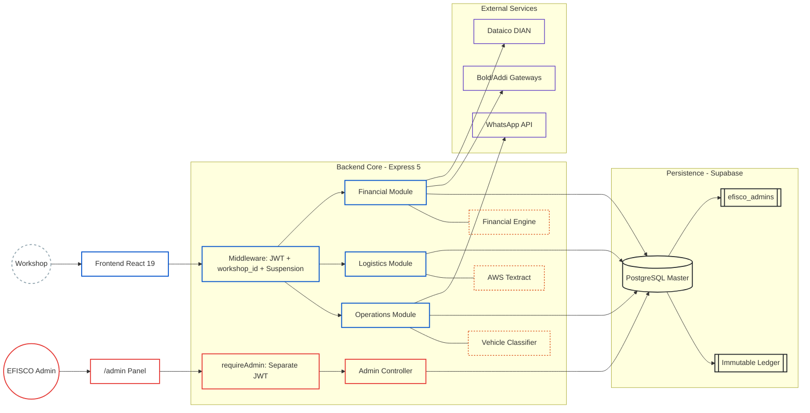
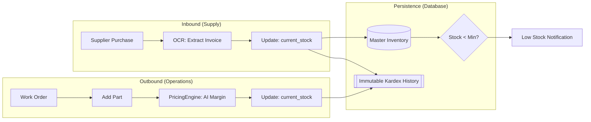
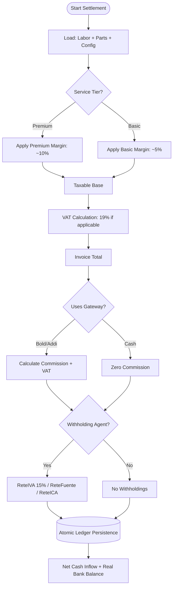

# Efisco ERP — Automotive Workshop SaaS

> **High-precision software engineering applied to profitability and automation in the automotive sector.**

Efisco is a SaaS platform designed to transform mechanical workshops into intelligent operational centers. It integrates a **Financial Engine (Fiscal/Accounting)** adapted to 2026 Colombian regulations, a **Vehicle Classifier** for dynamic pricing, **AI-powered OCR** for expense control, and an **Internal Admin Panel** for managing the workshop ecosystem.


---

## Table of Contents

- [Overview](#overview)
- [Architecture](#architecture)
- [Tech Stack](#tech-stack)
- [System Modules](#system-modules)
- [EFISCO Admin Panel](#efisco-admin-panel)
- [Financial Engine](#financial-engine)
- [Auxiliary Ledger (Cash Flow Ledger)](#auxiliary-ledger-cash-flow-ledger)
- [Environment Variables](#environment-variables)

---

## Overview

Efisco is not a generic ERP adapted for the automotive sector — it was built from scratch to solve the real problems of Colombian workshops:

- **Dynamic pricing** based on a vehicle classifier by segment (basic / premium)
- **Precise fiscal settlement** according to 2026 Colombian regulations: VAT, Withholding Tax (ReteFuente), Municipal Tax Withholding (ReteICA), VAT Withholding (ReteIVA), GMF 4×1000 (bank transaction tax)
- **Expense control with OCR** — automatic data extraction from supplier invoices via AWS Textract
- **Electronic invoicing** integrated with Dataico/DIAN (non-blocking, stores CUFE in the database)
- **Automated communication** with clients via WhatsApp Cloud API (Meta)
- **Multi-tenant** with data isolation per workshop verified at the application level — every endpoint validates `workshop_id` against the authenticated user's session (Supabase RLS is only active on a couple of specific tables, it is not the main isolation layer)
- **Credit sales** with installment plans: INC_GROSS is recorded at $0 upon settlement and actual revenue comes in via installment payments
- **Interactive break-even panel** with SVG hover chart, what-if projection with faithful margin calculation
- **VAT by spare-part category** — configurable rates for the 10 inventory categories
- **Colombian PUC (Chart of Accounts) presets** — 3 tax regimes that auto-fill the 21 accounting codes
- **EFISCO Admin Panel** — internal management of workshops, commissions, referrals, and access suspension

---

## Architecture

The system uses a **multi-tenant** architecture with data isolation verified at every backend endpoint (`workshop_id` from the session) and an immutable financial calculation core.

### 1. Component and Layer Map



---

## Operational Lifecycle (End-to-End)

```mermaid
sequenceDiagram
    autonumber
    participant C as Client
    participant R as Front Desk
    participant WA as WhatsApp (Meta)
    participant B as Bay (Ops)
    participant I as Inventory
    participant F as Finance
    participant EXT as External (DIAN/Pay)
    participant DB as Persistence (DB)

    C->>R: Intake (Reported Issue)
    activate R
    R->>WA: Notify the Client
    R->>B: Convert to Work Order
    activate B
    Note over B: The Classifier assigns Tier (Basic/Premium)
    deactivate R

    loop During Service
        B->>I: Request Part
        activate I
        I->>DB: Validate Stock & TX
        DB-->>I: Confirmation
        I-->>B: Item Delivered
        deactivate I
        B->>B: Accumulate Costs
    end

    B->>F: Finalize and Settle
    activate F
    deactivate B

    rect rgb(0, 0, 0)
        Note over F, DB: Accounting Closing Process (Fiscal 2026)
        F->>F: Calculate FinancialEngine
        F->>DB: Insert Ledger Entries
        F->>EXT: Issue Invoice & Process Payment
    end

    F->>C: Vehicle Ready + Digital Invoice
    deactivate F
```



---

## Tech Stack

| Layer | Technology | Role |
|:---|:---|:---|
| UI | React 19 + Vite | Client-side routing SPA |
| Styling | Tailwind CSS v4 | Utility-first design system |
| State | Zustand | `useFinancialStore`, `useBillingStore`, `useThemeStore`, `useAdminStore` |
| Backend | Express 5 + Node.js ESM | REST API with native async/await |
| Database | Supabase (PostgreSQL) | Persistence + application-level multi-tenant isolation |
| OCR | AWS Textract | Supplier invoice extraction |
| Communications | Meta WhatsApp Cloud API | Automatic notifications |
| Invoicing | Dataico | Electronic DIAN issuance (non-blocking) |
| Payment Gateways | Bold (in-person/online/QR) + Addi (credit) | Payment processing |
| Crypto | Node.js `crypto.scrypt` | Admin password hashing (no bcrypt) |
| Admin JWT | `jsonwebtoken` with `ADMIN_JWT_SECRET` | Token separate from workshop JWT |

---

## Key Technical Decisions

- **Application-level multi-tenancy** — every controller validates the authenticated user's `workshop_id`/role on every operation, with no independent databases per workshop (Postgres RLS only covers a couple of specific tables, it is not the main line of defense).
- **Immutable Ledger** — Every financial movement is append-only. Full, auditable accounting traceability.
- **Asynchronous OCR pipeline** — Invoice processing runs in the background via AWS Textract.
- **Dynamic tier-based pricing** — The vehicle classifier automatically assigns the tier.
- **Fully isolated admin** — Separate JWT (`ADMIN_JWT_SECRET`), separate Zustand store (`useAdminStore`), `/admin/*` routes rendered before the catch-all, distinct localStorage keys (`admin_token`/`admin_user` vs `token`/`user`).
- **Two-layer suspension** — `auth.controller.js` blocks login and `auth.middleware.js` invalidates already-issued tokens, preventing a pre-suspension token from still working.
- **Faithful what-if margin** — The projection calculation uses an absolute variable cost per order (`varCostPerOrder`), not a fixed percentage margin. When prices go up, the margin % improves automatically because parts costs don't increase.

---

## System Modules

### Frontend Routes

| Route | Module | Access |
|:---|:---|:---:|
| `/dashboard` | Dashboard | All |
| `/recepcion` | Front Desk | All |
| `/bahia` | Bays | All |
| `/inventario` | Inventory | All |
| `/proveedores` | Suppliers | All |
| `/ordenes` | Orders | All |
| `/referidos` | Referrals | All |
| `/soporte` | Support | All |
| `/config` | Settings | Owner |
| `/finanzas` | Financial Dashboard | Owner |
| `/equilibrio` | Break-even Panel | Owner |
| `/cobros` | Collections Panel | Owner |
| `/flujo-caja` | Cash Flow | Owner |
| `/cliente/registro/:workshopId/:intakeId` | EFISCO Secure Registration (WhatsApp link) | Public |
| `/admin` | EFISCO Admin Panel | Internal Admin |
| `/admin/talleres` | Workshop Management | Internal Admin |
| `/admin/pagos` | Commission Settlement | Internal Admin |
| `/admin/referidos` | Referral Tree | Internal Admin |

---

### Front Desk (Recepción)
Quick vehicle intake point. Records ID number, name, phone, and reported symptom — the ID number is requested here so the credit score can be activated immediately (previously it required the client to complete the EFISCO Secure Registration first).

- WhatsApp button for each queued intake: sends the **EFISCO Secure Registration** link (`/cliente/registro/:workshopId/:intakeId`), linked both to the workshop and to the specific intake
- OTP-based score verification: a 6-digit code is sent to the client's WhatsApp; only with the correct code is the local and network score shown to the front-desk staff
- Credit risk score with a 3-pillar breakdown (payment 60% / stability 10% / loyalty 30%), PDF report download

---

### EFISCO Secure Registration (`/cliente/registro/:workshopId/:intakeId`)
Public form that the client fills out from their own WhatsApp after receiving the link generated when the intake was registered at the Front Desk. Identity data (ID number, name, phone) is pulled automatically from the linked intake — the client doesn't have to re-enter it.

- Shows the client their own EFISCO score (local and global) transparently, or a "no history yet" message if they're a new client
- **Tax classification**: Individual | Company with sub-regime (Simple / Ordinary / Large Taxpayer) — captured here, not at the Front Desk, and persisted in the work order created when the form is submitted
- Requests email and residential address, vehicle data, and data-processing consent (Colombian Law 1581 of 2012) before submitting
- The link only works if it's linked to an existing Front Desk intake

---

### Bays (Work Orders)
Manages in-shop work: technician assignment, labor and parts recording.

- Vehicle classifier determines the service tier (Basic / Premium)
- Inventory consumption automatically recorded in the Kardex; each item stores `vat_percentage` (0%, 5%, or 19%)
- Order status: `pending → in_progress → ready_to_invoice → completed`
- **Settlement Modal** with live pre-calculation:
  - Bold/Addi commission simulation before confirming
  - Withholdings if the client is a withholding agent
  - Credit mode: installment selector (2/3/4), first payment date
- Upon settlement, an invoice is issued to Dataico/DIAN non-blockingly; on success it stores `cufe` and `invoice_pdf_url`

---

### Inventory
Full stock control with complete traceability.

- **Immutable Kardex**: every movement generates a transaction in `inventory_transactions`
- **Stock deduction 100% in application code** (`inventory.controller.js:addItemToWorkOrder`), respecting whether the item comes from current stock or new billing — requires migration 5 to have been run (above), which removes the database trigger that previously duplicated the deduction
- **VAT by category**: when selecting the spare-part category, the VAT rate is applied automatically from `workshop_config.category_vat_rates`
- **Minimum stock alert per item** (`min_stock_vital`): dashboard badge and row color in the table
- `getItemHistory` sorts by `requested_at`

**Inventory Logic and Immutable Kardex**

Full traceability: every physical movement generates a mandatory accounting reflection in the database.



---

### Suppliers and Expenses
Supplier management and purchase recording with fiscal settlement.

- **Supplier tax profile** (4 regimes): Individual · Simple Regime · Ordinary Regime · Large Taxpayer
  - `simple`: no withholdings apply
  - `ordinary` / `large_taxpayer`: full withholdings apply per UVT (27 UVT ≈ $1,358,586 COP)
- **Per-supplier ReteICA rate** (`reteica_rate_supplier`)
- **Invoice OCR**: AWS Textract extracts supplier, items, amounts
- **Payment method**: `bank` → GMF 4×1000 | `card` → transaction cost | `cash` → no fees
- **PUC code per supplier** (`puc_account_expense`): used in the ledger entry if defined

---

### Break-Even Panel (`/equilibrio`)
Break-even analysis, operating capacity, and scenario projection.

```
Fixed Costs = rent + utilities + payroll (fixed_costs_salaries)
Contribution Margin = net revenue / gross revenue
Break-Even Point = fixed costs / contribution margin
```

**Interactive SVG chart:**
- Hover with vertical crosshair that follows the cursor
- Real-time tooltip showing revenue, total cost, and profit/loss at that point
- X-axis showing the number of orders equivalent to each revenue level
- Loss (red) and profit (green) zones with semi-transparent fill
- "BEP" (amber) and "Today" (blue) points always visible

**What-if Projection (faithful calculation):**
- Variable costs are **absolute per order** (parts price), not a percentage
- When prices go up, the margin % improves automatically: `wiMarginPct = (wiRevenue − varCosts) / wiRevenue`
- The new BEP is recalculated with the projected margin: `wiPE = wiFixedCosts / wiMarginPct`
- Results panel shows a side-by-side comparison: current vs. projected orders, current vs. projected fixed costs
- The "orders needed" hint uses net contribution per order: `ceil(wiGap / (wiTicket − varCostPerOrder))`

---

### Collections Panel (`/cobros`)
Accounts receivable management — credit sales and installments.

- List of pending installments with due dates
- Payment recording: generates an `INC_GROSS` entry with PUC code `puc_income_code || '4135'`
- Client notification via WhatsApp when each installment payment is recorded

---

### Cash Flow (`/flujo-caja`)
General ledger of all financial movements.

- Filter by date range and impact type (CREDIT / DEBIT / All)
- Grouped by day with daily subtotals
- Running balance per movement (`running_balance`)
- CSV download via `/api/finance/report/ledger`

---

### Referrals
Referral system between workshops with cumulative discounts.

| Referred Subscriptions | Discount Applied |
|:---:|:---|
| 1 | 33% off monthly fee |
| 2 | 66% off monthly fee |
| 3+ | 100% (one free month) |
| Platinum (>5) | 15% direct commission (applied by EFISCO) |

---

### Workshop Settings (`/config`)
Fiscal and operational admin panel. Five tabs:

**1. Workshop Data** — Name, address, hours, fixed costs (rent + utilities)

**2. My Team & Roles** — Employee onboarding, compensation schemes (fixed / commission / hybrid). Creating, editing, deactivating employees, and enabling their access credentials is restricted to the `owner` role

**3. Service Catalog** — CRUD with basic/premium margins by vehicle type

**4. Payment Gateways**

Directly editable by the owner (no accountant required):

*Gateway rates*: Bold in-person (2.99%), Bold online (3.49%), Addi (10.5%)

*Folio (Invoice Numbering) Advance*: Dataico folio top-up calculator (quantity × unit cost + margin + gateway commission), with automatic expense entry recorded in the cash flow

**5. Accountant Module**

*Fiscal and Collection Parameters* — visible here in read-only mode for the owner (actual editing happens in the accountant's panel, `/contador`):

Tax Regime (4 options):
| Option | VAT | Simple Regime | Withholding Agent |
|:---|:---:|:---:|:---:|
| Not VAT-Liable | ✗ | ✗ | ✗ |
| Simple Regime (SIMPLE) | ✓ | ✓ | ✗ |
| Ordinary Regime | ✓ | ✗ | ✓ |
| Large Taxpayer | ✓ | ✗ | ✓ |

Rates: VAT (19%), ReteICA (‰), ReteFuente for filers/non-filers, ReteIVA (15%)

*Legal Identity*: Tax ID (NIT), Legal Name, Prefix, DIAN technical key — editing restricted to `owner`/`accountant` roles

*PUC Presets* — 3 buttons that auto-fill the 21 codes according to regime:
- **Ordinary Regime** (standard DIAN)
- **Simple Regime** (simplified subaccounts)
- **Large Taxpayer** (withholding-at-source subaccounts)

*Chart of Accounts (PUC) — 21 codes across 5 blocks*:

| Block | Codes | Defaults |
|:---|:---|:---|
| Revenue & Sales | `puc_income_code`, `puc_parts_income_code`, `puc_gateway_fee_code`, `puc_gateway_vat_code` | `4135`, `4135`, `5290`, `2408` |
| VAT | `puc_iva_generated_code`, `puc_iva_generated_5_code`, `puc_iva_deductible_code`, `puc_devolucion_iva_code` | `240805`, `240810`, `240820`, `135520` |
| Withholdings Payable | `puc_retefuente_code`, `puc_retefuente_compras_decl_code`, `puc_retefuente_compras_nodecl_code`, `puc_retefuente_servicios_code`, `puc_reteiva_code`, `puc_reteica_code` | `2365`, `236540`, `236540`, `236525`, `2367`, `2368` |
| Withholdings Receivable | `puc_anticipo_retefuente_code`, `puc_anticipo_reteica_code`, `puc_pasarela_retencion_code` | `135515`, `135518`, `135595` |
| Financial Control | `puc_cxc_clientes_code`, `puc_cxp_proveedores_code`, `puc_otros_ingresos_code`, `puc_gastos_financieros_code` | `130505`, `220505`, `4210`, `5305` |

*VAT by Spare-Part Category* — 10 categories with individually configured rates, applied automatically when selecting the category in Inventory.

*Accounting Export*: CSV of invoices, supplier purchases, accounts receivable, accounts payable, fiscal book, and valued inventory.

*Dataico Integration*: API key, auth token, environment (test/prod), numbering range, connection test button.

---

## EFISCO Admin Panel

Internal panel at `/admin` with authentication completely separate from workshops.

### Admin Authentication
- JWT signed with `ADMIN_JWT_SECRET` (different from workshops' Supabase JWT)
- Password hashing with `crypto.scrypt` + 16-byte salt (no external dependencies)
- Bootstrap: `POST /api/admin/bootstrap` — only works if `efisco_admins` is empty
- Token stored in `admin_token` (localStorage), distinct from workshops' `token`

### Admin Panel Modules

**Dashboard** — 4 KPIs: active/total workshops, orders this month, gross revenue this month, pending commission payouts.

**Workshops** — Paginated, searchable list of all workshops:
- View complete configuration (9-field grid)
- Create new workshop (creates Supabase Auth user + `workshop_config` in a transaction)
- **Suspend / Reactivate** — `PATCH /api/admin/workshops/:id/toggle` updates `is_active` in `workshop_config`
  - Suspension blocks login (`auth.controller.js`) AND in-progress requests (`auth.middleware.js`)
  - The suspended workshop sees an "Account Suspended" screen with contact channels

**Payouts** — Referral commission payout request management:
- Filters: pending / in process / paid
- KPIs by status
- `PATCH /api/admin/payouts/:id/mark-paid`

**Referrals** — Recursive hierarchical referral tree with collapse/expand:
- Colors by level: gray (0), blue (1-2), purple (Platinum: 3+)
- KPIs: total nodes, active referrers, Platinums, total commissions

### Admin API Routes

| Method | Route | Auth | Description |
|:---|:---|:---:|:---|
| POST | `/api/admin/bootstrap` | Public | Creates first admin (only if table is empty) |
| POST | `/api/admin/login` | Public | Admin login with email/password |
| GET | `/api/admin/stats` | Admin | Dashboard KPIs |
| GET | `/api/admin/workshops` | Admin | List workshops (with Supabase Auth emails) |
| GET | `/api/admin/workshops/:id` | Admin | Workshop detail |
| POST | `/api/admin/workshops` | Admin | Create new workshop |
| PATCH | `/api/admin/workshops/:id/toggle` | Admin | Suspend / reactivate |
| GET | `/api/admin/payouts` | Admin | List payout requests |
| PATCH | `/api/admin/payouts/:id/mark-paid` | Admin | Mark payout as completed |
| GET | `/api/admin/referrals` | Admin | Referral tree |

---

## Financial Engine

`backend/utils/financialEngine.js` — the immutable calculation core. 2026 constants: UVT = $50,318 COP, withholding threshold = 27 UVT ≈ $1,358,586 COP.

### Settlement Decision Matrix



### 1. Service Settlement (`liquidateClientInvoice`)

```
Taxable Base   = Labor × (1 + margin%) + Parts (with margin)
VAT            = Base × vat_percentage            (if is_responsable_iva)
Invoice Total  = Base + VAT

If clientIsRetainer:
  ReteFuente = Base × retefuente_rate_declarante
  ReteICA    = Base × (reteica_rate / 1000)
  ReteIVA    = VAT  × reteiva_rate

Bold in-person gateway:
  domestic_card       → 2.99% + $300
  international_card  → 3.99% + $300
  qr_wallet           → 1.50%

Bold online gateway:
  domestic_card       → 3.49% + $900
  international_card  → 4.49% + $900
  qr_wallet           → 1.50%

Addi gateway: gateway_addi_rate / 100
VAT on commission = Commission × 0.19

Net Cash Inflow = Total − ReteFuente − ReteICA − ReteIVA − Commission − VAT on commission
```

**Credit sale**: `INC_GROSS.net_amount = 0` at settlement; actual revenue comes in via `payInstallment`.

---

### 2. Purchase Settlement (`liquidateSupplierPurchase`)

```
Base            = total_gross_cost / (1 + 0.19)
Purchase VAT    = total_gross_cost − Base

Withholdings (base ≥ 27 UVT AND supplier ≠ 'simple'):
  ReteFuente: filer     → Base × supplier_retefuente_rate
              non-filer → Base × supplier_retefuente_rate × 1.4
  ReteICA:   Base × (reteica_rate_supplier ?? config.supplier_reteica_rate / 1000)
  ReteIVA:   VAT × 0.15

GMF (payment_method='bank' AND apply_4x1000=true):
  GMF = total_gross_cost × 0.004

Net Outflow = total_gross_cost − ReteFuente − ReteICA − GMF
```

---

### 3. Global Financial Health (`calculateGlobalHealth`)

```
totalInflows  = Σ INC_GROSS (CREDIT) + NON_OP_INC + VAT_REFUND
totalOutflows = Σ SUP_PAY + GW_FEE + GW_VAT + TAX_GMF + CARD_FEE (DEBIT)

bankBalance     = totalInflows − totalOutflows
ivaLiability    = Σ TAX_IVA − Σ RET_IVA − Σ VAT_REFUND
realBankBalance = bankBalance − ivaLiability
```

---

## Auxiliary Ledger (Cash Flow Ledger)

### Movement Types

| Type | Impact | Description |
|:---|:---:|:---|
| `INC_GROSS` | CREDIT | Service revenue (net_amount = 0 on credit) |
| `TAX_IVA` | CREDIT | VAT generated on the sale |
| `RET_FUENT` | DEBIT | Withholding tax applied by the client |
| `RET_ICA` | DEBIT | ReteICA applied by the client |
| `RET_IVA` | DEBIT | ReteIVA applied by the client |
| `GW_FEE` | DEBIT | Gateway commission (Bold / Addi) |
| `GW_VAT` | DEBIT | VAT on gateway commission |
| `SUP_PAY` | DEBIT | Supplier payment |
| `TAX_GMF` | DEBIT | GMF 4×1000 on bank payments |
| `CARD_FEE` | DEBIT | Card transaction cost |
| `NON_OP_INC` | CREDIT | Non-operational income (manual) |
| `VAT_REFUND` | CREDIT | VAT refund (`puc_code = '135520'`) |
| `MAN_INC` | CREDIT | Manual income entry recorded by the user |
| `MAN_EGR` | DEBIT | Manual expense entry recorded by the user |
| `REFERRAL` | CREDIT | Referral commission income |

---

## Environment Variables

`backend/.env`:

```env
# Supabase
SUPABASE_URL=https://<project>.supabase.co
SUPABASE_SERVICE_ROLE_KEY=<service-role-key>

# Workshop JWT (Supabase)
JWT_SECRET=<secret>

# Internal EFISCO admin JWT (separate)
ADMIN_JWT_SECRET=<secret-admin>

# AWS Textract (OCR)
AWS_ACCESS_KEY_ID=<key>
AWS_SECRET_ACCESS_KEY=<secret>
AWS_REGION=us-east-1

# WhatsApp Meta Cloud API
WHATSAPP_TOKEN=<bearer-token>
WHATSAPP_PHONE_NUMBER_ID=<phone-id>

# Dataico (DIAN Invoicing)
DATAICO_AUTH_TOKEN=<auth-token>
DATAICO_BASE_URL=https://app.dataico.com/api/2

# Bold/Addi Webhooks (optional but recommended)
# If not configured, webhooks accept any notification without
# verifying its origin — see security note below.
BOLD_WEBHOOK_TOKEN=<token-shared-with-bold>
ADDI_WEBHOOK_TOKEN=<token-shared-with-addi>
```

> **Security note — payment webhooks:** `boldWebhook`/`addiWebhook`
> (`backend/controllers/billing.controller.js`) mark an order as paid
> upon receiving the notification. Without `BOLD_WEBHOOK_TOKEN`/`ADDI_WEBHOOK_TOKEN`
> configured, they do not verify that the notification actually came from Bold/Addi
> — configure them before handling real payments in production.

---

## 📬 Contact
efiscosas@gmail.com

Developed and maintained by a single developer.

---

**Efisco ERP** — *Driving automotive engineering forward through high-performance software.*
